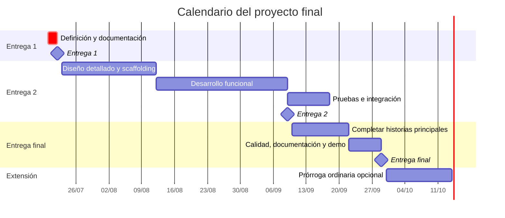
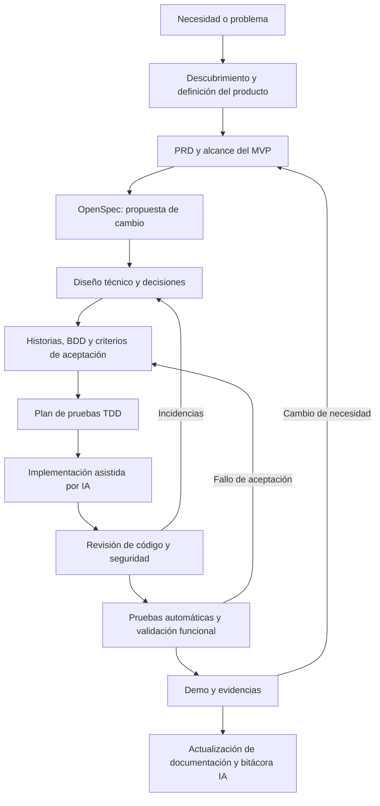
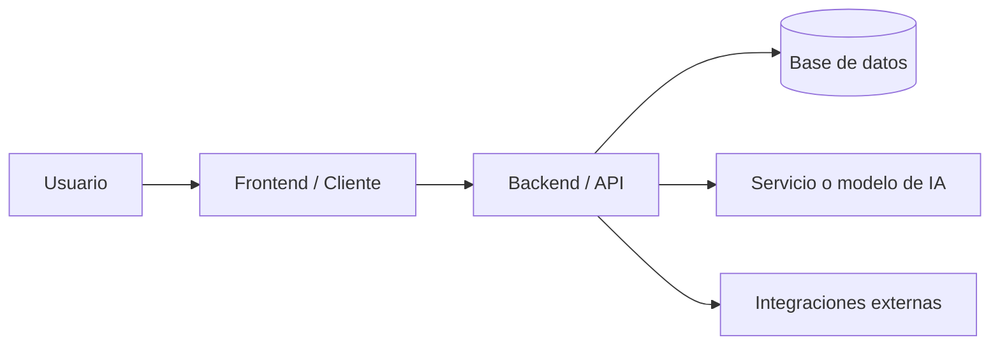
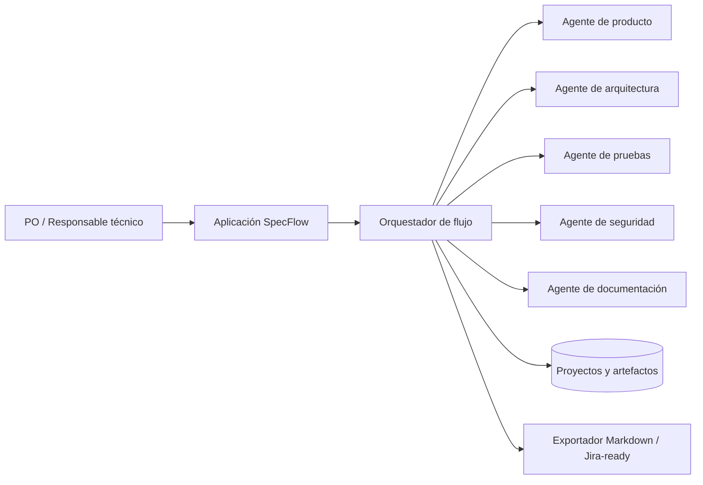

# Guía integrada del proyecto final — Máster AI for Devs

> Documento elaborado a partir de la transcripción de la primera tutoría del proyecto final.
>
> **Situación de referencia:** 20 de julio de 2026.  
> **Próxima fecha indicada en la tutoría:** primera entrega, 22 de julio de 2026.

---

## 1. Resumen ejecutivo

El proyecto final es uno de los cuatro criterios necesarios para obtener el certificado del máster. Su propósito es aplicar de forma práctica los conocimientos adquiridos mediante la construcción de un producto de software **end-to-end con inteligencia artificial**.

La dedicación estimada es de **30 horas**, aunque en la práctica puede requerir bastante más tiempo. En la tutoría se mencionaron casos de alumnos que dedicaron entre 90 y 120 horas al convertir el proyecto en un producto real. Por ello, la recomendación principal es controlar el alcance y definir un MVP realista.

El proyecto puede partir de:

- Una necesidad profesional.
- Un proyecto personal.
- Una aplicación completamente nueva.
- Una funcionalidad o módulo añadido a un proyecto existente.

La recomendación del tutor es reutilizar un proyecto ya iniciado cuando exista, porque permite aprovechar mejor el tiempo. También se puede pivotar de idea o alcance durante el desarrollo si la solución inicialmente planteada no resulta adecuada.

El MVP debería incluir:

- **Entre 3 y 5 historias principales**, relevantes y con valor real.
- **1 o 2 historias pequeñas opcionales**, que solo se desarrollarán si queda tiempo.

El objetivo no es integrar absolutamente todo lo visto en el máster, sino seleccionar las técnicas, herramientas y prácticas que aporten valor al producto.

---

## 2. Datos clave

| Aspecto | Criterio explicado en la tutoría |
|---|---|
| Objetivo | Desarrollar un producto end-to-end utilizando IA durante el ciclo de desarrollo. |
| Certificación | El proyecto final es uno de los cuatro criterios para obtener el certificado. |
| Dedicación estimada | 30 horas. Puede superar ampliamente esa estimación. |
| Alcance recomendado | 3–5 historias principales y 1–2 opcionales. |
| Tipo de proyecto | Profesional, personal, nuevo o basado en un producto existente. |
| Modalidad | Preferiblemente individual, aunque se permite trabajar en grupo. |
| Stack tecnológico | Libre. Se puede utilizar cualquier tecnología razonable para el proyecto. |
| Tipos de solución | Web, backend, frontend, móvil e incluso hardware. |
| Entregas | Tres entregas progresivas. |
| Forma de entrega | Repositorio, pull request y formulario de entrega. |
| Feedback | Automatizado en entregas 1 y 2; personalizado en la entrega final. |
| Confidencialidad | En proyectos empresariales puede entregarse la plantilla y un vídeo sin compartir el código. |
| Prórroga | Dos semanas desde la fecha final, previa comunicación al TA. Casos especiales pueden negociarse. |

---

## 3. Calendario de entregas

Según las fechas comunicadas durante la tutoría:

| Entrega | Fecha | Resultado esperado |
|---|---:|---|
| **Entrega 1** | **22 de julio de 2026** | Documentación de producto y documentación técnica. No es necesario incluir código. |
| **Entrega 2** | **9 de septiembre de 2026** | Código funcional y estructura base de la solución. |
| **Entrega 3 — Final** | **29 de septiembre de 2026** | Proyecto completo: documentación, código funcional y funcionalidades principales del MVP. |
| **Prórroga ordinaria** | Hasta aproximadamente el **13 de octubre de 2026** | Dos semanas adicionales, solicitadas por correo al TA. |

Las fechas de las entregas 1 y 2 se plantean con cierta flexibilidad debido al perfil profesional y familiar de los alumnos. La fecha final es más relevante, aunque existe la posibilidad de solicitar una prórroga.



---

## 4. Desglose de las tres entregas

### 4.1. Entrega 1 — Producto y diseño técnico

**Fecha indicada:** 22 de julio de 2026.

Esta entrega es exclusivamente documental. El tutor indicó expresamente que todavía no es necesario incluir ninguna línea de código.

Debe cubrir, como mínimo:

#### Identificación

- Nombre completo del alumno.
- Nombre del proyecto.
- Descripción breve.
- URL del proyecto o repositorio, si existe.
- Enlaces complementarios, vídeo o archivo ZIP, cuando proceda.

#### Definición del producto

- Problema que se quiere resolver.
- Usuarios o actores afectados.
- Propuesta de valor.
- Objetivos.
- Alcance del MVP.
- Elementos fuera de alcance.
- Historias principales.
- Historias opcionales.
- Criterios de aceptación.
- Riesgos y supuestos.

#### Diseño técnico

- Arquitectura propuesta.
- Componentes principales.
- Responsabilidades de frontend, backend y servicios externos.
- Modelo de datos.
- Interfaces o contratos principales.
- Decisiones tecnológicas y justificación.
- Estrategia inicial de pruebas.
- Consideraciones de seguridad.
- Estrategia de despliegue, aunque sea preliminar.

#### Uso previsto de IA

- Herramientas y modelos que se utilizarán.
- Prompts relevantes.
- Skills, comandos o subagentes.
- Flujo SDD, OpenSpec u otro framework seleccionado.
- Mecanismos para validar los resultados generados por IA.

### 4.2. Entrega 2 — Código funcional y estructura base

**Fecha indicada:** 9 de septiembre de 2026.

Debe existir una base funcional del producto. El tutor recomendó disponer de los **scaffolds** o estructuras arquitectónicas de los componentes principales.

Resultado esperado:

- Repositorio organizado.
- Aplicación ejecutable.
- Estructura principal de frontend, backend, móvil o hardware, según el proyecto.
- Persistencia o modelo de datos inicial.
- Flujos principales conectados.
- Primeras pruebas automatizadas.
- Documentación actualizada.
- Bitácora del uso de IA actualizada.
- Evidencias del funcionamiento.

No es obligatorio haber incorporado todos los elementos del máster. CI/CD, observabilidad, seguridad avanzada u otras capacidades deben añadirse solo cuando aporten valor y sean asumibles.

### 4.3. Entrega 3 — Proyecto final completo

**Fecha indicada:** 29 de septiembre de 2026.

Es la unión de las entregas anteriores, completada con las funcionalidades principales del MVP.

Debe incluir:

- Documentación funcional final.
- Documentación técnica final.
- Código funcional.
- Entre 3 y 5 historias principales completadas, según su complejidad.
- Historias opcionales completadas únicamente si existe capacidad.
- Suite de pruebas.
- Evidencias de ejecución.
- Bitácora completa del uso de IA.
- Decisiones, cambios de alcance y pivotes realizados.
- Vídeo o demostración cuando sea útil o sea necesario por confidencialidad.
- Instrucciones claras de instalación, ejecución y validación.

La revisión final será humana y tendrá en cuenta, entre otros elementos:

- La calidad y utilidad de la idea.
- La coherencia de la arquitectura.
- Las decisiones técnicas.
- La documentación.
- El uso real de inteligencia artificial.
- La capacidad de explicar y justificar el proceso seguido.

---

## 5. Artefactos que debe contener el proyecto

### 5.1. Documentación de producto

El proyecto debe permitir comprender:

1. Qué problema existe.
2. Para quién es importante.
3. Qué solución se propone.
4. Qué valor aporta.
5. Qué incluye el MVP.
6. Cómo se valida que la solución funciona.

### 5.2. Diseño técnico

Debe describir:

- Contexto del sistema.
- Arquitectura general.
- Componentes y responsabilidades.
- Flujo de datos.
- Modelo de datos.
- Integraciones.
- APIs o contratos.
- Decisiones tecnológicas.
- Seguridad.
- Pruebas.
- Despliegue.

### 5.3. Core del software

Puede estar formado por:

- Frontend web.
- Backend o API.
- Aplicación móvil.
- Automatizaciones.
- Servicios de IA.
- Integraciones externas.
- Componentes de hardware, cuando el proyecto lo requiera.

### 5.4. Suite de pruebas

Es recomendable incluir una combinación de:

- Pruebas unitarias.
- Pruebas de integración.
- Pruebas de contrato.
- Pruebas end-to-end.
- Casos BDD.
- Validación manual o UAT.

No es necesario utilizar todas las modalidades. Deben seleccionarse las que protejan los riesgos principales del producto.

### 5.5. CI/CD

La integración y entrega continuas son artefactos valorables, pero el tutor aclaró que no es obligatorio forzar su inclusión si el alcance o el tiempo no lo permiten.

Una versión mínima razonable podría incluir:

- Instalación de dependencias.
- Linter.
- Comprobación de tipos.
- Ejecución de pruebas.
- Build.
- Publicación o despliegue, cuando proceda.

### 5.6. Bitácora de inteligencia artificial

La antigua idea de limitarse a un archivo `prompts.md` está evolucionando hacia una documentación más completa del flujo de trabajo.

La bitácora debería registrar:

- Objetivo de cada interacción con IA.
- Herramienta o modelo utilizado.
- Prompt, skill, comando o agente empleado.
- Contexto suministrado.
- Resultado obtenido.
- Errores o alucinaciones detectadas.
- Validación aplicada.
- Cambios manuales realizados.
- Decisión final y justificación.

Ejemplo de registro:

```markdown
## AI-LOG-007 — Diseño del modelo de autorización

- **Fecha:** 2026-08-14
- **Objetivo:** Proponer un modelo RBAC para los tres perfiles del MVP.
- **Herramienta:** Agente de arquitectura.
- **Entrada:** PRD, OpenSpec y restricciones de seguridad.
- **Salida:** Modelo de roles, permisos y middleware.
- **Validaciones:** Revisión contra OWASP ASVS y pruebas negativas.
- **Problemas detectados:** El agente concedía permisos de edición al perfil lector.
- **Corrección:** Se ajustó la matriz de permisos y se añadieron pruebas de autorización.
- **Decisión:** Aceptado tras revisión.
```

---

## 6. Flujo de trabajo recomendado con SDD, OpenSpec y TDD

La tutoría anima a evolucionar desde prompts aislados hacia flujos compuestos por especificaciones, skills y subagentes especializados.



### Flujo operativo por funcionalidad

1. Registrar la necesidad.
2. Confirmar el valor y el actor afectado.
3. Crear o actualizar el PRD.
4. Elaborar la propuesta OpenSpec.
5. Definir criterios de aceptación en BDD.
6. Diseñar arquitectura y contratos.
7. Crear primero las pruebas relevantes.
8. Implementar con ayuda de agentes especializados.
9. Revisar seguridad, calidad y regresiones.
10. Recoger evidencias.
11. Actualizar la documentación y la bitácora IA.

### Posibles subagentes

- Agente de producto y PRD.
- Agente de arquitectura.
- Agente de frontend.
- Agente de backend.
- Agente de datos.
- Agente de pruebas.
- Agente de seguridad OWASP.
- Agente de revisión de pull requests.
- Agente de documentación.

La función de estos agentes no debe ser sustituir el criterio humano, sino especializar las revisiones y reducir omisiones.

---

## 7. Validación de la calidad de las respuestas de IA

Una de las principales dudas planteadas en la tutoría fue cómo evaluar un PRD, una arquitectura o una especificación generada en un área en la que el alumno no es especialista.

La respuesta práctica es no aceptar automáticamente la salida de la IA. Se debe crear un sistema de validación.

### Checklist general

- ¿Resuelve el problema real definido?
- ¿Respeta el alcance del MVP?
- ¿Es coherente con las demás especificaciones?
- ¿Incluye casos alternativos y errores?
- ¿Se puede probar?
- ¿Tiene criterios de aceptación objetivos?
- ¿Introduce complejidad innecesaria?
- ¿Explica sus supuestos?
- ¿Presenta riesgos de seguridad o privacidad?
- ¿Existe evidencia que respalde la decisión?

### Estrategias de contraste

- Revisar contra documentación oficial.
- Utilizar listas de comprobación del área.
- Pedir una crítica separada a otro agente.
- Crear pruebas antes de aceptar la implementación.
- Revisar con un compañero especialista.
- Plantear las dudas en el grupo del cohort.
- Aprovechar las siguientes tutorías para recibir apoyo técnico.

No conviene encadenar ciegamente las respuestas de varias herramientas. Cada transferencia entre ChatGPT, Cursor, Claude u otros agentes debe conservar:

- El objetivo.
- La fuente de verdad.
- Las restricciones.
- Los criterios de aceptación.
- Las decisiones ya aprobadas.

---

## 8. Repositorio y proceso de entrega

La tutoría indica que existe una plantilla oficial que se puede clonar y mantener dentro del repositorio del proyecto.

El proceso explicado es:

1. Acceder a la plantilla oficial del proyecto final.
2. Clonarla o incorporarla al repositorio propio.
3. Completar progresivamente la documentación.
4. Trabajar mediante pull requests.
5. Enviar la entrega a través del formulario oficial.
6. Indicar nombre, correo y número de entrega.
7. Comprobar que el equipo evaluador tiene acceso al repositorio.

### Repositorios privados

Cuando el repositorio sea privado, debe concederse acceso al TA o a las personas que indiquen las instrucciones oficiales.

### Proyectos empresariales o confidenciales

No es necesario compartir código propietario. Se puede entregar:

- La plantilla documental completada.
- La bitácora del proceso.
- Un vídeo que muestre el funcionamiento.

Esto permite evaluar el aprendizaje sin exponer código, credenciales, datos o información interna de la empresa.

### Estructura recomendada del repositorio

> Esta estructura es una propuesta práctica. Debe adaptarse a la plantilla oficial suministrada por el máster.

```text
project-final/
├── README.md
├── docs/
│   ├── 00-project-summary.md
│   ├── 01-product/
│   │   ├── problem-and-users.md
│   │   ├── prd.md
│   │   ├── scope.md
│   │   └── user-stories.md
│   ├── 02-technical-design/
│   │   ├── architecture.md
│   │   ├── data-model.md
│   │   ├── api-contracts.md
│   │   ├── security.md
│   │   └── adr/
│   ├── 03-testing/
│   │   ├── test-strategy.md
│   │   └── acceptance-cases.md
│   ├── 04-delivery/
│   │   ├── deployment.md
│   │   └── demo.md
│   └── 05-ai-log/
│       ├── ai-workflow.md
│       ├── prompts.md
│       ├── agents.md
│       └── decisions.md
├── openspec/
│   ├── specs/
│   └── changes/
├── src/
├── tests/
├── scripts/
└── .github/
    └── workflows/
```

---

## 9. Feedback, revisión y tutorías

### Feedback

- **Entregas 1 y 2:** feedback principalmente automatizado, enfocado en la estructura y completitud de la documentación.
- **Entrega 3:** revisión humana y feedback específico sobre producto, arquitectura, decisiones técnicas y uso de IA.

El formulario de entrega genera una alerta para que el equipo pueda ejecutar los flujos de revisión.

### Tutorías

Se indicaron tres tutorías:

1. **Primera tutoría:** alinear expectativas, explicar estructura, entregas y reglas.
2. **Segunda tutoría:** encaminar el proyecto, revisar el alcance y resolver bloqueos.
3. **Tercera tutoría:** apoyo final, validación de decisiones y ayuda especializada.

### Canales de soporte

- Grupo de WhatsApp del cohort.
- Teacher Assistant asignado, Kate en la tutoría.
- Correo indicado en la plataforma.
- Mentores y especialistas del programa.

El TA actúa como punto de entrada y deriva cada duda a la persona adecuada: mentor, operaciones, pagos o dirección del programa.

---

## 10. Decisiones aclaradas durante las preguntas

### ¿Debe ser individual?

Se recomienda hacerlo individualmente, pero se permite trabajar en grupo y dividir la carga.

### ¿Es mejor empezar de cero?

No necesariamente. Si ya existe un proyecto, se recomienda reutilizarlo y añadir un módulo o una funcionalidad nueva. Esto permite dedicar más tiempo a aplicar el proceso completo y menos a construir infraestructura básica.

### ¿Se puede cambiar de idea?

Sí. Se puede pivotar cuando la definición técnica demuestre que la idea no encaja, es demasiado sencilla o no aporta suficiente valor.

### ¿Hay un stack obligatorio?

No. Existe libertad tecnológica. Debe tenerse en cuenta que usar tecnologías poco conocidas aumenta el esfuerzo y el riesgo.

### ¿Hay que integrar todo lo visto en el máster?

No. El tutor pidió expresamente no intentar incorporar todo. Deben priorizarse las capacidades que sean útiles para el producto.

### ¿Se puede hacer una app móvil o un proyecto con hardware?

Sí. El concepto de frontend no se limita a una web. También se aceptan aplicaciones móviles y proyectos con hardware.

### ¿Cómo se gestiona un proyecto confidencial?

Se puede entregar la documentación y un vídeo funcional sin proporcionar acceso al código empresarial.

### ¿Se puede solicitar más tiempo?

Sí. Existe una prórroga ordinaria de dos semanas y pueden negociarse casos especiales, especialmente en proyectos empresariales o de equipo.

---

## 11. Plan inmediato para la entrega del 22 de julio

Dado que la primera entrega es documental, el objetivo debe ser presentar una definición coherente y verificable, sin intentar desarrollar código antes de tiempo.

### 20 de julio — Decisión y alcance

- [ ] Elegir el proyecto o módulo.
- [ ] Redactar el problema en una frase.
- [ ] Identificar usuario principal y actores secundarios.
- [ ] Definir objetivo y propuesta de valor.
- [ ] Delimitar qué queda fuera del MVP.
- [ ] Seleccionar 3–5 historias principales.
- [ ] Seleccionar 1–2 historias opcionales.
- [ ] Definir criterios de aceptación iniciales.

### 21 de julio — Diseño técnico y revisión

- [ ] Crear el diagrama de arquitectura.
- [ ] Describir los componentes.
- [ ] Definir el modelo de datos inicial.
- [ ] Identificar integraciones y contratos.
- [ ] Definir estrategia de pruebas.
- [ ] Registrar riesgos y seguridad.
- [ ] Definir el flujo de trabajo con IA.
- [ ] Completar la bitácora inicial.
- [ ] Revisar consistencia entre producto, historias y arquitectura.

### 22 de julio — Entrega

- [ ] Incorporar la documentación a la plantilla oficial.
- [ ] Comprobar enlaces y diagramas.
- [ ] Revisar que no existan secretos ni información confidencial.
- [ ] Crear el pull request requerido.
- [ ] Completar el formulario de entrega.
- [ ] Guardar evidencia de la entrega.

---

## 12. Plan de trabajo hasta la entrega final

### Fase 1 — Definición y primera entrega

**Hasta el 22 de julio**

- Problema, usuarios y valor.
- MVP y criterios de aceptación.
- Arquitectura preliminar.
- Modelo de datos.
- Estrategia de IA y pruebas.

### Fase 2 — Fundaciones técnicas

**23 de julio–12 de agosto**

- Preparación del repositorio.
- Scaffolding.
- Entorno local.
- Convenciones y calidad automática.
- Primer flujo vertical ejecutable.
- Pruebas base.

### Fase 3 — Desarrollo del MVP

**13 de agosto–31 de agosto**

- Implementación de las historias principales.
- TDD o pruebas por riesgo.
- Integración frontend/backend.
- Persistencia.
- Seguridad mínima.
- Actualización continua de la bitácora IA.

### Fase 4 — Segunda entrega

**1–9 de septiembre**

- Estabilización del código funcional.
- Verificación de scaffolds y componentes.
- README de ejecución.
- Evidencias.
- Entrega mediante PR y formulario.

### Fase 5 — Cierre funcional

**10–22 de septiembre**

- Completar historias pendientes.
- Corregir feedback.
- Mejorar pruebas.
- Revisar arquitectura y datos.
- Añadir CI/CD solo si aporta valor.

### Fase 6 — Entrega final

**23–29 de septiembre**

- Pruebas de regresión.
- Revisión de seguridad.
- Documentación final.
- Vídeo o demo.
- Limpieza de secretos y datos.
- Entrega definitiva.

---

## 13. Plantilla rellenable para la entrega 1

### 13.1. Identificación

- **Alumno:** Germán González Pérez
- **Nombre del proyecto:** `[Pendiente]`
- **Descripción breve:** `[Pendiente]`
- **Repositorio o URL:** `[Pendiente]`
- **Vídeo o evidencias:** `[Pendiente]`

### 13.2. Problema

**Situación actual**  
`[Describir qué ocurre actualmente y por qué representa un problema.]`

**Usuarios afectados**  
`[Indicar usuario principal, actores secundarios y contexto.]`

**Impacto**  
`[Tiempo perdido, errores, coste, riesgo, mala experiencia u otra consecuencia.]`

### 13.3. Propuesta de valor

`[Explicar en una o dos frases cómo el producto mejora la situación.]`

### 13.4. Objetivos

- `[Objetivo 1]`
- `[Objetivo 2]`
- `[Objetivo 3]`

### 13.5. Fuera de alcance

- `[Elemento que no se construirá]`
- `[Integración aplazada]`
- `[Funcionalidad avanzada no incluida]`

### 13.6. Historias principales

#### US-01 — `[Título]`

**Como** `[actor]`  
**quiero** `[acción]`  
**para** `[beneficio]`

**Criterios de aceptación**

```gherkin
Escenario: [Nombre]
  Dado [contexto]
  Cuando [acción]
  Entonces [resultado observable]
```

#### US-02 — `[Título]`

`[Completar siguiendo la misma estructura.]`

#### US-03 — `[Título]`

`[Completar siguiendo la misma estructura.]`

#### US-04 — `[Opcional según alcance]`

#### US-05 — `[Opcional según alcance]`

### 13.7. Historias opcionales

- `OPT-01 — [Título]`
- `OPT-02 — [Título]`

### 13.8. Arquitectura



**Componentes**

| Componente | Responsabilidad | Tecnología prevista |
|---|---|---|
| Cliente | `[Responsabilidad]` | `[Tecnología]` |
| API | `[Responsabilidad]` | `[Tecnología]` |
| Datos | `[Responsabilidad]` | `[Tecnología]` |
| IA | `[Responsabilidad]` | `[Tecnología]` |

### 13.9. Modelo de datos inicial

| Entidad | Propósito | Campos principales |
|---|---|---|
| `[Entidad]` | `[Propósito]` | `[Campos]` |

### 13.10. Estrategia de pruebas

- **Unitarias:** `[Qué lógica se protegerá]`
- **Integración:** `[Qué componentes se probarán juntos]`
- **End-to-end:** `[Qué flujo crítico se validará]`
- **BDD/UAT:** `[Qué escenarios validará el usuario]`

### 13.11. Riesgos

| Riesgo | Probabilidad | Impacto | Mitigación |
|---|---:|---:|---|
| Alcance excesivo | Alta | Alta | Limitar a 3–5 historias principales. |
| Alucinaciones de IA | Media | Alta | Validaciones, pruebas y revisión humana. |
| Dependencia externa | Media | Media | Mock, fallback o integración opcional. |
| Falta de tiempo | Alta | Alta | Priorizar flujo vertical y aplazar opcionales. |

### 13.12. Uso de IA

| Fase | IA o agente | Entrada | Resultado esperado | Validación |
|---|---|---|---|---|
| Producto | `[Herramienta]` | Problema y usuarios | PRD | Checklist de producto |
| Arquitectura | `[Herramienta]` | PRD y restricciones | Diseño técnico | ADR y revisión |
| Pruebas | `[Herramienta]` | Criterios BDD | Casos y tests | Ejecución automática |
| Código | `[Herramienta]` | OpenSpec y tests | Implementación | Review y pipeline |

---

## 14. Propuesta de proyecto opcional alineada con tu contexto

### Nombre provisional

**SpecFlow AI — Flujo inteligente de definición y entrega de software**

### Problema

Las necesidades de negocio llegan por distintos canales y se transforman en historias de usuario, especificaciones, arquitectura y pruebas con niveles de calidad desiguales. Esto genera ambigüedad, retrabajo, bloqueos entre producto y desarrollo y validaciones tardías.

### Propuesta

Una aplicación que guía a un PO o responsable técnico desde una necesidad inicial hasta un paquete de trabajo preparado para desarrollo, utilizando SDD, OpenSpec, BDD, TDD y agentes especializados.

### MVP propuesto

1. **Registrar una necesidad** con problema, usuario, objetivo y restricciones.
2. **Generar y revisar un PRD** mediante un agente de producto.
3. **Crear una propuesta OpenSpec** con alcance y cambios requeridos.
4. **Generar historias BDD y estrategia TDD** listas para implementación.
5. **Ejecutar una revisión multiagente** de producto, arquitectura, seguridad y pruebas.

Historias opcionales:

- Exportación a Markdown o formato preparado para Jira.
- Puntuación de calidad y detección de campos incompletos.

### Arquitectura posible



### Por qué encaja con el máster

- Es un producto end-to-end.
- Utiliza IA como parte central del flujo.
- Permite documentar prompts, skills y subagentes.
- Aplica SDD y OpenSpec.
- Permite utilizar BDD y TDD.
- Tiene un MVP controlable.
- Se puede desarrollar como proyecto independiente sin exponer información interna de la empresa.

---

## 15. Checklist final de cumplimiento

### Producto

- [ ] El problema está claramente definido.
- [ ] El usuario objetivo está identificado.
- [ ] La propuesta de valor es comprensible.
- [ ] El MVP tiene 3–5 historias principales.
- [ ] Las historias opcionales no bloquean la entrega.
- [ ] Cada historia tiene criterios verificables.

### Técnica

- [ ] La arquitectura responde al problema.
- [ ] Los componentes tienen responsabilidades claras.
- [ ] El modelo de datos está documentado.
- [ ] Las decisiones tecnológicas están justificadas.
- [ ] Existe una estrategia de pruebas.
- [ ] Se han considerado seguridad y privacidad.

### Inteligencia artificial

- [ ] Se documentan herramientas, agentes y skills.
- [ ] Se conservan los prompts o instrucciones relevantes.
- [ ] Se registran alucinaciones y correcciones.
- [ ] Las salidas de IA se validan.
- [ ] La IA forma parte del proceso, no solo de la redacción del documento.

### Entrega

- [ ] Se utiliza la plantilla oficial.
- [ ] El repositorio es accesible o se ha acordado una alternativa.
- [ ] No existen secretos ni datos confidenciales.
- [ ] El pull request está creado.
- [ ] El formulario está enviado.
- [ ] Se ha guardado evidencia de la entrega.

---

## 16. Conclusión

La prioridad es demostrar que se sabe aplicar inteligencia artificial de manera estructurada y responsable durante el ciclo completo de desarrollo. El proyecto no debe medirse por la cantidad de tecnologías incorporadas, sino por la coherencia entre problema, producto, arquitectura, implementación, pruebas y evidencias.

Para llegar a la primera entrega, debe priorizarse la definición documental. El código puede esperar a la segunda fase. Una primera entrega sólida debe dejar claro qué se va a construir, por qué, para quién, cómo se validará y qué papel tendrá la IA en cada etapa.
