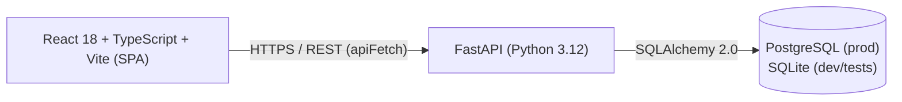
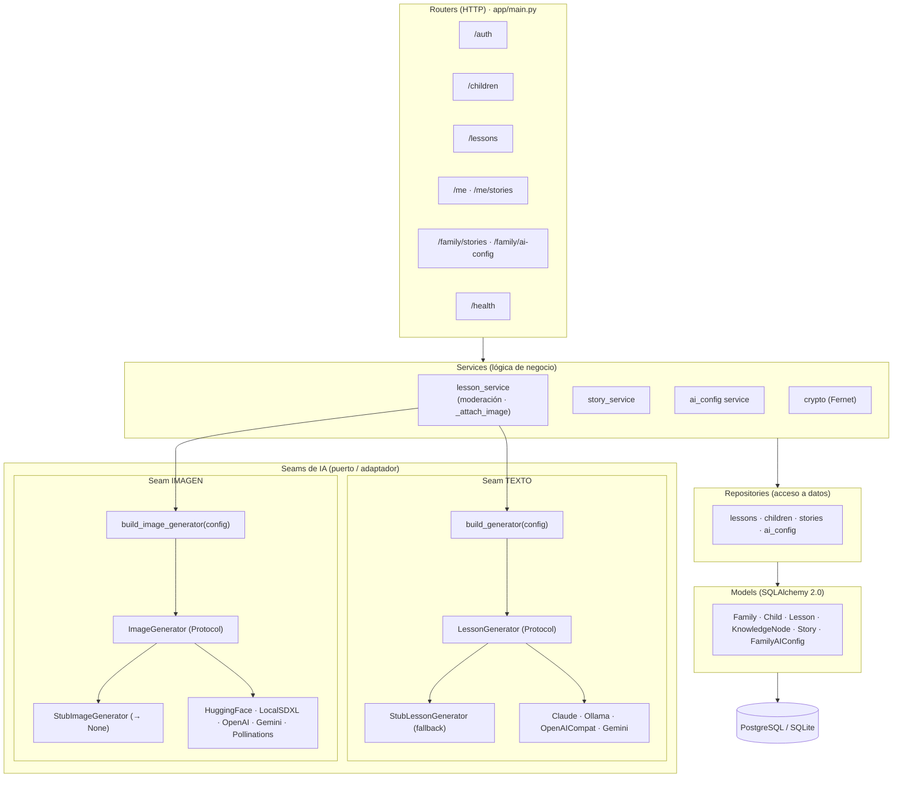
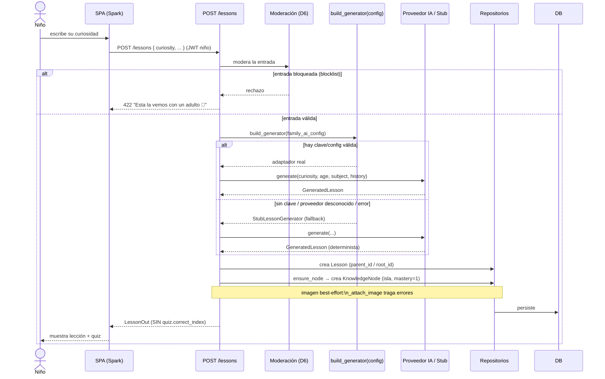
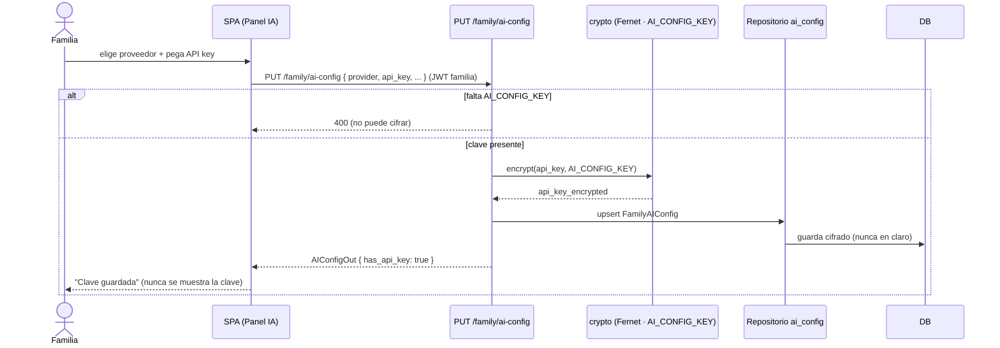

# Arquitectura propuesta — Chispa

> Entrega 1 · Diseño técnico (previo a la implementación)
> App familiar autoalojable que enciende la curiosidad de los niños: convierte una pregunta ("¿por qué el cielo es azul?") en una micro-lección con quiz, imagen opcional e islas de conocimiento. Segura para menores, con IA **opcional** y **sin lock-in** de proveedor.

## 1. Visión general

Chispa se diseña como una aplicación **cliente-servidor REST por capas**. Una SPA de React consumirá una API FastAPI sobre HTTPS/REST; la API persistirá en PostgreSQL (producción) o SQLite (desarrollo y tests) mediante el mismo ORM. La generación de contenido con IA será un detalle enchufable: se prevén **dos seams** (puerto/adaptador) —texto e imagen— que permitirán cambiar de proveedor o funcionar **sin IA** cayendo a un stub determinista.



Principios de diseño que gobernarán toda la arquitectura:

- **Autoalojable**: todo el sistema arrancará con un `docker compose up` en un PC de casa (Postgres + backend + frontend + Ollama).
- **Seguro para menores**: moderación de entrada, aprobación parental de cuentos, aislamiento entre familias y doble sesión (familia/niño) separada.
- **IA opcional y sin lock-in**: proveedores intercambiables por familia (BYOK) y fallback al stub, para que *el niño nunca vea un fallo del proveedor*.
- **Degradación elegante**: cada capacidad "de lujo" (imagen, voz, QR) degradará sin romper la experiencia base.

## 2. Contexto (C4 · nivel 1)

```mermaid
flowchart TB
    child(["Niño\n(sesión con PIN)"])
    family(["Familia / Madre-Padre\n(sesión con contraseña)"])

    subgraph chispa["Sistema Chispa (autoalojado)"]
        spa["SPA React\n(20 pantallas)"]
        api["API FastAPI"]
        db[("Base de datos\nPostgreSQL / SQLite")]
        media["Media estática\n/media/lessons"]
    end

    subgraph ext["Proveedores de IA (opcionales, externos o locales)"]
        claude["Claude API\napi.anthropic.com"]
        ollama["Ollama (local)\n/api/chat"]
        oai["OpenAI / DeepSeek / Kimi\n/chat/completions"]
        gemini["Gemini\ngenerativelanguage"]
        img["Proveedores de imagen\nHuggingFace / SDXL / OpenAI / Gemini / Pollinations"]
    end

    child --> spa
    family --> spa
    spa --> api
    api --> db
    api --> media
    api -. "texto (si hay config)" .-> claude
    api -. .-> ollama
    api -. .-> oai
    api -. .-> gemini
    api -. "imagen (best-effort)" .-> img
```

Las flechas punteadas hacia los proveedores son **opcionales**: si la familia no configura IA, la API responderá con el stub determinista y el sistema funcionará por completo sin salir a Internet.

## 3. Componentes: capas del backend y los dos seams

El backend seguirá un flujo estricto por capas: **routers** (HTTP) → **services** (lógica de negocio) → **repositories** (acceso a datos) → **models** (SQLAlchemy 2.0, estilo `Mapped`/`mapped_column`). Los contratos de entrada/salida serán **schemas Pydantic v2**. Se contempla una base declarativa (módulo `database`) y un módulo de dependencias de autenticación (`deps`) que usará `HTTPBearer(auto_error=False)`.



### 3.1 Seam de texto — `LessonGenerator`

- **Puerto**: la interfaz `LessonGenerator` (Protocol del módulo de generación de lecciones), con método `generate(curiosity, age, subject, history) → GeneratedLesson`.
- **Adaptadores** previstos, todos con **httpx y SIN SDKs** (menos dependencias, control total), timeout 120 s:
  - `ClaudeGenerator` → `api.anthropic.com/v1/messages` (default `claude-haiku-4-5`).
  - `OllamaGenerator` → `{base_url}/api/chat` (local, default `qwen3:4b`).
  - `OpenAICompatGenerator` → `/chat/completions` (OpenAI / DeepSeek / Kimi).
  - `GeminiGenerator` → `generativelanguage…:generateContent`.
  - `StubLessonGenerator` → determinista, sin IA: **será el fallback**.
- **Fábrica**: `build_generator(config)` elegirá según la config de la familia y **caerá al Stub** si no hay clave o el proveedor es desconocido.
- **Prompting compartido**: bandas de edad (`_age_band`), system prompt pedagógico y parseo robusto (`_strip_fences`, que validará **exactamente 3 opciones** y `0 ≤ correct_index < 3`).

### 3.2 Seam de imagen — `ImageGenerator`

- **Puerto**: la interfaz `ImageGenerator` (Protocol del módulo de generación de imagen), con método `generate(prompt) → GeneratedImage | None`.
- **Adaptadores** previstos: `StubImageGenerator` (devolverá `None`), HuggingFace (FLUX.1-schnell), LocalSDXL (Automatic1111 txt2img), OpenAI (gpt-image-1-mini), Gemini (gemini-3.1-flash-image), Pollinations (gratis, sin clave).

  > Los identificadores concretos se revisaron en 09-2026: la familia Imagen se apagó el 17-08-2026 y en Google la imagen la generan ahora los modelos Gemini.
- **Fábrica**: `build_image_generator(config)`: si `image_enabled=False` → Stub; **validará la URL (anti-SSRF)** para `local_sdxl`; Pollinations sin clave; el resto requerirá clave descifrada o caerá a Stub.
- **Best-effort**: la función `_attach_image` del servicio de lecciones **tragará las excepciones**, guardará la imagen en `media/lessons/{id}.png` y **nunca romperá la lección**.

### 3.3 Catálogo de IA — `ai_catalog`

Un módulo de catálogo de IA describirá la oferta que ve la familia: 6 modelos de Ollama con `min_vram`/`min_ram`, 7 proveedores de texto (stub/ollama/claude `enabled=True`; openai/gemini/deepseek/kimi `enabled=False`), `DEFAULT_LOCAL_MODEL="qwen3:4b"`, 6 proveedores de imagen y una función `recommend_local(vram, ram)` para sugerir el mejor modelo local según el hardware del PC.

## 4. Frontend (SPA)

- **React 18 + TypeScript 5.5 strict + Vite 5.4**, React Router 6. 20 pantallas previstas.
- Rutas **públicas**: `/`, `/crear`, `/login`, `/recuperar`. El resto quedará tras `ProtectedRoute` (**solo sesión familia**).
- **Dos sesiones independientes** en `localStorage`: familia `chispa_token` (gestionada por `SessionContext`) y niño `chispa_child_token`. Así el padre no se desloguearía cuando el niño falle el PIN (ver ADR-002).
- Cliente API tipado `apiFetch<T>` con `ApiError(status, detail)`; base configurable con `VITE_API_URL`.
- Sin framework CSS: un único `theme.css` con variables CSS (tokens del design system "Archipiélago") e inline styles.

## 5. Secuencia — "Encender la chispa" (crear lección)

Flujo principal previsto: el niño pregunta algo, se modera la entrada, se genera la lección (proveedor o fallback), se persiste la lección y su isla de conocimiento, y se devuelve **sin la respuesta correcta del quiz** (para que el quiz siga siendo práctica de recuerdo real).



La creación de la isla (`ensure_node`) se diseña **desacoplada del quiz**: la isla nacerá al crear la lección con `mastery` por defecto 1, y solo el **quiz correcto** subirá maestría vía `upsert_node` (ver ADR-004).

## 6. Secuencia — Guardar configuración de IA (BYOK)

La familia introducirá su clave de proveedor; la API la **cifrará con Fernet** antes de persistir y nunca la devolverá: la respuesta solo expondrá banderas `has_api_key` / `has_image_api_key`.



## 7. Persistencia y despliegue

- **ORM único** para ambos motores: PostgreSQL en producción, SQLite en dev/tests → portabilidad sin cambiar el código de acceso a datos.
- **Migraciones Alembic siempre aditivas** como estrategia prevista: sin drops ni alters destructivos, cero pérdida de datos (ver ADR-006).
- **Despliegue** con Docker Compose (`docker-compose.yml`): `postgres` + `backend` + `frontend` + `ollama`. Ollama solo se expondrá en `127.0.0.1` (no a la red); el backend lo alcanzará por la red interna de Docker (`http://ollama:11434`). CORS controlado por `CORS_ORIGINS`.

## 8. Registro de decisiones (ADR)

| ADR | Decisión |
|-----|----------|
| [ADR-001](./adr/ADR-001-seams-ia-fallback-stub.md) | Seams de IA (puerto/adaptador) + fábrica por familia + fallback al stub |
| [ADR-002](./adr/ADR-002-jwt-tipado-familia-nino.md) | JWT tipado familia/niño con doble sesión separada |
| [ADR-003](./adr/ADR-003-cifrado-fernet-claves-ia.md) | Cifrado Fernet de las claves de IA (BYOK) |
| [ADR-004](./adr/ADR-004-conversacion-hilos-islas-auto.md) | Conversación en hilos + islas de conocimiento automáticas |
| [ADR-005](./adr/ADR-005-aprobacion-parental-cuentos.md) | Aprobación parental de cuentos (máquina de estados) |
| [ADR-006](./adr/ADR-006-migraciones-aditivas.md) | Migraciones Alembic siempre aditivas |
| [ADR-007](./adr/ADR-007-degradacion-elegante.md) | Degradación elegante transversal |
| [ADR-008](./adr/ADR-008-rate-limiting-en-memoria-por-proceso.md) | Límite de intentos en memoria, por proceso *(añadida el 21-09-2026, durante la implementación)* |
