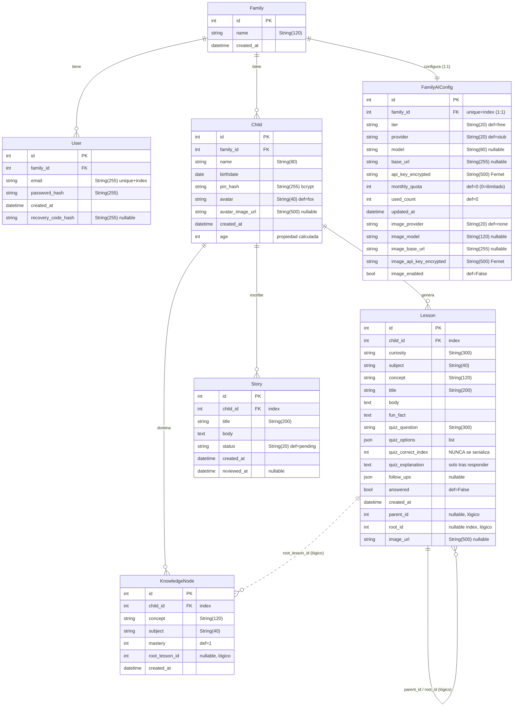

# Modelo de datos propuesto — Chispa

> Entrega 1 · Diseño técnico (previo a la implementación) · Máster LIDR–AI4Devs
> Modelo de datos previsto sobre SQLAlchemy 2.0 (estilo `Mapped[...]` / `mapped_column`), con migraciones Alembic.

## 1. Visión general

El modelo de datos de Chispa se organizará en torno a **7 entidades**. La familia será el agregado raíz: agrupará a los usuarios que inician sesión, a los niños y a la configuración de IA. Toda la actividad de aprendizaje (lecciones, nodos de conocimiento e historias) colgará del niño.

Decisiones de diseño relevantes:

- **Sin enums nativos de base de datos.** Los campos "de tipo enum" (`subject`, `tier`, `provider`, `status`, `image_provider`, …) se almacenarán como `String` con un conjunto de valores convencionales, validados en la capa de servicio/router y no en el esquema de BD. Esto simplificará las migraciones (no habrá que alterar tipos `ENUM` de Postgres/SQLite) a cambio de mover la validación a la aplicación.
- **Timestamps UTC-aware.** Todas las entidades usarán un helper local `_utcnow()` que devolverá `datetime.now(timezone.utc)` como valor por defecto de `created_at` / `updated_at` / `reviewed_at`.
- **Hilo conversacional auto-referencial en `lessons`.** Los campos `parent_id` y `root_id` serán enteros lógicos (no claves foráneas formales) que enlazarán turnos de una misma conversación. Se resolverán en la aplicación, no con integridad referencial de BD.
- **Enlaces lógicos hacia lecciones.** `knowledge_nodes.root_lesson_id` será también un entero lógico (nullable), no una FK declarada.
- **Secretos cifrados con Fernet.** Las claves de API de proveedores de IA se guardarán cifradas en `api_key_encrypted` e `image_api_key_encrypted`; nunca en claro y nunca se serializarán al cliente.

## 2. Diagrama entidad-relación

Cardinalidades:

| Relación | Cardinalidad | Implementación |
| --- | --- | --- |
| Family → User | 1 : N | FK `users.family_id` |
| Family → Child | 1 : N | FK `children.family_id` |
| Family → FamilyAIConfig | 1 : 1 | FK `family_ai_config.family_id` con `unique=True` |
| Child → Lesson | 1 : N | FK `lessons.child_id` (indexado) |
| Child → KnowledgeNode | 1 : N | FK `knowledge_nodes.child_id` (indexado) |
| Child → Story | 1 : N | FK `stories.child_id` (indexado) |
| Lesson → Lesson | auto-ref | `parent_id` / `root_id` (enteros lógicos, sin FK) |
| Lesson → KnowledgeNode | 1 : N lógico | `knowledge_nodes.root_lesson_id` (entero lógico) |

## 3. Detalle campo a campo por entidad

### 3.1 `families` — `Family`

Agregado raíz del sistema.

| Campo | Tipo SQLAlchemy | Nulo | Por defecto | Notas |
| --- | --- | --- | --- | --- |
| `id` | `int` (PK) | No | autoincrement | Clave primaria |
| `name` | `String(120)` | No | — | Nombre de la familia |
| `created_at` | `DateTime` | No | `_utcnow()` | UTC-aware |

Relaciones: `users` (1:N), `children` (1:N). La relación 1:1 con `FamilyAIConfig` se materializa desde el lado de la config.

### 3.2 `users` — `User`

El "usuario familia": la cuenta que inicia sesión y administra a los niños.

| Campo | Tipo SQLAlchemy | Nulo | Por defecto | Notas |
| --- | --- | --- | --- | --- |
| `id` | `int` (PK) | No | autoincrement | |
| `family_id` | `ForeignKey("families.id")` | No | — | Familia a la que pertenece |
| `email` | `String(255)` | No | — | `unique=True`, `index=True` |
| `password_hash` | `String(255)` | No | — | Hash de contraseña |
| `created_at` | `DateTime` | No | `_utcnow()` | |
| `recovery_code_hash` | `String(255)` | Sí | `NULL` | Hash del código de recuperación (flujo sin email) |

Relaciones: `family` (N:1).

### 3.3 `children` — `Child`

Perfil del niño. Autenticación por PIN (bcrypt).

| Campo | Tipo SQLAlchemy | Nulo | Por defecto | Notas |
| --- | --- | --- | --- | --- |
| `id` | `int` (PK) | No | autoincrement | |
| `family_id` | `ForeignKey("families.id")` | No | — | Familia propietaria |
| `name` | `String(80)` | No | — | |
| `birthdate` | `Date` | No | — | Base del cálculo de edad |
| `pin_hash` | `String(255)` | No | — | PIN de 4 dígitos (`^\d{4}$`) hasheado con bcrypt |
| `avatar` | `String(40)` | No | `"fox"` | Avatar predefinido |
| `avatar_image_url` | `String(500)` | Sí | `NULL` | Avatar generado por IA (imagen) |
| `created_at` | `DateTime` | No | `_utcnow()` | |
| `age` | *propiedad calculada* | — | — | `@property` en Python; no es columna |

La propiedad `age` calculará la edad a partir de `birthdate` y la fecha actual; no se persistirá. Relaciones: `family` (N:1).

### 3.4 `lessons` — `Lesson`

Unidad central de aprendizaje: una respuesta educativa a la curiosidad del niño, con quiz e hilo conversacional.

| Campo | Tipo SQLAlchemy | Nulo | Por defecto | Notas |
| --- | --- | --- | --- | --- |
| `id` | `int` (PK) | No | autoincrement | |
| `child_id` | `ForeignKey("children.id")` | No | — | `index=True` |
| `curiosity` | `String(300)` | No | — | Pregunta/curiosidad del niño |
| `subject` | `String(40)` | No | — | `{ciencia, matematicas, lenguaje, arte, cultura}` |
| `concept` | `String(120)` | No | — | Concepto abordado |
| `title` | `String(200)` | No | — | Título de la lección |
| `body` | `Text` | No | — | Contenido |
| `fun_fact` | `Text` | No | — | Dato curioso |
| `quiz_question` | `String(300)` | No | — | Pregunta del quiz |
| `quiz_options` | `JSON` (list) | No | — | Opciones de respuesta |
| `quiz_correct_index` | `Integer` | No | — | **Nunca se serializa al cliente** |
| `quiz_explanation` | `Text` | No | — | Solo llega tras responder |
| `follow_ups` | `JSON` (list) | Sí | `list` | Sugerencias de continuación |
| `answered` | `Boolean` | No | `False` | Marca de quiz acertado |
| `created_at` | `DateTime` | No | `_utcnow()` | |
| `parent_id` | `Integer` | Sí | `NULL` | Turno padre (lógico, sin FK) |
| `root_id` | `Integer` | Sí | `NULL` | Raíz del hilo, `index=True` (lógico) |
| `image_url` | `String(500)` | Sí | `NULL` | Imagen ilustrativa opcional |

Hilo conversacional: cada nueva pregunta de seguimiento creará una nueva fila `Lesson` con `parent_id` = turno anterior y `root_id` = primer turno del hilo. Al ser enteros lógicos, la reconstrucción del hilo se hará por consulta en la aplicación.

### 3.5 `knowledge_nodes` — `KnowledgeNode`

Cada nodo representa una "isla" de conocimiento adquirido por el niño (mapa de dominio).

| Campo | Tipo SQLAlchemy | Nulo | Por defecto | Notas |
| --- | --- | --- | --- | --- |
| `id` | `int` (PK) | No | autoincrement | |
| `child_id` | `ForeignKey("children.id")` | No | — | `index=True` |
| `concept` | `String(120)` | No | — | Concepto de la isla |
| `subject` | `String(40)` | No | — | Materia asociada |
| `mastery` | `Integer` | No | `1` | Sube al acertar el quiz de una lección |
| `root_lesson_id` | `Integer` | Sí | `NULL` | Lección raíz que originó el nodo (lógico) |
| `created_at` | `DateTime` | No | `_utcnow()` | |

Al acertar un quiz, el servicio ejecutará un *upsert* del nodo correspondiente (`concept` + `subject`), incrementando su `mastery`.

### 3.6 `stories` — `Story`

Historias creadas por el niño, sujetas a moderación de la familia.

| Campo | Tipo SQLAlchemy | Nulo | Por defecto | Notas |
| --- | --- | --- | --- | --- |
| `id` | `int` (PK) | No | autoincrement | |
| `child_id` | `ForeignKey("children.id")` | No | — | `index=True` |
| `title` | `String(200)` | No | — | |
| `body` | `Text` | No | — | |
| `status` | `String(20)` | No | `"pending"` | `{pending, approved, rejected}` |
| `created_at` | `DateTime` | No | `_utcnow()` | |
| `reviewed_at` | `DateTime` | Sí | `NULL` | Momento de la revisión familiar |

Flujo de estado: `pending` → `approved` / `rejected` (decisión de la familia). El niño solo verá sus historias `approved`.

### 3.7 `family_ai_config` — `FamilyAIConfig`

Configuración de proveedores de IA (texto e imagen) por familia. Relación 1:1 con `Family`.

| Campo | Tipo SQLAlchemy | Nulo | Por defecto | Notas |
| --- | --- | --- | --- | --- |
| `id` | `int` (PK) | No | autoincrement | |
| `family_id` | `ForeignKey("families.id")` | No | — | `unique=True`, `index=True` (1:1) |
| `tier` | `String(20)` | No | `"free"` | `{free, byok, managed}` |
| `provider` | `String(20)` | No | `"stub"` | `{stub, ollama, claude, openai, gemini, deepseek, kimi}` |
| `model` | `String(80)` | Sí | `NULL` | Modelo de texto |
| `base_url` | `String(255)` | Sí | `NULL` | Endpoint personalizado |
| `api_key_encrypted` | `String(500)` | Sí | `NULL` | **Cifrada con Fernet** |
| `monthly_quota` | `Integer` | No | `0` | `0 = ilimitado` |
| `used_count` | `Integer` | No | `0` | Consumo del periodo |
| `updated_at` | `DateTime` | No | `_utcnow()` | |
| `image_provider` | `String(20)` | No | `"none"` | `{none, huggingface, local_sdxl, openai, gemini, pollinations}` |
| `image_model` | `String(120)` | Sí | `NULL` | Modelo de imagen |
| `image_base_url` | `String(255)` | Sí | `NULL` | Endpoint de imagen |
| `image_api_key_encrypted` | `String(500)` | Sí | `NULL` | **Cifrada con Fernet** |
| `image_enabled` | `Boolean` | No | `False` | Habilita generación de imágenes |

Los campos `*_encrypted` no se expondrán nunca: la API devolverá booleanos `has_api_key` / `has_image_api_key` en su lugar (ver `contratos-api.md`).

## 4. Estrategia de migración (Alembic)

El esquema se construirá mediante **migraciones Alembic lineales y siempre aditivas**. La estrategia prevista es que el contenedor ejecute `alembic upgrade head` al arrancar, de modo que la base de datos quede siempre al día sin intervención manual. El esquema descrito arriba se irá materializando en pasos aditivos como los siguientes (secuencia prevista de evolución):

| # | Paso de migración | Cambio principal |
| --- | --- | --- |
| 1 | Esquema inicial | Crear `families`, `users`, `children`; `users.email` único |
| 2 | Aprendizaje base | Crear `lessons` y `knowledge_nodes` |
| 3 | Config de IA | Crear `family_ai_config`; `family_id` único |
| 4 | Historias | Crear `stories` |
| 5 | Avatares | Añadir `children.avatar` |
| 6 | Seguimientos | Añadir `lessons.follow_ups` |
| 7 | Hilos | Añadir `lessons.parent_id` / `lessons.root_id` |
| 8 | Enlace isla↔lección | Añadir `knowledge_nodes.root_lesson_id` |
| 9 | Imagen | Añadir config de imagen + `lessons.image_url` |
| 10 | Avatar por imagen | Añadir `children.avatar_image_url` |
| 11 | Recuperación | Añadir `users.recovery_code_hash` |

La secuencia se mantendrá como **cadena lineal** (un único HEAD, sin ramas ni merges), de forma que el paso 1 preceda al 2, este al 3, y así sucesivamente hasta el último.

Características de la estrategia de migración:

- **Todas aditivas.** Se emplearán operaciones `create_table`, `create_index` y `add_column` con columnas `nullable` o con `server_default`. Nunca se eliminará información en `upgrade()`.
- **Los `drop_*` solo aparecerán en `downgrade()`**, garantizando compatibilidad hacia atrás en despliegues.
- **Cadena lineal** (un único HEAD, sin ramas ni merges), lo que evitará conflictos de revisión y hará el historial trivial de auditar.
