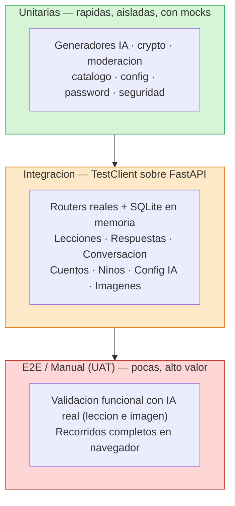

# Estrategia de Pruebas (Plan) — Chispa

> Entrega 1 (documental) · Máster LIDR–AI4Devs
> Rol: Agente de QA/Pruebas
>
> Este documento describe la **estrategia de pruebas prevista** para Chispa, redactada **antes de
> implementar** (es el paso previo a escribir código). Define qué se probará, con qué herramientas
> y bajo qué principios; no reporta resultados de ejecución. Documentos relacionados:
> [Historias de usuario](../01-product/historias-usuario.md) ·
> [Casos de aceptación](casos-aceptacion.md).

## 1. Filosofía

La calidad no se perseguirá con una batería de tests escrita al final, sino como consecuencia del
método de trabajo. Dos principios regirán la estrategia:

### 1.1 TDD dirigido por specs (SDD)

Cada incremento del producto nacerá de un *brief* SDD (Spec-Driven Development) que **escribirá
primero las pruebas**: se definirá el comportamiento esperado, se verá fallar la prueba (rojo), se
implementará lo mínimo para que pase (verde) y se refactorizará. Así, ninguna historia se
implementará sin dejar antes su prueba escrita.

### 1.2 Pruebas por riesgo

No todo el código tendrá el mismo coste si falla. La cobertura se concentrará deliberadamente en
los cuatro riesgos que definen la propuesta de valor y la responsabilidad ética de una app
infantil:

| Riesgo a proteger | Por qué será crítico | Dónde se probará (previsto) |
|---|---|---|
| **Seguridad del menor** | Contenido generado por IA que llega a un niño; peticiones de imágenes hacia URLs arbitrarias (SSRF) | Pruebas de moderación, de imágenes/SSRF y de generación de avatar |
| **Aislamiento de datos** | Una familia jamás debe ver/editar datos de otra | Pruebas de la API de niños, de cuentos (404 entre familias) y de dependencias de acceso del niño |
| **Secreto del quiz** | Las respuestas correctas no podrán filtrarse al cliente antes de responder | Pruebas de la API de respuestas y de lecciones (contrato de la respuesta) |
| **Degradación de IA** | Sin clave, sin voz o con proveedor caído, la app deberá seguir siendo usable | Pruebas de configuración de IA, de proveedores y de los componentes de voz |

---

## 2. Pirámide de pruebas prevista

La estrategia seguirá una pirámide clásica: muchas pruebas unitarias rápidas en la base, una capa
sólida de integración sobre la app FastAPI en medio, y una cima estrecha de validación E2E/manual
con IA real y navegador.



Aunque se ejecutarán todas con `pytest`/`vitest`, conviene distinguir la **naturaleza** de cada
prueba. En el backend se levantará un `engine` SQLite **en memoria** con `StaticPool`, se
recrearán todas las tablas por test (fixture `db_session`) y se expondrá un `TestClient(app)` con
`get_db` sobreescrito (fixture `client`). Esto convertirá a buena parte de la suite en pruebas de
**integración reales** contra la aplicación FastAPI (router → dependencia → ORM → BD), no en meros
unitarios con dobles.

---

## 3. Tipos de prueba que se escribirán

| Tipo | Qué protegerá | Herramienta prevista | Alcance de ejemplo |
|---|---|---|---|
| **Unitaria** | Lógica pura: cifrado de claves, moderación, catálogo de modelos, validación de config, hashing de contraseñas | pytest + monkeypatch | Cifrado, moderación, catálogo de IA, contraseñas |
| **Integración** | Contrato HTTP real de los routers sobre FastAPI + BD en memoria | pytest + `TestClient` | Lecciones, conversación, cuentos, niños |
| **Contrato / esquema** | Forma de la respuesta hacia el frontend (p. ej. BYOK que nunca devuelve la clave) | pytest + aserciones sobre JSON | Config de IA, perfil (`/me/*`) |
| **Componente (frontend)** | Render y comportamiento de pantallas y componentes | Vitest + Testing Library | Pantallas de familia/niño, botones de voz |
| **E2E (IA real)** | Que un proveedor real produzca una lección/imagen aprovechable de extremo a extremo | Docker + proveedor real | Validación manual planificada |
| **Manual / UAT** | Recorridos de usuario en navegador | Navegador + checklist | Ver [casos-aceptacion.md](casos-aceptacion.md) |

Los generadores de IA se probarán **siempre con mocks/monkeypatch**: la suite automatizada **no**
realizará llamadas HTTP reales a proveedores, para que sea determinista, gratuita y rápida. La
confianza en el comportamiento con IA real se obtendrá por separado, en la cima de la pirámide
(sección 6).

---

## 4. Áreas que se cubrirán

Se prevén pruebas para **cada router y cada servicio**, organizadas por módulo. No se fija un
número de casos: la cobertura crecerá con el producto bajo el ciclo TDD/SDD.

### 4.1 Backend — pytest

| Área | Alcance previsto de las pruebas |
|---|---|
| Modelo / BD | Entidades del dominio, arranque de la base de datos y vínculo `root_lesson_id` |
| Auth / seguridad | Registro/login, hashing de contraseña, separación de sesiones family/child, CORS, health, configuración |
| IA / generadores | Catálogo de modelos, proveedores, generador de lecciones, wiring proveedor↔lección, moderación |
| Configuración de IA | API, CRUD y modelo de la configuración por familia |
| Imágenes (incl. SSRF / avatar) | Matriz de proveedores de imagen, validación anti-SSRF y generación de avatar |
| Lecciones / quiz / conversación | Creación de lecciones, evaluación de respuestas y conversación con islas |
| Niños / perfil | Alta y listado de exploradores, endpoints `/me/*` (solo lectura) |
| Cuentos | Modelo y API de cuentos con aprobación parental |

### 4.2 Frontend — Vitest + jsdom + Testing Library

Stack previsto: `@testing-library/react`, `@testing-library/user-event`, `jest-dom`.

| Área | Alcance previsto de las pruebas |
|---|---|
| API / cliente | Cliente HTTP, núcleo de dominio y cliente de configuración de IA |
| Infra / estado | Sesión, rutas protegidas, i18n y arranque de la app |
| Componentes | Botones, avatar, cabecera del niño y botones de voz (micrófono/lectura) |
| Pantallas | Alta de familia, alta de explorador, acceso del niño, encender la chispa, lección, archipiélago, cuentos, panel de configuración, conectar dispositivo, etc. |

---

## 5. Degradación como categoría destacada

La **degradación elegante** será un diferenciador de Chispa y se probará explícitamente, no se
dejará al azar. La app deberá seguir siendo usable cuando falte una capacidad:

| Escenario de degradación | Comportamiento esperado | Prueba prevista |
|---|---|---|
| Navegador sin API de reconocimiento de voz | El botón de micrófono renderizará `null` (no romperá la UI) | Prueba del componente de micrófono |
| Navegador sin síntesis de voz | El botón de lectura renderizará `null` | Prueba del componente de lectura |
| Sin clave de proveedor (sin BYOK) | Se usará el proveedor `free`/`stub` por defecto | Prueba de la API de configuración de IA |
| Proveedor de imagen no disponible | Fallback dentro de la matriz de proveedores | Pruebas de imágenes y de proveedores |
| Generador IA caído / no configurado | Se caerá al *stub* determinista sin romper el flujo | Prueba de wiring proveedor↔lección |

Que un componente renderice `null` en lugar de lanzar una excepción será una decisión de diseño
que se probará: el niño usará la app igual, solo sin el extra de voz.

---

## 6. Validación funcional con IA real (más allá del unit test)

Como la suite automatizada usará mocks, la confianza en la IA real se obtendrá con pruebas E2E
manuales planificadas, que se registrarán en el diario de progreso:

- **Lección real**: generación de una lección por un proveedor real (p. ej. Claude) en el entorno
  con Docker.
- **Imagen real**: generación de una imagen contra un proveedor sin clave (p. ej. Pollinations).

Estas validaciones cerrarán la brecha entre "el contrato pasa con un doble" y "el proveedor real
produce algo aprovechable".

---

## 7. CI/CD e integración previstos

### 7.1 Integración continua (a configurar)

Se configurará un pipeline que se disparará en **push a cualquier rama** y en **pull request**, con
dos jobs independientes:

| Job | Entorno previsto | Pasos previstos |
|---|---|---|
| `backend` | Python 3.12 | Instalar dependencias → `ruff check .` → `pytest` |
| `frontend` | Node 20 | `npm ci` → `npm run lint` (tsc) → `npm test` (vitest run) |

Notas de calidad previstas:
- **`ruff`** con `line-length = 100` será el linter/formateador del backend.
- **`npm run lint` = `tsc --noEmit`**: comprobación estricta de tipos (TS `strict`, con
  `noUnusedLocals` y `noUnusedParameters`). El "lint" del frontend será, en la práctica, el
  compilador de TypeScript actuando como red de seguridad de tipos.

### 7.2 Comandos locales previstos

```bash
# Backend
cd backend
pytest -q && ruff check .

# Frontend
cd frontend
npm test && npm run lint
```

---

## 8. Riesgos de cobertura a vigilar

Con transparencia, se anticipan zonas donde la cobertura podría quedarse corta y que deberán
vigilarse durante la implementación:

| Zona | Riesgo | Mitigación prevista |
|---|---|---|
| Pantalla de login | Puerta de entrada; regresiones no detectadas | Cubrirla con pruebas de componente y de contexto de sesión |
| Lectura de cuento (lector de cuentos) | Experiencia del niño | Asegurar prueba de render además de la API de cuentos |
| Componentes presentacionales (avatar del niño) | Riesgo bajo, pero fácil de olvidar | Cubrirlos vía pruebas de los componentes de avatar |

Serán deuda de test a priorizar, no puntos ciegos que se ignoren.
