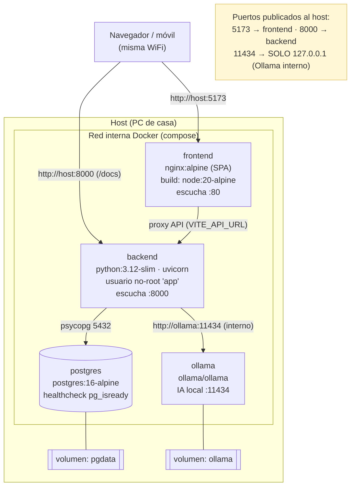

# Despliegue — Chispa

> Entrega 1 (documental) · Máster LIDR–AI4Devs
> Este documento describe la **estrategia de despliegue prevista** de Chispa: topología propuesta, variables de entorno previstas, modelos de despliegue, datos/migraciones, endurecimiento planificado y pipeline de CI/CD a configurar.
> Chispa se concibe como una aplicación **autoalojable** (self-hosted): pensada para funcionar en el ordenador de casa de una familia, con IA local opcional y sin dependencias de nube de pago.

---

## 1. Topología de despliegue prevista

Chispa se empaquetará con **Docker Compose** y el stack constará de **4 servicios** más 2 volúmenes persistentes y una red interna de Docker. El acceso desde fuera del host se limitará al **frontend (5173)** y a la **API (8000)**; el servicio de IA local (Ollama) quedará ligado a `127.0.0.1` y no se expondrá a la red.



**Mapa de puertos previsto**

| Servicio | Imagen / build | Puerto interno | Publicado al host | Alcance |
|---|---|---|---|---|
| frontend | multi-stage `node:20-alpine` → `nginx:alpine` | 80 | `5173:80` | Red (LAN) |
| backend | build `./backend` (`python:3.12-slim`) | 8000 | `8000:8000` | Red (LAN) |
| postgres | `postgres:16-alpine` | 5432 | *(no publicado)* | Solo red Docker |
| ollama | `ollama/ollama` | 11434 | `127.0.0.1:11434:11434` | **Solo el propio host** |

**Volúmenes persistentes previstos**

| Volumen | Montaje | Contenido |
|---|---|---|
| `pgdata` | `postgres:/var/lib/postgresql/data` | Datos de PostgreSQL (familias, exploradores, progreso, chats, cuentos). |
| `ollama` | `ollama:/root/.ollama` | Modelos de IA local descargados (p. ej. `qwen3:4b`). |

> Nota: los ficheros de media (imágenes generadas) se guardarán en `MEDIA_DIR` dentro del contenedor backend. Para persistirlos entre reconstrucciones se prevé montar un volumen sobre esa ruta (**siguiente paso**, ver §7).

---

## 2. Variables de entorno previstas

El backend usará **pydantic-settings** y leerá un fichero `.env` (copiado de `.env.example`). Fuera de `development`, la configuración se diseñará como **fail-closed**: si falta un secreto fuerte, el arranque fallará en lugar de arrancar inseguro.

| Variable | Por defecto | Propósito | ¿Obligatoria fuera de dev? |
|---|---|---|---|
| `ENVIRONMENT` | `development` | Modo de ejecución. Compose lo forzará a `production`, lo que activará las validaciones estrictas. | — |
| `JWT_SECRET` | *(vacío)* | Firma de tokens JWT de sesión. En prod exigirá **≥ 32 caracteres** o el arranque fallará (fail-closed). | **Sí** |
| `JWT_EXPIRE_MINUTES` | `43200` (30 días) | Caducidad del token de sesión. | No |
| `DATABASE_URL` | SQLite (dev) | Cadena de conexión. En Compose apuntará a PostgreSQL vía `postgresql+psycopg://…@postgres:5432/…`. | **Sí** (prod usará Postgres) |
| `CORS_ORIGINS` | `http://localhost:5173` | Orígenes permitidos (coma-separados). Deberá incluir la IP del PC para acceso LAN. | Recomendable |
| `AI_CONFIG_KEY` | *(vacío)* | Clave **Fernet** que cifrará en reposo las API keys de IA de cada familia. | **Sí** (si se usa BYOK) |
| `MEDIA_DIR` | `media` | Directorio donde se guardarán imágenes generadas. | No |
| `IMAGE_TIMEOUT` | `60` | Timeout (s) para generación de imágenes. | No |
| `POSTGRES_USER` | `chispa` | Usuario de la base de datos. | Recomendable cambiar |
| `POSTGRES_PASSWORD` | *(obligatoria)* | Contraseña de Postgres; Compose fallará si no se define. | **Sí** |
| `POSTGRES_DB` | `chispa` | Nombre de la base de datos. | No |
| `VITE_API_URL` | `http://localhost:8000` | URL de la API embebida en el build del frontend (ARG en build-time). Para LAN deberá ser `http://IP_DEL_PC:8000`. | Para LAN |

Generación de la clave Fernet (prevista):

```bash
docker compose run --rm backend python -c "from app.services.crypto import generate_key; print(generate_key())"
```

---

## 3. Modelos de despliegue previstos

### 3.1. Autoalojado con Docker (recomendado)

Modo principal y soportado. Levantará los 4 servicios en el PC de casa.

1. Copiar la plantilla de entorno: `cp .env.example .env`
2. Rellenar en `.env`: `JWT_SECRET` (≥ 32 caracteres), `POSTGRES_PASSWORD` y `AI_CONFIG_KEY`.
3. Generar la clave Fernet para `AI_CONFIG_KEY`:
   `docker compose run --rm backend python -c "from app.services.crypto import generate_key; print(generate_key())"`
4. Arrancar: `docker compose up --build -d`
5. Al iniciarse, el `docker-entrypoint.sh` del backend ejecutará **`alembic upgrade head`** (migraciones) y luego arrancará uvicorn.
6. Acceder:
   - Frontend: `http://localhost:5173`
   - API + Swagger: `http://localhost:8000/docs`

### 3.2. Desarrollo local (sin Docker)

Para iterar rápido sobre el código.

**Backend**
1. `py -3.12 -m venv .venv` y activar el entorno.
2. `pip install -e ".[dev]"`
3. `alembic upgrade head`
4. `uvicorn app.main:app --reload`

Con `ENVIRONMENT=development` usará **SQLite** por defecto y no exigirá secreto fuerte.

**Frontend**
1. `npm install`
2. `npm run dev`

### 3.3. Acceso LAN familiar (móvil / tablet de casa)

Para usar Chispa desde otros dispositivos de la misma WiFi.

1. Averiguar la IP del PC (`ipconfig` en Windows).
2. En `.env`:
   - `VITE_API_URL=http://IP_DEL_PC:8000`
   - `CORS_ORIGINS=http://localhost:5173,http://IP_DEL_PC:5173`
3. Reconstruir (el `VITE_API_URL` se horneará en build-time): `docker compose up -d --build`
4. Abrir `http://IP_DEL_PC:5173` en el móvil (misma red).
5. El panel de familia incluirá la pantalla **"📱 Conectar móvil"**, que mostrará la URL actual (`window.location.origin`) y un **código QR** (`qrcode.react`); avisará si se sigue en `localhost` (no accesible desde otros dispositivos).

---

## 4. Datos y migraciones (estrategia prevista)

- **Motor**: PostgreSQL 16 en producción (Compose); SQLite en desarrollo.
- **Migraciones**: se gestionarán con **Alembic**. El entrypoint del backend ejecutará `alembic upgrade head` **en cada arranque**, de forma idempotente.
- **Estrategia aditiva**: las migraciones se diseñarán **aditivas** (añadir tablas/columnas), lo que permitirá actualizar el contenedor y aplicar cambios de esquema sin borrar datos.
- **Persistencia**: los datos vivirán en el volumen `pgdata`, independiente del ciclo de vida del contenedor; los modelos de IA local en el volumen `ollama`.
- **Copias de seguridad**: se recomienda `pg_dump` periódico del volumen `pgdata` (**siguiente paso**, no automatizado en la Entrega 1).

---

## 5. Niveles de IA (contexto de despliegue)

La IA se configurará desde el panel de padres → **⚙️ Configurar IA**. Se prevén tres niveles de texto y varias opciones de imagen, todos compatibles con el modelo autoalojado:

- **(a) Demo / stub** — por defecto, sin coste ni dependencias externas.
- **(b) Local gratis con Ollama** — descarga de modelo con `docker compose exec ollama ollama pull qwen3:4b`; incluirá recomendador por hardware (VRAM/RAM).
- **(c) BYOK Claude** — la familia aportará su clave, que se **cifrará** con `AI_CONFIG_KEY` (Fernet).

**Imagen**: HuggingFace (token Inference Providers), **Pollinations** (sin clave) o SDXL local.

**Modelos Ollama recomendados por VRAM**

| Modelo | VRAM aprox. | Nota |
|---|---|---|
| `llama3.2:3b` | ~3 GB | Ligero |
| `qwen3:4b` | ~5 GB | **Por defecto recomendado** |
| `qwen3:14b` | ~10 GB | Calidad media-alta |
| `deepseek-r1:32b` | ~22 GB | Requiere GPU potente |

> El bloque GPU NVIDIA se dejará **comentado** en `docker-compose.yml`; se activará (junto con `nvidia-container-toolkit`) si se dispone de GPU.

---

## 6. Endurecimiento (hardening) previsto

Medidas de seguridad planificadas para el despliegue de Chispa:

1. **Backend no-root**: el `Dockerfile` creará y usará el usuario `app`; el proceso no correrá como root.
2. **Ollama interno**: ligado a `127.0.0.1:11434`, **no** accesible desde la red; el backend lo alcanzará por la red interna Docker (`http://ollama:11434`).
3. **Secreto fail-closed**: fuera de `development`, `JWT_SECRET` deberá tener ≥ 32 caracteres o el arranque abortará; `POSTGRES_PASSWORD` será obligatoria en Compose.
4. **CORS restringido**: `CORS_ORIGINS` limitará los orígenes; por defecto solo `localhost:5173`.
5. **Claves de IA cifradas en reposo**: las API keys de cada familia se cifrarán con Fernet (`AI_CONFIG_KEY`); no se guardarán en claro.
6. **Postgres no publicado**: la base de datos no expondrá puerto al host; solo será accesible dentro de la red Docker.

---

## 7. Estrategia preliminar de CI/CD

### 7.1. Pipeline a configurar

- **CI (Integración Continua)** con GitHub Actions (`.github/workflows/ci.yml`): se disparará en **push a cualquier rama** y en **pull request**.
  - **Job backend** (Python 3.12): `ruff check .` + `pytest -v`.
  - **Job frontend** (Node 20): `npm run lint` (tsc) + `npm test` (vitest).
- **Migraciones automáticas** en el arranque del contenedor (`alembic upgrade head`).
- **Despliegue**: **autoalojado y manual** vía `docker compose up --build -d`. **No se contempla CD** (despliegue continuo) automatizado — es una decisión coherente con el modelo self-hosted por familia.

### 7.2. Siguientes pasos (fuera del alcance de la Entrega 1)

Marcados explícitamente como trabajo futuro:

1. **TLS / reverse proxy** — Caddy o Traefik delante para HTTPS (el tráfico LAN previsto es HTTP).
2. **CD** — publicar imágenes en un registry y automatizar despliegue (o `watchtower` para auto-actualización del self-hosted).
3. **Observabilidad** — logs estructurados, métricas y healthchecks de backend/frontend (de inicio solo Postgres tendría healthcheck).
4. **Backups automáticos** — `pg_dump` programado del volumen `pgdata` y del volumen `media`.
5. **Volumen para media** — montar `MEDIA_DIR` en un volumen para persistir imágenes entre reconstrucciones.
6. **Escaneo de seguridad** — análisis de imágenes (Trivy) y dependencias en CI.

---

## Referencias

- `docker-compose.yml` · `backend/Dockerfile` · `backend/docker-entrypoint.sh`
- `frontend/Dockerfile` · `frontend/nginx.conf`
- `.github/workflows/ci.yml` · `.env.example`
- `docs/MANUAL.md` · `README.md`
