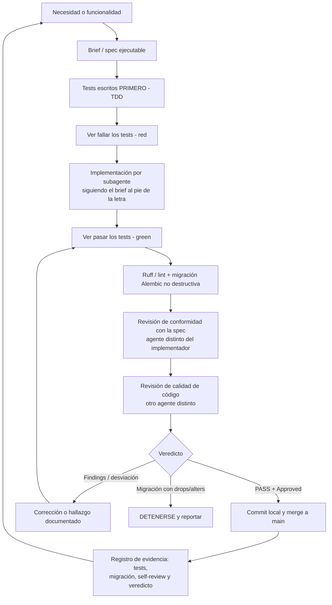

# Flujo de trabajo con IA (previsto) — Chispa

> Uso previsto de IA · Entrega 1 (documental) · Máster LIDR–AI4Devs
> Este documento describe **cómo se construirá Chispa con IA de forma estructurada y
> responsable**, antes de escribir código. Es un plan de método, no una bitácora de lo ya
> ejecutado: define el flujo que se seguirá, los agentes que se emplearán y los mecanismos
> con los que se validarán las salidas de la IA.

## 1. Resumen

Chispa **no se desarrollará** pidiéndole código a un chat y pegándolo. Se desarrollará con un
método **SDD (Spec/Subagent-Driven Development)** apoyado en el conjunto de skills
**"superpowers"** dentro de Claude Code. El proyecto se descompondrá en **tareas pequeñas y
verificables**, y cada una seguirá el mismo ciclo de tres fases:

**brief (spec ejecutable) → implementación (TDD) → revisión en dos capas**

La idea rectora es que **el criterio de aceptación (los tests) se escriba antes que el
código** y que **quien revisa no sea quien implementa**. Así, ninguna tarea se integrará a
`main` sin superar su spec y una revisión de calidad independiente.

## 2. El ciclo previsto de una tarea

Cada tarea seguirá este ciclo:

### 2.1. Brief = especificación ejecutable escrita ANTES de codear

Un brief no será un prompt libre; será una **spec que se puede ejecutar**. Contendrá:

- La lista **exacta** de archivos a crear y a modificar.
- El **código concreto** que debe producirse (no "algo parecido").
- Los **tests embebidos escritos primero (TDD)**.
- Pasos explícitos de **"ver fallar → ver pasar"** (red → green).
- El **comando de commit local** (sin `git push`; la integración será deliberada, no
  automática).

El patrón completo del brief se detalla, con una plantilla ilustrativa, en
[`prompts.md`](prompts.md).

### 2.2. Implementación = ejecutar el brief con disciplina

Un subagente ejecutará el brief **al pie de la letra**: escribirá primero el test, lo verá
fallar, implementará, lo verá pasar, pasará `ruff`/lint y, si la tarea toca la base de datos,
generará una **migración Alembic no destructiva**. Regla dura prevista: si la migración
autogenerada trae `drop`/`alter` sobre tablas existentes, el agente **se detendrá y
reportará** en vez de aplicarla. Cada migración se inspeccionará línea a línea, aceptando solo
operaciones aditivas (`add_column` / `create_table`).

### 2.3. Registro de evidencia + revisión en dos capas

Al terminar cada tarea se dejará constancia de:

- El **commit** y su asunto.
- El **resumen de tests** (nuevos y de regresión), que deberán quedar en verde.
- Las **líneas `op.*` de la migración** y su veredicto de seguridad.
- Un **self-review checklist**.
- El bloque de **revisión en dos capas por agentes distintos del implementador**:
  conformidad con la spec y calidad del código.

El detalle de los roles de estos agentes está en [`agentes.md`](agentes.md). Las decisiones
tomadas sobre las salidas de la IA se registrarán en formato AI-LOG en
[`decisiones.md`](decisiones.md).

## 3. Cronología prevista (planes secuenciales)

El desarrollo avanzará en planes encadenados, siempre con el mismo ciclo. El desglose
previsto por bloques funcionales es:

1. **Onboarding** (i18n, UX): scaffold frontend, auth, rutas, PIN.
2. **Núcleo** (backend + frontend): lecciones + grafo de conocimiento.
3. **IA multiproveedor + Docker**: proveedor de IA configurable por familia, cifrado de
   claves, dockerización.
4. **Cuentos**, **avatares**, **lecciones ricas + chat** (con buscador), **infra LAN +
   imágenes** (QR) y **contraseña/recuperación**.

Además de la suite automática, se prevén **hitos de validación funcional real** contra un
proveedor de IA vivo (una lección real generada, una imagen real de extremo a extremo), para
comprobar que la integración funciona más allá de los mocks.

## 4. Relación con el flujo recomendado por la guía (§6)

La guía académica (§6) recomienda el flujo
**PRD → OpenSpec → BDD → TDD → implementación → review → evidencias**. Chispa lo respetará en
su esencia, con una decisión explícita:

| Fase de la guía (§6) | Cómo se materializará en Chispa |
|---|---|
| PRD y alcance del MVP | Documentación de producto de la Entrega 1 |
| Propuesta de cambio (OpenSpec) | **Brief SDD** ejecutable por tarea (spec + tests + código) |
| BDD / criterios de aceptación | Tests embebidos en el brief, escritos **antes** de codear |
| Plan de pruebas TDD | Ciclo "ver fallar → ver pasar" obligatorio en cada tarea |
| Implementación asistida por IA | Subagente ejecutor que sigue el brief literalmente |
| Revisión de código y seguridad | **Doble revisión** (conformidad + calidad) por agentes distintos |
| Pruebas y validación funcional | Suite completa verde + pruebas reales con proveedor de IA/imagen |
| Evidencias y bitácora | Registro por tarea + serie AI-LOG en [`decisiones.md`](decisiones.md) |

**Decisión de framework: SDD con "superpowers", en lugar de OpenSpec.** Se elegirá SDD
porque:

- El **brief ya es la propuesta de cambio**: lista de archivos + código concreto + tests. No
  hará falta una segunda capa formal (OpenSpec) sobre la misma información.
- El ciclo brief→implementación→revisión encaja de forma natural con el modelo de
  **subagentes** de Claude Code, permitiendo que un agente distinto del que implementa haga
  la revisión (lo que la guía §7 llama "pedir una crítica separada a otro agente").
- Los **tests-primero** cumplirán el rol de BDD/criterios de aceptación de forma objetiva y
  ejecutable, evitando specs que no se puedan probar.

## 5. Cómo se VALIDARÁN las salidas de la IA (no aceptación ciega)

Este es el punto que la guía §7 considera crítico: *no aceptar automáticamente la salida de
la IA*. En Chispa la validación será multicapa y dejará rastro:

1. **Tests escritos primero (TDD).** El criterio de aceptación existirá *antes* que el
   código. Si el código de la IA no pasa el test ya escrito, no se aceptará.
2. **Revisión en dos capas por agentes distintos del implementador.** Cada tarea recibirá un
   veredicto de **conformidad con la spec** y otro de **calidad de código**.
3. **`ruff` / lint** limpio como puerta de calidad.
4. **Migraciones no destructivas** verificadas línea a línea; drops/alters ⇒ parada.
5. **Pruebas funcionales reales** contra un proveedor de IA vivo, no solo mocks.
6. **Checklist de la guía §7** aplicada de forma sistemática: ¿resuelve el problema real?,
   ¿respeta el alcance del MVP?, ¿incluye casos alternativos y de error?, ¿se puede probar?,
   ¿introduce complejidad innecesaria?, ¿presenta riesgos de seguridad/privacidad?

### Checklist §7 de la guía (calidad de las salidas de IA) → cómo se comprobará

| Pregunta de la guía §7 | Cómo se comprobará en Chispa |
|---|---|
| ¿Resuelve el problema real definido? | Cada brief partirá de la historia/valor; se hará validación funcional con proveedor real |
| ¿Respeta el alcance del MVP? | El brief fijará archivos y contrato antes de codear, para evitar *scope creep* |
| ¿Es coherente con las demás especificaciones? | Revisión de conformidad con la spec por un agente distinto del implementador |
| ¿Incluye casos alternativos y de error? | Se escribirán primero tests de error (401/404/422, moderación, degradación) — ver [casos-aceptacion.md](../03-testing/casos-aceptacion.md) |
| ¿Se puede probar? | TDD: el test existirá antes que el código — ver [estrategia-pruebas.md](../03-testing/estrategia-pruebas.md) |
| ¿Tiene criterios de aceptación objetivos? | Gherkin trazado a tests reales — ver [historias-usuario.md](../01-product/historias-usuario.md) |
| ¿Introduce complejidad innecesaria? | Segunda capa de revisión enfocada en calidad de código |
| ¿Presenta riesgos de seguridad o privacidad? | Revisión de seguridad + moderación + cifrado + aislamiento — ver [seguridad.md](../02-technical-design/seguridad.md) |
| ¿Existe evidencia que respalde la decisión? | Cada tarea dejará commit + tests + registro de revisión |

El registro de **hallazgos → corrección → decisión justificada** (que es la prueba de un uso
responsable) se irá recogiendo como serie de entradas AI-LOG en
[`decisiones.md`](decisiones.md) durante las Entregas 2 y 3.

## 6. Herramientas y modelos que se utilizarán

- **Claude Code** con el conjunto de skills **"superpowers"**: `brainstorming`,
  `writing-plans`, `subagent-driven-development`, `test-driven-development`,
  `requesting-code-review`, `systematic-debugging`, entre otras (ver
  [`prompts.md`](prompts.md)).
- **Proveedor de IA en runtime configurable** por cada familia (se prevé activar Claude y
  Ollama; dejar preparados OpenAI-compat y Gemini) con **fallback seguro** a un stub
  determinista.
- El propio producto **integrará la IA tras "costuras" (seams)**: la generación de lecciones
  e imágenes vivirá detrás de una interfaz, de modo que si el proveedor falla o no está
  configurado, el sistema degradará con elegancia y el niño nunca verá un error del proveedor.
