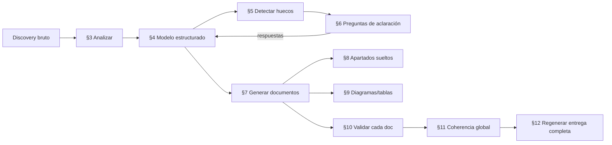

# Playbook de prompts: de un *discovery* a la Entrega 1 — Chispa

> Uso previsto de IA · Entrega 1 · Máster LIDR–AI4Devs
> Este documento es el **playbook de prompts** que permite reproducir, **paso a paso** y a partir de una
> **única conversación de discovery**, todos los documentos de `docs/entrega-1/` con **la misma estructura,
> apartados, nivel de detalle, formato (tablas, Mermaid, Gherkin, bloques técnicos) y trazabilidad**.
>
> Cada prompt está listo para pegarse a un agente de IA sin explicaciones externas. La sección §2.4 conserva
> además el **patrón de *brief* ejecutable** y las **skills "superpowers"** con las que se dirigirá la IA
> durante la construcción del producto (Entrega 2+), que es el otro sentido de "prompt" en esta bitácora.

---

## 1. Contexto general y objetivo

**Objetivo del playbook.** Convertir una **conversación de discovery** (reunión larga de descubrimiento de
producto y diseño técnico) en la **Entrega 1 completa**: 23 documentos + 7 ADRs, con estructura y profundidad
equivalentes a los actuales. El criterio de éxito es que una persona pueda pegar un discovery nuevo, seguir los
prompts de §3 a §12 en orden y obtener una entrega con la misma forma que esta.

**Qué NO hace este playbook.** No inventa producto ni tecnología: todo sale del discovery. Cuando falte un dato,
el prompt **lo marca** y **genera preguntas** (§5–§6) en vez de rellenar con supuestos.

**Marco temporal (pre-implementación).** La Entrega 1 es **documental y previa al código**: se escribe en voz
**futura/propuesta** ("se probará", "previsto", "el backend nunca enviará…"), nunca como registro de algo ya
construido. Todos los prompts heredan esta disciplina.

**Mapa de lo que se genera** (destino de cada prompt de §7):

| Carpeta | Documentos | Prompt |
|---|---|---|
| raíz | `README.md`, `00-resumen-proyecto.md` | P-README, P-RESUMEN |
| `01-product/` | `problema-y-usuarios`, `prd`, `alcance`, `historias-usuario`, `requisitos` | P-PROB, P-PRD, P-ALC, P-HU, P-REQ |
| `02-technical-design/` | `arquitectura`, `modelo-datos`, `contratos-api`, `seguridad`, `decisiones-tecnologicas` | P-ARQ, P-DATOS, P-API, P-SEG, P-TEC |
| `02-technical-design/adr/` | `ADR-001` … `ADR-007` (7) | P-ADR (parametrizado por `{{ADR_N}}`) |
| `03-testing/` | `estrategia-pruebas`, `casos-aceptacion` | P-EST, P-CASOS |
| `04-delivery/` | `despliegue`, `demo` | P-DESP, P-DEMO |
| `05-ai-log/` | `flujo-trabajo-ia`, `agentes`, `decisiones`, `prompts` | P-FLUJO, P-AGENTES, P-DEC, P-PROMPTS |

**Pipeline del playbook (orden de uso):**



---

## 2. Instrucciones globales para todos los prompts

Estas reglas se aplican **a todos** los prompts de §3–§12. Cuando un prompt diga "respeta las instrucciones
globales", se refiere a esta sección.

### 2.1 Variables canónicas

Los prompts usan variables entre `{{ }}`. Quien ejecute el playbook las sustituye por su contenido real:

| Variable | Contenido |
|---|---|
| `{{DISCOVERY_COMPLETO}}` | Transcripción íntegra de la conversación de discovery (texto bruto). |
| `{{CONTEXTO_PROYECTO}}` | Ficha corta del proyecto: nombre, alumno, máster, repositorio, fecha de entrega, una frase de producto. |
| `{{INFORMACION_ESTRUCTURADA}}` | El modelo estructurado del discovery producido en §4 (JSON/YAML). Fuente de verdad para §5–§12. |
| `{{RESPUESTAS_ADICIONALES}}` | Respuestas a las preguntas de aclaración de §6, en el mismo formato que `{{INFORMACION_ESTRUCTURADA}}` (se fusionan con ella). |
| `{{DOCUMENTO_REFERENCIA}}` | Contenido (o esqueleto) del documento actual que sirve de patrón a imitar. |
| `{{ID_DOCUMENTO}}` | Identificador corto del documento objetivo (p. ej. `prd`, `modelo-datos`, `casos-aceptacion`). |
| `{{APARTADO}}` | Título exacto de un apartado/subapartado concreto a (re)generar (p. ej. `3.4 lessons — Lesson`). |
| `{{ESQUEMA_APARTADO}}` | Esqueleto esperado de ese apartado: subtítulos, columnas de tabla, tipo de diagrama, longitud. |
| `{{ADR_N}}` | Número y tema del ADR a generar (p. ej. `002 — JWT tipado familia/niño`). |
| `{{ENTREGA_GENERADA}}` | El conjunto de documentos ya generados, para las pasadas de validación §10–§11. |

> Regla de sustitución: si una variable requerida llega **vacía**, el prompt **no continúa**: emite
> `⟦FALTA: <variable> — no puedo generar sin esto⟧` y (si aplica) las preguntas de §6.

### 2.2 Reglas de estilo y formato compartidas

Todo documento generado debe cumplir el **esqueleto común** de la entrega:

1. **Idioma:** español (España). Tono claro, técnico y sobrio.
2. **Encabezado:** `# <Título> — Chispa` (o el H1 exacto de la referencia) seguido de un **blockquote de
   metadatos** de 2–3 líneas (`> Entrega 1 · … · Máster LIDR–AI4Devs`) y, en `01-product/`, una línea
   `> **Documentos relacionados:** …` con enlaces relativos.
3. **Secciones:** `## 1.`, `## 2.`, … numeradas; subapartados `### x.y`; en historias, `#### Bloque N`.
   Separadores `---` entre secciones mayores cuando la referencia los use.
4. **Voz pre-implementación:** futuro/propuesta ("se implementará", "previsto", "nunca enviará"). **Prohibido**
   el "as-built" (no "hemos implementado", "el test pasa", "ya funciona").
5. **Tablas:** respetar **exactamente** las cabeceras de columna de la referencia (ver §8 checklist maestro y §9).
6. **Diagramas Mermaid:** solo donde la referencia los tiene (arquitectura, modelo-datos, estrategia-pruebas,
   despliegue, flujo-trabajo-ia). Tipos permitidos: `erDiagram`, `sequenceDiagram`, `flowchart TB/LR`, `graph TD`.
7. **Gherkin:** bloques ```gherkin solo en `historias-usuario.md` (Bloque 4) y `casos-aceptacion.md`. En
   `requisitos.md` los criterios GWT van **inline** en la celda de tabla con **Given/When/Then** en negrita
   separados por `<br>` (no fenced).
8. **Bloques de código:** `python` solo en `contratos-api.md` (§8) y `prompts.md` (plantilla de brief); `bash`
   solo en `estrategia-pruebas.md` y `despliegue.md`.
9. **Gramática de IDs** (reutilizable con cualquier proyecto, adaptando los nombres de módulo):
   - Historias `US1…USN`; épicas `E1…EN`. Si dos historias se fusionan, notación `US5/US6`.
   - Requisitos funcionales `RF-<MOD>-NN` (módulos del proyecto, p. ej. ONB/APR/CON/CUE/IA/PLT/SEG en Chispa).
   - Requisitos no funcionales `RNF-01…NN`; objetivos `O1…ON`; opcionales `OPT-01…`; bitácora `AI-LOG-00X`.
   - ADRs `ADR-00N`. Referencias a la guía académica con `§`.
10. **Enlaces:** siempre relativos entre documentos de la entrega; nunca rutas absolutas del disco.

### 2.3 Disciplina de trazabilidad discovery → apartado

- **No inventar.** Cada afirmación de un documento debe poder rastrearse a `{{INFORMACION_ESTRUCTURADA}}` /
  `{{RESPUESTAS_ADICIONALES}}`. Si un apartado exige un dato que no está, insertar en su lugar el marcador
  `⟦FALTA: <qué dato> · pregunta: <pregunta concreta>⟧` y continuar el resto del documento.
- **No agrupar ni omitir apartados.** Si la referencia separa dos subapartados, el resultado los mantiene
  separados aunque el contenido sea breve.
- **Coherencia de dominio.** Respetar el modelo de datos del discovery (en Chispa: **7 entidades** —
  `families, users, children, lessons, knowledge_nodes, stories, family_ai_config`). No introducir entidades o
  conceptos que no estén en `{{INFORMACION_ESTRUCTURADA}}`.

### 2.4 (Conservado) El patrón de *brief* ejecutable y las skills "superpowers"

> Este subapartado conserva el contenido original de `prompts.md`: describe **cómo se dirigirá a la IA durante
> la construcción del producto** (el "prompt" de cada tarea de código será un *brief*). Es distinto de los
> prompts de generación documental de §3–§12, y sigue siendo la fuente de las referencias que apuntan aquí
> desde [`flujo-trabajo-ia.md`](flujo-trabajo-ia.md) y [`agentes.md`](agentes.md).

**El prompt en Chispa no será texto libre: será un *brief* ejecutable.** La guía §5.6 señala que "la antigua
idea de limitarse a un archivo `prompts.md` está evolucionando hacia una documentación más completa del flujo
de trabajo". En Chispa el "prompt" de cada tarea será un **brief**: una especificación tan detallada que un
subagente pueda ejecutarla sin ambigüedad. Su anatomía prevista (7 partes) es siempre la misma:

1. **Encabezado con reglas duras** — rama, intérprete/venv, "sin deps nuevas", "sin push", "usa el código
   EXACTO", "TDD".
2. **Archivos** — qué crear y qué modificar, con ruta completa.
3. **Tests primero** — el/los test(s) escritos **antes** que la implementación.
4. **Ver fallar (red)** — comando de test que debe fallar.
5. **Código exacto** — la implementación literal a producir.
6. **Ver pasar (green)** — el mismo comando de test, ahora en verde.
7. **Commit local** — el mensaje de commit exacto, sin `git push`.

**Plantilla ilustrativa de un brief** (ejemplo, no un brief ya ejecutado; ilustra el núcleo: interfaz del
generador de lecciones + stub determinista + moderación):

> **Encabezado (reglas duras):** "Usa el código EXACTO. TDD. Backend `backend/`, venv
> `./.venv/Scripts/python.exe`. Rama `feature-<bloque>`. SIN deps nuevas. SIN push."
>
> **Files:** crear `app/services/lesson_generator.py`, `app/services/moderation.py`; tests
> `tests/test_lesson_generator.py`, `tests/test_moderation.py`.
>
> **Step 1 — Test primero:**
> ```python
> def test_stub_is_deterministic_and_well_formed():
>     gen = StubLessonGenerator()
>     a = gen.generate("¿por qué llueve?", age=7, subject=None)
>     b = gen.generate("¿por qué llueve?", age=7, subject=None)
>     assert a.subject == b.subject
>     assert len(a.quiz_options) == 3
>     assert 0 <= a.quiz_correct_index < 3
> ```
>
> **Step 2 — Ver fallar:** `pytest tests/test_lesson_generator.py -v` → FAIL.
> **Step 3 — Código exacto:** definir `GeneratedLesson` (dataclass), el `Protocol` `LessonGenerator` y
> `StubLessonGenerator` como **costura** hacia un adaptador LLM real.
> **Step 4 — Ver pasar:** el mismo comando → PASS.
> **Steps 5–7:** test y código de `moderation.py` (blocklist mínima que lanza `ModerationError`).
> **Step 8 — Commit local (sin push):**
> `git commit -m "feat(backend): LessonGenerator interface + deterministic stub + moderation stub"`

Lo importante para el uso de IA: **el criterio de aceptación (los tests) se escribirá antes que el código**, y
la interfaz se diseñará como *seam* para poder enchufar IA real después sin reescribir el núcleo.

**Skills "superpowers" que se emplearán** (cada una cubre una fase del ciclo brief→implementación→revisión):

| Skill | Para qué se usará en Chispa |
|---|---|
| `brainstorming` | Explorar intención y requisitos **antes** de escribir un plan |
| `writing-plans` | Convertir un requisito multi-paso en un plan de tareas antes de tocar código |
| `subagent-driven-development` | Ejecutar el plan tarea a tarea con subagentes independientes en la sesión |
| `test-driven-development` | Escribir el test primero, verlo fallar y luego implementar (núcleo de cada brief) |
| `requesting-code-review` | Pedir la revisión en dos capas (conformidad + calidad) por un agente distinto del implementador |
| `receiving-code-review` | Procesar los hallazgos de la revisión y decidir corrección vs. hallazgo abierto |
| `systematic-debugging` | Aislar la causa raíz de fallos antes de parchear |
| `verification-before-completion` | Verificar suite verde + lint limpio + migración segura antes de dar por hecha una tarea |
| `finishing-a-development-branch` | Decidir cómo integrar el trabajo terminado (merge a `main`) |

### 2.5 Regla de honestidad de esta bitácora

- **No se transcribirán prompts que no se puedan verificar** en el repositorio. Cuando se cite un brief real (a
  partir de la Entrega 2), se citará de su fuente y se enlazará su ruta.
- Los briefs contendrán **código concreto**, por lo que reproducirán fielmente lo que se pida a la IA; no habrá
  reconstrucción "de memoria".
- El resultado de cada prompt/brief (tests que pasan, commit, hallazgos) quedará registrado en su entrada de la
  bitácora [`decisiones.md`](decisiones.md).
- Los prompts de generación documental de §3–§12 son **reutilizables** con cualquier discovery: no llevan datos
  de Chispa cableados; el producto entra siempre por `{{CONTEXTO_PROYECTO}}` y `{{INFORMACION_ESTRUCTURADA}}`.

> **Convención de este playbook:** el texto reutilizable de cada prompt va dentro de un bloque delimitado por
> `~~~` (para poder contener, sin romperse, bloques internos de ```` ``` ````). Copia el interior del bloque
> `~~~prompt … ~~~`, sustituye las `{{VARIABLES}}` y pégalo al agente.

---

## 3. Prompt para analizar la conversación de discovery

**Nombre:** P-ANALISIS — Análisis y normalización del discovery.

**Objetivo:** leer la conversación bruta y producir un **acta de discovery** normalizada: hechos, decisiones,
actores, temas y citas, sin interpretar de más ni descartar detalle técnico.

**Cuándo utilizarlo:** primer paso, una vez por entrega, sobre la transcripción completa.

**Entradas necesarias:** `{{DISCOVERY_COMPLETO}}`, `{{CONTEXTO_PROYECTO}}`.

**Prompt completo:**

~~~prompt
Eres analista de producto y arquitecto de software. Vas a leer la transcripción íntegra de una
conversación de discovery y producir un ACTA NORMALIZADA que servirá para redactar la documentación
de diseño (producto + técnico) de un proyecto, ANTES de escribir código.

CONTEXTO DEL PROYECTO:
{{CONTEXTO_PROYECTO}}

TRANSCRIPCIÓN DEL DISCOVERY:
{{DISCOVERY_COMPLETO}}

TAREA. Extrae y organiza SOLO lo que aparece en la transcripción (no inventes). Devuelve un acta con
estas secciones, cada afirmación acompañada de una cita textual breve o marca de tiempo si existe:

1. PROBLEMA Y CONTEXTO: dolor, a quién afecta, por qué ahora.
2. USUARIOS Y ACTORES: cada actor, su rol, autenticación mencionada, motivaciones y frustraciones.
3. PROPUESTA DE VALOR Y PRINCIPIOS: promesa, líneas rojas ("lo que NO debe ser"), principios innegociables.
4. ALCANCE: qué entra en el MVP, qué queda en el límite, qué queda fuera/futuro.
5. FUNCIONALIDAD: flujos y capacidades descritas (agrupa por área funcional/épica si se deduce).
6. MODELO DE DATOS: entidades, campos, relaciones, estados/enums mencionados.
7. DISEÑO TÉCNICO: stack, capas, integraciones externas, patrones (costuras/seams, fallback…).
8. SEGURIDAD Y PRIVACIDAD: amenazas, controles, datos sensibles, aislamiento.
9. IA EN EL PRODUCTO: proveedores, modelos, configuración, degradación.
10. DESPLIEGUE Y OPERACIÓN: topología, variables de entorno, entornos.
11. PRUEBAS Y CALIDAD: riesgos a proteger, tipos de prueba, criterios de aceptación citados.
12. IA EN EL PROCESO: método de trabajo, agentes/roles, herramientas.
13. DECISIONES TOMADAS vs ABIERTAS: lista explícita de decisiones cerradas y de temas sin cerrar.
14. TERMINOLOGÍA: glosario producto↔dominio (metáforas y su equivalente técnico).

REGLAS:
- No interpretes ni "mejores" el producto: refleja lo dicho.
- Si algo se menciona de forma ambigua o contradictoria, anótalo en una lista "AMBIGÜEDADES".
- Conserva números, nombres propios de entidades, endpoints y tecnologías tal cual se dijeron.
- Idioma de salida: español.
~~~

**Formato esperado de salida:** documento estructurado en las 14 secciones + listas "AMBIGÜEDADES" y
"DECISIONES ABIERTAS". Markdown con viñetas y citas; sin prosa de relleno.

**Criterios de validación:** cada sección existe (aunque sea "sin datos"); toda afirmación tiene respaldo en la
transcripción; hay una lista explícita de ambigüedades y de decisiones abiertas.

**Dependencias con otros prompts:** ninguna aguas arriba. Alimenta a **P-MODELO (§4)**.

**Errores/situaciones a detectar:** transcripción vacía o truncada (`⟦FALTA: {{DISCOVERY_COMPLETO}}⟧`);
afirmaciones sin respaldo (marcarlas); mezcla de decisiones cerradas con deseos no confirmados.

---

## 4. Prompt para generar un modelo estructurado del discovery

**Nombre:** P-MODELO — Modelo estructurado (`{{INFORMACION_ESTRUCTURADA}}`).

**Objetivo:** convertir el acta de §3 en un **objeto de datos** consultable (JSON/YAML) que sea la **única
fuente de verdad** para generar los documentos. Debe cubrir todos los "discovery inputs" que exige cada doc.

**Cuándo utilizarlo:** tras P-ANALISIS, y de nuevo tras integrar `{{RESPUESTAS_ADICIONALES}}` (§6).

**Entradas necesarias:** acta de P-ANALISIS; `{{CONTEXTO_PROYECTO}}`; opcional `{{RESPUESTAS_ADICIONALES}}`.

**Prompt completo:**

~~~prompt
Convierte el ACTA DE DISCOVERY en un MODELO ESTRUCTURADO en YAML que servirá de única fuente de verdad
para redactar la documentación de la Entrega 1. Rellena solo con datos presentes en el acta o en las
respuestas adicionales; para cualquier campo sin dato usa el valor null y añádelo a la lista `_faltantes`.

ACTA DE DISCOVERY:
<pega aquí la salida de P-ANALISIS>

RESPUESTAS ADICIONALES (si las hay):
{{RESPUESTAS_ADICIONALES}}

Devuelve EXCLUSIVAMENTE un YAML con esta forma (añade elementos a las listas según haga falta, pero no
elimines claves; usa null donde no haya dato):

identificacion: { proyecto, alumno, correo, master, repositorio, fecha_entrega, modalidad, frase_producto }
problema: { dolor, barreras: [], impacto: [], por_que_ahora: [] }
usuarios:
  actores: [ { id, nombre_rol, autenticacion, tipo_sesion, puede: [], motivaciones: [], frustraciones: [], accesibilidad } ]
  vocabulario: [ { termino_producto, concepto_tecnico } ]
propuesta_valor: { concepto, lineas_rojas: [], metafora: { nombre, elementos: [] }, norte }
principios: [ { n, nombre, descripcion } ]        # innegociables
objetivos: [ { id: O1, objetivo, como_se_materializa } ]
epicas: [ { id: E1, nombre, historias: [US1], descripcion } ]
historias:
  - id: US1
    titulo_tag: "[Modulo] ..."
    rol: { como, quiero, para }
    beneficiario, solicitante, validador_uat
    prioridad
    principios_aplicables: []
    rf_relacionados: []
    alcance: { dentro: [], fuera: [] }
    reglas_negocio: []
    datos_campos: [ { campo, origen, sistema_maestro, notas } ]
    escenarios_gwt: [ { nombre, given: [], when: [], then: [], tipo: feliz|borde|error } ]
    dependencias: { fe: [], be: [], data: [], ux: [] }
    pantallas: []
    endpoints: []
    pruebas: []
requisitos_funcionales:
  - id: RF-MOD-01
    modulo, nombre, hu_origen, descripcion, entradas, salidas
    criterios_gwt: [ { given, when, then } ]
    reglas_negocio: [], prioridad, dependencias: [], riesgos: []
    pantalla, endpoint, prueba_funcional
requisitos_no_funcionales:
  - id: RNF-01
    categoria, descripcion, criterio_verificacion, prioridad, relacionados: [], riesgos_mitigacion
modelo_datos:
  entidades: [ { tabla, clase, campos: [ { nombre, tipo, nulo, por_defecto, notas } ], relaciones: [], enums: [] } ]
  migraciones: [ { n, paso, cambio_principal } ]
arquitectura:
  stack_backend: [], stack_frontend: [], capas: [], seams: [ { nombre, puerto, adaptadores: [], fallback } ]
  secuencias: [ { nombre, pasos: [] } ], despliegue: { servicios: [], puertos: [] }
api:
  convenciones: {}, endpoints: [ { metodo, ruta, auth, request, response, codigos: [], notas } ]
  esquemas_clave: [ { nombre, campos: [] } ], regla_secreto_quiz
seguridad:
  activos: [ { activo, sensibilidad, por_que } ], actores_amenaza: [ { actor, intencion, capacidad } ]
  superficies: [], controles_owasp: [ { categoria, control, componente } ]
  privacidad_menor: [ { principio, como } ], matriz_amenazas: [ { n, amenaza, control, componente } ]
  riesgos_residuales: [ { riesgo, impacto, mejora } ]
decisiones_tecnologicas: { backend: [ { tecnologia, version, por_que } ], frontend: [], datos_despliegue: [], principios: [] }
adrs: [ { n, titulo, contexto, decision, alternativas: [], consecuencias: [], componentes: [] } ]
pruebas:
  riesgos: [ { riesgo, por_que, donde } ], tipos: [], areas_backend: [], areas_frontend: []
  degradacion: [ { escenario, comportamiento, prueba } ], ci: [ { job, entorno, pasos: [] } ], comandos_locales: []
despliegue:
  topologia: [], variables_entorno: [ { variable, por_defecto, proposito, obligatoria_prod } ]
  modelos_despliegue: [], migraciones_estrategia, hardening: [], ci_cd: []
demo: { preparacion: [], guion: [ { paso, pantalla, accion, resultado } ], evidencias: [] }
proceso_ia:
  metodo, ciclo_tarea: [], roles_producto: [], roles_documentacion: [], skills: []
  validacion_salidas: [ { pregunta_guia, como_se_comprueba } ], ai_log_temas: []
_faltantes: [ "camino.a.campo — por qué falta" ]

REGLAS: no inventes; usa null + `_faltantes`; conserva IDs y nombres tal cual; salida solo el YAML.
~~~

**Formato esperado de salida:** un único bloque YAML válido con todas las claves; lista `_faltantes` poblada.

**Criterios de validación:** YAML parseable; todas las claves de nivel superior presentes; cada `null` tiene su
entrada en `_faltantes`; IDs conformes a la gramática de §2.2.

**Dependencias con otros prompts:** consume P-ANALISIS (§3); es entrada de **todos** los prompts de §5–§12.

**Errores/situaciones a detectar:** claves inventadas fuera del esquema; IDs mal formados; entidades ausentes;
listas obligatorias vacías sin marca en `_faltantes`.

---

## 5. Prompts para detectar información faltante

**Nombre:** P-HUECOS — Detección de información incompleta, ambigua o contradictoria.

**Objetivo:** contrastar `{{INFORMACION_ESTRUCTURADA}}` contra **lo que cada documento exige** y devolver un
informe de huecos accionable, priorizado y trazado al documento afectado.

**Cuándo utilizarlo:** tras P-MODELO y antes de generar documentos; repetir tras integrar respuestas.

**Entradas necesarias:** `{{INFORMACION_ESTRUCTURADA}}`; el checklist maestro de apartados (§8).

**Prompt completo:**

~~~prompt
Actúa como revisor de completitud. Tienes el MODELO ESTRUCTURADO del discovery y la lista de documentos a
generar con sus apartados. Detecta TODO lo que impide redactar cada documento con el detalle de referencia.

MODELO ESTRUCTURADO:
{{INFORMACION_ESTRUCTURADA}}

DOCUMENTOS Y APARTADOS EXIGIDOS (checklist maestro):
<pega aquí la tabla del §8 "Checklist maestro de apartados por documento">

TAREA. Para cada documento, comprueba si el modelo tiene los datos que ese documento necesita (usa la
columna "Discovery necesario" del checklist). Clasifica cada problema como:
- FALTANTE: el dato no existe.
- AMBIGUO: existe pero admite varias lecturas.
- CONTRADICTORIO: dos partes del modelo se contradicen (cítalas).

Devuelve una tabla:
| # | Documento | Apartado | Tipo (FALTANTE/AMBIGUO/CONTRADICTORIO) | Qué falta o choca | Severidad (bloqueante/alta/media) | Campo del modelo afectado |

Luego una lista "BLOQUEANTES" con los que impiden por completo generar algún documento.
No propongas todavía preguntas: solo detecta. No inventes datos para tapar huecos.
~~~

**Formato esperado de salida:** tabla de huecos + lista de bloqueantes.

**Criterios de validación:** cada `_faltantes` del modelo aparece mapeado a ≥1 documento/apartado; se distingue
faltante vs ambiguo vs contradictorio; severidad asignada.

**Dependencias con otros prompts:** consume P-MODELO (§4) y el checklist de §8; alimenta a **P-PREGUNTAS (§6)**.

**Errores/situaciones a detectar:** huecos silenciados; contradicciones no citadas; confundir "opcional en la
referencia" con "faltante bloqueante".

---

## 6. Prompts para generar preguntas de aclaración

**Nombre:** P-PREGUNTAS — Preguntas concretas para cerrar huecos.

**Objetivo:** transformar el informe de huecos en un **cuestionario mínimo y concreto** para la persona experta,
agrupado por documento y ordenado por impacto, cuyas respuestas se integran como `{{RESPUESTAS_ADICIONALES}}`.

**Cuándo utilizarlo:** tras P-HUECOS, cuando existan FALTANTES/AMBIGUOS relevantes.

**Entradas necesarias:** informe de huecos (§5); `{{INFORMACION_ESTRUCTURADA}}`.

**Prompt completo:**

~~~prompt
A partir del INFORME DE HUECOS, redacta el cuestionario MÍNIMO necesario para poder completar la
documentación. No preguntes lo que ya está en el modelo. Agrupa por documento y ordena por severidad.

INFORME DE HUECOS:
<pega aquí la salida de P-HUECOS>

MODELO ESTRUCTURADO (para no repetir lo ya conocido):
{{INFORMACION_ESTRUCTURADA}}

Para cada pregunta:
- Formúlala de forma cerrada y accionable (que se pueda responder en 1-3 frases o con una opción).
- Cuando ayude, ofrece 2-4 opciones sugeridas basadas en el contexto (marca cuál parece más probable).
- Indica a qué campo del modelo (`camino.a.campo`) irá la respuesta.
- Agrupa: "BLOQUEANTES" primero, luego por documento.

Formato de salida:
### <Documento>
1. [campo.destino] <pregunta> — opciones: (a) … (b) … (c) …
...

Al final, incluye una PLANTILLA DE RESPUESTAS en YAML con los `camino.a.campo` a rellenar, para que la
respuesta se pueda fusionar directamente en el modelo estructurado como {{RESPUESTAS_ADICIONALES}}.
~~~

**Formato esperado de salida:** preguntas agrupadas (bloqueantes primero) + plantilla YAML de respuestas.

**Criterios de validación:** ninguna pregunta duplica dato ya presente; cada pregunta apunta a un
`camino.a.campo`; la plantilla YAML es fusionable con el modelo (mismas rutas que §4).

**Dependencias con otros prompts:** consume P-HUECOS (§5); su salida, una vez respondida, vuelve a **P-MODELO
(§4)** como `{{RESPUESTAS_ADICIONALES}}`.

**Errores/situaciones a detectar:** preguntas abiertas o retóricas; preguntar lo ya conocido; rutas de destino
que no existen en el esquema del modelo.

---

## 7. Prompts por cada documento de `entrega-1`

Hay **un prompt por documento** (23 documentos) más un **generador de ADR** parametrizado para los 7 ADRs.
Todos comparten la **plantilla base P-DOC (§7.0)**: cada entrada de documento aporta su **esquema/checklist de
apartados** (tomado del documento de referencia) y sus criterios propios; el cuerpo del prompt es P-DOC con ese
esquema inyectado. Así ningún apartado se agrupa ni se omite.

### 7.0 Plantilla base — P-DOC (común a todos los documentos)

**Nombre:** P-DOC — Generar un documento de la entrega a partir del modelo estructurado.

**Objetivo:** redactar un documento completo respetando su estructura de referencia, su formato y la voz
pre-implementación.

**Cuándo utilizarlo:** siempre como base; se especializa con el bloque **ESQUEMA** de cada §7.x.

**Entradas necesarias:** `{{INFORMACION_ESTRUCTURADA}}` (+`{{RESPUESTAS_ADICIONALES}}`), `{{CONTEXTO_PROYECTO}}`,
`{{ID_DOCUMENTO}}`, y el **ESQUEMA** del documento (su árbol de apartados + elementos de formato).

**Prompt completo (base):**

~~~prompt
Eres redactor técnico. Redacta el documento "{{ID_DOCUMENTO}}" de la Entrega 1 (documental, PREVIA a la
implementación) usando EXCLUSIVAMENTE los datos del MODELO ESTRUCTURADO. No inventes; para huecos usa el
marcador ⟦FALTA: … · pregunta: …⟧ y sigue con el resto.

CONTEXTO DEL PROYECTO:
{{CONTEXTO_PROYECTO}}

MODELO ESTRUCTURADO (fuente de verdad):
{{INFORMACION_ESTRUCTURADA}}
{{RESPUESTAS_ADICIONALES}}

ESQUEMA OBLIGATORIO DEL DOCUMENTO (respeta TODOS los apartados, en este orden; no agrupes ni elimines
ninguno; usa las cabeceras de tabla y los tipos de diagrama indicados):
{{ESQUEMA_APARTADO}}

REGLAS DE FORMATO (instrucciones globales §2.2):
- Encabezado: H1 exacto del esquema + blockquote de metadatos (Entrega 1 · … · Máster LIDR–AI4Devs) y, en
  01-product, la línea "> **Documentos relacionados:** …" con enlaces relativos.
- Secciones numeradas como en el esquema; subapartados y sub-subapartados respetados.
- Voz futura/propuesta (se probará, previsto, nunca enviará). Prohibido el "as-built".
- Tablas con las cabeceras EXACTAS del esquema. Diagramas Mermaid solo donde el esquema los pide.
- Español. Enlaces relativos. IDs conforme a la gramática (US/E/RF/RNF/O/OPT/ADR/AI-LOG).

SALIDA: solo el contenido Markdown del documento, listo para guardar en su ruta.
~~~

**Formato esperado de salida:** Markdown del documento completo.

**Criterios de validación:** aparecen **todos** los apartados del ESQUEMA en orden; cabeceras de tabla exactas;
diagramas donde toca; voz futura; sin datos inventados (huecos marcados).

**Dependencias con otros prompts:** consume §4 (y §6); se valida con §10; participa en §11 y §12.

**Errores/situaciones a detectar:** apartados omitidos o reordenados; tablas con columnas cambiadas; lenguaje
"as-built"; entidades/endpoints ajenos al modelo.

> En cada §7.x siguiente, "Prompt completo" = **P-DOC con el ESQUEMA de abajo**. Solo se detallan los campos que
> cambian respecto a la base.

---

### 7.1 P-PROB — `01-product/problema-y-usuarios.md`

**Objetivo:** definir problema, impacto, propuesta de valor, actores/usuarios y principios transversales.
**Entradas:** `problema`, `usuarios`, `propuesta_valor`, `objetivos`, `principios` del modelo.
**ESQUEMA:**

~~~esquema
# Chispa ✨ — Entrega 1 · Producto        (H1 + blockquote metadatos + "> Documentos relacionados")
## 1. Resumen ejecutivo
## 2. El problema
### Impacto del problema          (tabla: Consecuencia | Descripción)
### Por qué ahora
## 3. Propuesta de valor           (blockquote con el enunciado de valor)
### Concepto: un espacio personal de descubrimiento
### Línea roja de producto (lo que Chispa no debe ser)
### Metáfora de producto: "Archipiélago"
## 4. Usuarios y actores
### 4.1 Familia / Adulto ("tripulación")
### 4.2 Explorador / Niño
### 4.3 Actor de soporte: Operador / Autoalojador
### 4.4 Usuario futuro (fuera de alcance inicial): docente / aula
### 4.5 Mapa de vocabulario (diseño ↔ dominio)   (tabla: Término de producto/diseño | Concepto técnico)
## 5. Escenarios de uso (historias de contexto)
## 6. Objetivos del producto        (tabla: # | Objetivo | Cómo se materializa; IDs O1–O4)
## 7. Principio transversal: degradación elegante
## 8. Norte del proyecto            (blockquote con la frase norte)
~~~

**Validación específica:** O1–On presentes con "cómo se materializa"; línea roja y norte citados del modelo.
**Errores a detectar:** convertir la metáfora en literal; omitir el actor futuro (docente) o el de soporte.

---

### 7.2 P-PRD — `01-product/prd.md`

**Objetivo:** documentar visión, principios, actores/sesiones, épicas, y **resúmenes** de RF/RNF con enlace a
`requisitos.md` (el detalle vive allí).
**Entradas:** `propuesta_valor`, `principios`, `usuarios.actores`, `epicas`, resúmenes de
`requisitos_funcionales`/`requisitos_no_funcionales`.
**ESQUEMA:**

~~~esquema
# Chispa ✨ — Entrega 1 · Producto
## 1. Visión del producto            (2 blockquotes de visión)
### 1.1 Promesa diferencial: tres mundos que se necesitan   (tabla: Mundo | Qué aporta | Riesgo si va solo | Cómo lo resuelve Chispa)
### 1.2 Principios de producto no negociables               (lista numerada 1–8)
### 1.3 El motor pedagógico          (blockquote tesis)
### 1.4 La Ficha de Conocimiento del Niño
## 2. Actores y sesiones             (tabla: Actor | Autenticación | Tipo de token JWT | Puede)
## 3. Épicas y alcance funcional     (tabla: Épica | Historias | Descripción; E1–E6)
## 4. Requisitos funcionales         (tabla RESUMEN: Módulo | Requisitos | Épica · HU + enlace a requisitos.md)
## 5. Requisitos no funcionales      (tabla RESUMEN: # | Categoría | En una frase; RNF-01–10 + enlace)
## 6. Experiencia y dirección visual
## 7. Supuestos y dependencias
## 8. Métricas de éxito (cualitativas)   (blockquote de caveat)
## 9. Fuera de alcance
~~~

**Validación específica:** §4/§5 son **resúmenes** con enlace a `requisitos.md` (no duplican el detalle); los 8
principios de 1.2 coinciden con los referenciados por las HU; RF-<MOD> y RNF-01–10 coherentes con `requisitos.md`.
**Errores a detectar:** inflar §4/§5 con el detalle tabular (debe estar solo en `requisitos.md`); principios que
no cuadran con los citados en las historias.

---

### 7.3 P-ALC — `01-product/alcance.md`

**Objetivo:** delimitar dentro/límite/fuera de alcance, priorización y recortes, riesgos y "definición de hecho".
**Entradas:** `epicas`, `alcance` de las historias, `objetivos`, riesgos del modelo, opcionales OPT.
**ESQUEMA:**

~~~esquema
# Chispa ✨ — Entrega 1 · Producto
## 1. Objetivo del documento
## 2. Dentro de alcance               (blockquote "Núcleo del producto")
### 2.1 Familia, perfiles y seguridad de acceso (E1)
### 2.2 Bucle de aprendizaje adaptado por edad (E2)
### 2.3 Conocimiento vivo: archipiélago y chat (E3)
### 2.4 Cuentos con aprobación parental (E4)
### 2.5 IA multiproveedor por familia (E5)
### 2.6 Plataforma y accesibilidad (E6)
## 3. En el límite (incluido pero condicionado)   (tabla: Elemento | Condición)
## 4. Fuera de alcance / futuro        (tabla: Elemento | Motivo / estado)
## 5. Priorización y recortes          (historias opcionales OPT-01 / OPT-02)
## 6. Riesgos y supuestos              (tabla: Riesgo / supuesto | Impacto | Mitigación)
## 7. Criterios de "terminado" para la entrega
~~~

**Validación específica:** una subsección §2.x por épica; OPT-01/OPT-02 marcados como no bloqueantes; tabla de
riesgos con impacto y mitigación.
**Errores a detectar:** mezclar "en el límite" con "fuera de alcance"; opcionales presentados como obligatorios.

---

### 7.4 P-HU — `01-product/historias-usuario.md`

**Objetivo:** redactar las historias (US1–US11) con la **plantilla DoR de 6 bloques**, Gherkin en Bloque 4 y la
matriz de realización.
**Entradas:** `historias` (completo), `epicas`, `requisitos_funcionales` (para "RF relacionados"), `principios`.
**ESQUEMA:**

~~~esquema
# Chispa ✨ — Entrega 1 · Producto
## Cómo leer este documento
### Índice de épicas               (tabla: Épica | Historias | Prioridad, con anclas)
## E1 · Onboarding y perfiles
### US1 — … · `[Onboarding] …`
## E2 · Bucle de aprendizaje
### US2 — … · `[Aprendizaje] …`
### US3 — …
### US4 — …
## E3 · Conocimiento vivo
### US7 — …
### US8 — …
## E4 · Cuentos
### US9 — …
## E5 · IA configurable
### US10 — …
## E6 · Plataforma y accesibilidad
### US5/US6 — Panel de familia …
### US11 — …
## Matriz de realización prevista (resumen)   (tabla: Historia | Épica | Pantalla(s) | Endpoint(s) | Prueba(s))

# Bajo CADA US:
#  > blockquote "Como <rol> quiero <capacidad> para <beneficio>"
#  **Épica:** … · **Prioridad:** …   + tag `[Modulo] …`
#  #### Bloque 1 — Contexto      (beneficiario, solicitante, validador UAT como ROLES; Principios aplicables; RF relacionados)
#  #### Bloque 2 — Alcance       (dentro / fuera / MVP)
#  #### Bloque 3 — Funcional     (reglas de negocio; tabla Datos: Campo/entidad | Origen | Sistema maestro | Notas; casos feliz/borde/error)
#  #### Bloque 4 — Validación    (```gherkin Feature + Scenarios Given/When/Then, incluye escenarios de error)
#  #### Bloque 5 — Operativa     (Dependencias FE/BE/Data/UX; prioridad justificada)
#  #### Bloque 6 — Trazabilidad IA (boilerplate: SDD, brief, modelo Claude, revisor PO, nota de cambios manuales)
~~~

**Validación específica:** numeración no contigua correcta (US1–4, US7–10, US5/US6, US11); los 6 bloques en cada
US; Gherkin presente en Bloque 4 (incl. errores); "RF relacionados" coherentes con `requisitos.md`; roles, no
nombres de personas físicas.
**Errores a detectar:** faltar un bloque; nombrar personas físicas en lugar de roles; Gherkin sin escenarios de
error; matriz final incompleta.

---

### 7.5 P-REQ — `01-product/requisitos.md`

**Objetivo:** especificar RF y RNF en **tablas de etiqueta fija a 2 columnas** (una por requisito) y la **matriz
de trazabilidad** (Tabla A HU→RF, Tabla B RF→prueba funcional).
**Entradas:** `requisitos_funcionales`, `requisitos_no_funcionales`, `historias`, `epicas`.
**ESQUEMA:**

~~~esquema
# Chispa ✨ — Entrega 1 · Producto
## Cómo leer este documento   (bullets + "Coherencia de modelo de datos" 7 entidades + leyenda Prioridad)
# PARTE 1 — Requisitos funcionales (RF)
## Módulo ONB — Onboarding y perfiles (US1)
### RF-ONB-01 … RF-ONB-05
## Módulo APR — Bucle de aprendizaje (US2, US3, US4)
### RF-APR-01 … RF-APR-05
## Módulo CON — Conocimiento vivo (US7, US8)
### RF-CON-01 … RF-CON-05
## Módulo CUE — Cuentos (US9)
### RF-CUE-01 … RF-CUE-03
## Módulo IA — IA configurable (US10)
### RF-IA-01 … RF-IA-06
## Módulo PLT — Plataforma y accesibilidad (US5/US6, US11)
### RF-PLT-01 … RF-PLT-05
## Módulo SEG — Seguridad transversal
### RF-SEG-01 … RF-SEG-03
# PARTE 2 — Requisitos no funcionales (RNF)
### RNF-01 … RNF-10
# PARTE 3 — Matriz de trazabilidad (trazabilidad + pruebas funcionales)
## Tabla A — HU → RF        (HU | Épica | RF que la realizan | Prioridad)
## Tabla B — RF → prueba funcional   (RF | Nombre | HU origen | Módulo | Pantalla | Endpoint | Prueba funcional | Prioridad)

# Cada RF = tabla 2 col (Campo | Descripción) con filas fijas:
#   ID · Módulo · Nombre del requisito · HU / CU relacionada · Descripción funcional · Entradas ·
#   Salidas esperadas · Criterios de aceptación (GWT inline con **Given/When/Then** separados por <br>) ·
#   Reglas de negocio · Prioridad · Dependencias · Riesgos
# Cada RNF = tabla 2 col (Campo | Descripción) con filas fijas:
#   ID · Categoría · Descripción · Criterio de verificación / métrica · Prioridad · HUs/RF relacionados · Riesgos / mitigación
~~~

**Validación específica:** cada RF y RNF es su propia tabla de 2 columnas con **todas** las filas fijas; GWT
**inline** (no fenced); Tabla A cubre US1–US11 sin huérfanos; Tabla B tiene una fila por RF; IDs coherentes con
PRD e historias.
**Errores a detectar:** usar Gherkin fenced en vez de inline; RF sin HU o ausente de la matriz; contar mal los RF
por módulo (ONB5/APR5/CON5/CUE3/IA6/PLT5/SEG3).

---

### 7.6 P-ARQ — `02-technical-design/arquitectura.md`

**Objetivo:** arquitectura cliente-servidor por capas, C4 nivel 1, los dos *seams* de IA y secuencias clave.
**Entradas:** `arquitectura` (stack, capas, seams, secuencias, despliegue), enlace a ADRs.
**ESQUEMA:**

~~~esquema
# Arquitectura propuesta — Chispa     (blockquote banner)
## 1. Visión general                  (mermaid flowchart LR)
## 2. Contexto (C4 · nivel 1)         (mermaid flowchart TB con subgraph)
## 3. Componentes: capas del backend y los dos seams   (mermaid flowchart TB con subgraphs anidados)
### 3.1 Seam de texto — LessonGenerator
### 3.2 Seam de imagen — ImageGenerator
### 3.3 Catálogo de IA — ai_catalog
## 4. Frontend (SPA)
## 5. Secuencia — "Encender la chispa" (crear lección)   (mermaid sequenceDiagram con alt/else/Note, moderación+fallback)
## 6. Secuencia — Guardar configuración de IA (BYOK)     (mermaid sequenceDiagram con alt/else)
## 7. Persistencia y despliegue
## 8. Registro de decisiones (ADR)    (tabla: ADR | Decisión, enlaces a ./adr/ADR-00X-*.md)
~~~

**Validación específica:** 5 diagramas Mermaid del tipo indicado y sin errores de sintaxis; puerto/adaptador/
fábrica/fallback en 3.1 y 3.2; §8 enlaza los 7 ADRs.
**Errores a detectar:** diagramas de tipo equivocado; olvidar el fallback al stub; enlaces ADR rotos.

---

### 7.7 P-DATOS — `02-technical-design/modelo-datos.md`

**Objetivo:** modelo de 7 entidades con ER, detalle campo a campo y estrategia de migración aditiva.
**Entradas:** `modelo_datos.entidades`, `modelo_datos.migraciones`.
**ESQUEMA:**

~~~esquema
# Modelo de datos propuesto — Chispa   (blockquote banner)
## 1. Visión general                   (decisiones de diseño en viñetas)
## 2. Diagrama entidad-relación        (mermaid erDiagram con los 7 entidades + cardinalidades ||--o{, ||--||, ||..o{)
   (+ tabla: Relación | Cardinalidad | Implementación)
## 3. Detalle campo a campo por entidad
### 3.1 families — Family      (tabla: Campo | Tipo SQLAlchemy | Nulo | Por defecto | Notas)
### 3.2 users — User
### 3.3 children — Child
### 3.4 lessons — Lesson
### 3.5 knowledge_nodes — KnowledgeNode
### 3.6 stories — Story
### 3.7 family_ai_config — FamilyAIConfig
## 4. Estrategia de migración (Alembic)   (tabla: # | Paso de migración | Cambio principal; 11 filas)
~~~

**Validación específica:** las 7 entidades presentes en ER y en §3.x con la tabla de 5 columnas; enums-string
documentados; migraciones aditivas y lineales; sin FKs físicas donde el modelo dice lógicas (`parent_id`/`root_id`).
**Errores a detectar:** introducir entidades de otra visión (learning_events, uuid, etc.); ER con atributos que no
están en §3; migraciones destructivas.

---

### 7.8 P-API — `02-technical-design/contratos-api.md`

**Objetivo:** contratos de endpoints por prefijo, esquemas clave y la regla "el quiz nunca filtra la respuesta".
**Entradas:** `api` (convenciones, endpoints, esquemas_clave, regla_secreto_quiz).
**ESQUEMA:**

~~~esquema
# Contratos de la API a implementar — Chispa   (blockquote banner, cita /docs)
## 1. Convenciones generales
## 2. Autenticación — prefijo /auth       (tabla: Método | Ruta | Auth | Request | Response | Códigos)
## 3. Niños — prefijo /children
## 4. Lecciones — prefijo /lessons
## 5. Espacio del niño — prefijo /me
## 6. Historias
## 7. Configuración de IA — prefijo /family/ai-config
## 8. Patrón de seguridad estrella: el quiz nunca filtrará la respuesta   (3 bloques ```python)
## 9. Esquemas clave      (bloques de forma de esquema)
### ChildRead
### LessonRead
### AIConfigRead
### AIConfigUpdate (entrada del PUT)
### Token / RegisterResult
## 10. Referencia interactiva
~~~

**Validación específica:** cada tabla de endpoints con las 6 columnas y marcadores de auth `[FAMILIA]`/`[NIÑO]`/
`(sin auth)`; §8 con el mecanismo de 3 capas en Python; ningún endpoint expone `quiz_correct_index`/`explanation`.
**Errores a detectar:** columnas de tabla alteradas; devolver la respuesta del quiz; esquemas con campos ausentes
en el modelo.

---

### 7.9 P-SEG — `02-technical-design/seguridad.md`

**Objetivo:** diseño de seguridad OWASP: modelo de amenazas, controles por categoría, privacidad del menor,
matriz amenaza→control→componente y riesgos residuales.
**Entradas:** `seguridad` (activos, actores_amenaza, superficies, controles_owasp, privacidad_menor,
matriz_amenazas, riesgos_residuales).
**ESQUEMA:**

~~~esquema
# Seguridad (perspectiva OWASP) — Chispa   (metadatos en negrita, no blockquote banner; separadores ---)
## 1. Modelo de amenazas (resumen)
### 1.1 Activos a proteger        (tabla: Activo | Sensibilidad | Por qué importa)
### 1.2 Actores                   (tabla: Actor | Intención | Capacidad asumida)
### 1.3 Superficies principales
## 2. Controles por categoría OWASP Top 10
### A01 — Broken Access Control (control de acceso roto)
### A02 — Cryptographic Failures (fallos criptográficos)
### A03 — Injection (inyección)
### A04 — Insecure Design (diseño inseguro) — núcleo de la protección del menor
### A05 — Security Misconfiguration (configuración insegura)
### A07 — Identification and Authentication Failures
### A10 — Server-Side Request Forgery (SSRF)
## 3. Privacidad del menor         (tabla: Principio | Cómo se aplicará en Chispa)
## 4. Matriz Amenaza → Control → Componente de diseño   (tabla: # | Amenaza | Control previsto | Componente de diseño (función))
## 5. Riesgos residuales y mejoras futuras   (tabla: Riesgo residual | Impacto | Mejora recomendada)
## 6. Conclusión
~~~

**Validación específica:** las 7 categorías OWASP como H3; controles numerados 1–10 hilados; matriz §4 con
componente (función) por amenaza; riesgos residuales honestos con impacto y mejora.
**Errores a detectar:** inventar controles no soportados por el diseño; omitir SSRF o el secreto del quiz; prometer
cifrado/medidas no descritas en el modelo.

---

### 7.10 P-TEC — `02-technical-design/decisiones-tecnologicas.md`

**Objetivo:** justificar, orientado al problema, el stack backend/frontend/datos-despliegue y los principios
transversales.
**Entradas:** `decisiones_tecnologicas`.
**ESQUEMA:**

~~~esquema
# Decisiones tecnológicas — Chispa   (blockquote banner)
## 1. Backend      (tabla: Tecnología | Versión | Por qué (orientado al problema); + callout "Arquitectura de código")
## 2. Frontend     (tabla igual 3 col; + "Nota de tooling")
## 3. Datos y despliegue   (tabla: Elección | Por qué (orientado al problema))
## 4. Principios transversales   (lista; enlace a ./adr/)
~~~

**Validación específica:** cada fila con versión y razón **orientada al problema** (no "porque es popular"); §4
enlaza a los ADR relevantes.
**Errores a detectar:** justificaciones genéricas; versiones inventadas; contradicción con el stack de arquitectura.

---

### 7.11 P-ADR — `02-technical-design/adr/ADR-00N-*.md` (parametrizado, ×7)

**Objetivo:** redactar un ADR con la plantilla común (Estado, Contexto, Decisión, Alternativas, Consecuencias,
Componentes de diseño).
**Cuándo utilizarlo:** una vez por cada ADR de `adrs[]` del modelo, variando `{{ADR_N}}`.
**Entradas:** una entrada de `adrs[]` (n, titulo, contexto, decision, alternativas, consecuencias, componentes),
más `{{ADR_N}}`.
**Prompt completo (base P-DOC con este ESQUEMA + variable `{{ADR_N}}`):**

~~~esquema
# ADR-00N — <Título>
**Estado:** Aceptada (fase de diseño)
## Contexto
## Decisión
## Alternativas consideradas
## Consecuencias        (incluye trade-offs)
## Componentes de diseño   (funciones/campos concretos, en inline code)
~~~

Los 7 ADRs a generar (uno por iteración de `{{ADR_N}}`): 001 Seams de IA + fallback al stub · 002 JWT tipado
familia/niño · 003 Cifrado Fernet de claves de IA · 004 Conversación en hilos + islas automáticas · 005 Aprobación
parental de cuentos · 006 Migraciones Alembic aditivas · 007 Degradación elegante transversal.
**Validación específica:** los 6 encabezados presentes; sin tablas/Mermaid; nombre de archivo `ADR-00N-<slug>.md`
coincide con el H1; referencias cruzadas a otros ADR por número.
**Errores a detectar:** ADR sin "Alternativas consideradas"; decisión sin consecuencias/trade-offs; slug del
fichero desalineado con el número.

---

### 7.12 P-EST — `03-testing/estrategia-pruebas.md`

**Objetivo:** plan de pruebas por riesgo (previo a implementar): filosofía, pirámide, tipos, áreas, degradación,
validación con IA real, CI y riesgos de cobertura.
**Entradas:** `pruebas` (riesgos, tipos, areas_backend, areas_frontend, degradacion, ci, comandos_locales).
**ESQUEMA:**

~~~esquema
# Estrategia de Pruebas (Plan) — Chispa   (blockquote con enlaces relacionados)
## 1. Filosofía
### 1.1 TDD dirigido por specs (SDD)
### 1.2 Pruebas por riesgo         (tabla: Riesgo a proteger | Por qué será crítico | Dónde se probará (previsto))
## 2. Pirámide de pruebas prevista (mermaid graph TD con subgraphs CIMA/MEDIO/BASE)
## 3. Tipos de prueba que se escribirán   (tabla: Tipo | Qué protegerá | Herramienta prevista | Alcance de ejemplo)
## 4. Áreas que se cubrirán
### 4.1 Backend — pytest           (tabla: Área | Alcance previsto de las pruebas)
### 4.2 Frontend — Vitest + jsdom + Testing Library   (tabla: Área | Alcance previsto)
## 5. Degradación como categoría destacada   (tabla: Escenario de degradación | Comportamiento esperado | Prueba prevista)
## 6. Validación funcional con IA real (más allá del unit test)
## 7. CI/CD e integración previstos
### 7.1 Integración continua (a configurar)   (tabla: Job | Entorno previsto | Pasos previstos)
### 7.2 Comandos locales previstos  (bloque ```bash)
## 8. Riesgos de cobertura a vigilar   (tabla: Zona | Riesgo | Mitigación prevista)
~~~

**Validación específica:** pirámide en Mermaid; tablas con las cabeceras exactas; voz futura ("se escribirá", "se
cubrirá"); sin resultados de ejecución (no "108 tests pasan").
**Errores a detectar:** reportar cobertura real como hecha; omitir la categoría de degradación; comandos que no
correspondan al stack.

---

### 7.13 P-CASOS — `03-testing/casos-aceptacion.md`

**Objetivo:** criterios de aceptación BDD (Gherkin) por historia US1–US11 con trazabilidad prevista.
**Entradas:** `historias.escenarios_gwt`, `pantallas`, `endpoints`, `pruebas`; catálogo canónico de US.
**ESQUEMA:**

~~~esquema
# Casos de Aceptación (BDD) — Chispa   (blockquote: rol + nota de catálogo canónico)
## Leyenda de trazabilidad          (tabla: Símbolo | Significado; [AUTO]/[UAT])
## US1 — Cuenta familiar y perfiles de niño
## US2 — Encender la chispa (curiosidad → lección)
## US3 — Mini-lección adaptada por edad + lectura en voz alta
## US4 — Reto (quiz) que sube la maestría
## US5/US6 — Panel de familia (supervisión, ficha, seguridad)
## US7 — Archipiélago y buscador
## US8 — Chat con contexto e islas automáticas
## US9 — Biblioteca de cuentos con aprobación parental
## US10 — IA multiproveedor por familia (texto + imagen)
## US11 — Voz, imágenes IA, QR/LAN e i18n
## Escenarios transversales (plataforma y seguridad)
## Matriz de trazabilidad resumida   (tabla: Historia | Épica | Pantalla(s) | Endpoint(s) clave | Área de prueba prevista | Modo)
## Resumen automático vs manual

# Cada US: narrativa *Como… quiero… para…* → bloque ```gherkin (Feature + Scenarios) → tabla
#          (Escenario | Se validará mediante (previsto) | Modo)
~~~

**Validación específica:** IDs US alineados con `historias-usuario.md` (catálogo canónico, incl. US5/US6 fusionada);
cada US con Gherkin + tabla de trazabilidad; etiquetas [AUTO]/[UAT]; no describir tests como ya existentes.
**Errores a detectar:** divergencia de significado de US respecto a `historias-usuario.md`; inventar un endpoint o
test que no está en el modelo; escenario sin modo AUTO/UAT.

---

### 7.14 P-DESP — `04-delivery/despliegue.md`

**Objetivo:** estrategia de despliegue prevista: topología, variables de entorno, modelos de despliegue, datos/
migraciones, niveles de IA, hardening y CI/CD preliminar.
**Entradas:** `despliegue`, `arquitectura.despliegue`, `proceso_ia`/IA tiers.
**ESQUEMA:**

~~~esquema
# Despliegue — Chispa   (blockquote banner)
## 1. Topología de despliegue prevista   (mermaid flowchart TB con subgraphs host/docker; tablas: puertos, volúmenes)
## 2. Variables de entorno previstas      (tabla: Variable | Por defecto | Propósito | ¿Obligatoria fuera de dev?; bloque ```bash Fernet)
## 3. Modelos de despliegue previstos
### 3.1. Autoalojado con Docker (recomendado)
### 3.2. Desarrollo local (sin Docker)
### 3.3. Acceso LAN familiar (móvil / tablet de casa)
## 4. Datos y migraciones (estrategia prevista)
## 5. Niveles de IA (contexto de despliegue)   (tabla modelos Ollama: Modelo | VRAM aprox. | Nota)
## 6. Endurecimiento (hardening) previsto
## 7. Estrategia preliminar de CI/CD
### 7.1. Pipeline a configurar
### 7.2. Siguientes pasos (fuera del alcance de la Entrega 1)
## Referencias
~~~

**Validación específica:** diagrama de topología; tabla de env-vars con columna "obligatoria fuera de dev";
runbooks §3.1–3.3; migración aditiva en el arranque; voz futura.
**Errores a detectar:** exponer secretos reales; env-vars sin fail-closed; prometer despliegue ya hecho.

---

### 7.15 P-DEMO — `04-delivery/demo.md`

**Objetivo:** guion de demo E2E de camino feliz mapeado a pantallas y evidencias a capturar más adelante.
**Entradas:** `demo` (preparacion, guion, evidencias), `pantallas`.
**ESQUEMA:**

~~~esquema
# Demo E2E — Chispa   (blockquote banner)
## 1. Preparación prevista        (lista de pasos + comandos/URLs)
## 2. Guion de demo previsto (camino feliz)   (tabla: # | Pantalla | Acción | Resultado esperado; + blockquote resumen)
## 3. Evidencias a capturar (entregas posteriores)   (lista: capturas, vídeo 2–4 min, Swagger, CI, lección/imagen, QR)
## Referencias
~~~

**Validación específica:** guion en tabla numerada con pantalla/acción/resultado; evidencias marcadas como de
entregas **posteriores**; enlaces a `despliegue.md`.
**Errores a detectar:** presentar la demo como ya grabada; pasos que referencian pantallas inexistentes en el modelo.

---

### 7.16 P-FLUJO — `05-ai-log/flujo-trabajo-ia.md`

**Objetivo:** flujo de trabajo con IA previsto (SDD + superpowers), ciclo de tarea en 3 fases y validación de
salidas de IA.
**Entradas:** `proceso_ia` (metodo, ciclo_tarea, validacion_salidas, skills, herramientas).
**ESQUEMA:**

~~~esquema
# Flujo de trabajo con IA (previsto) — Chispa   (blockquote banner)
## 1. Resumen
## 2. El ciclo previsto de una tarea   (mermaid flowchart TD con nodo decisión Veredicto y ramas PASS/Findings/Migración→STOP;
                                        línea "brief → implementación (TDD) → revisión en dos capas")
### 2.1. Brief = especificación ejecutable escrita ANTES de codear
### 2.2. Implementación = ejecutar el brief con disciplina
### 2.3. Registro de evidencia + revisión en dos capas
## 3. Cronología prevista (planes secuenciales)
## 4. Relación con el flujo recomendado por la guía (§6)   (tabla: Fase de la guía (§6) | Cómo se materializará en Chispa)
## 5. Cómo se VALIDARÁN las salidas de la IA (no aceptación ciega)
### Checklist §7 de la guía (calidad de las salidas de IA) → cómo se comprobará   (tabla: Pregunta de la guía §7 | Cómo se comprobará)
## 6. Herramientas y modelos que se utilizarán
~~~

**Validación específica:** diagrama del ciclo con regla de STOP en migración destructiva; tabla de mapeo a la guía
§6 y checklist §7→cómo se comprueba; enlaces a `prompts.md`/`agentes.md`/`decisiones.md`.
**Errores a detectar:** describir el proceso en pasado; omitir el gate de revisión en dos capas.

---

### 7.17 P-AGENTES — `05-ai-log/agentes.md`

**Objetivo:** catálogo de roles de subagentes (para construir el producto y para producir la documentación),
mapeados a los subagentes sugeridos por la guía §6.
**Entradas:** `proceso_ia.roles_producto`, `roles_documentacion`, `skills`.
**ESQUEMA:**

~~~esquema
# Agentes y roles de IA (previstos) — Chispa   (blockquote banner + pull-quote guía §6)
## 1. Principio rector
## 2. Roles que se usarán en el desarrollo del producto   (tabla: Rol | Responsabilidad prevista)
## 3. Roles que se usarán para elaborar la entrega documental   (tabla: Rol | Responsabilidad prevista)
## 4. Mapa con los "posibles subagentes" de la guía §6   (tabla: Subagente sugerido (guía §6) | Cobertura prevista en Chispa)
## 5. Límite explícito: la IA no decidirá sola
~~~

**Validación específica:** separación especificar/implementar/revisar; los tres patrones de decisión humana en §5;
mapeo a la guía §6.
**Errores a detectar:** roles sin responsabilidad; sugerir que la IA decide sola (contradice §5).

---

### 7.18 P-DEC — `05-ai-log/decisiones.md`

**Objetivo:** definir el **formato** de la bitácora AI-LOG, un ejemplo plantilla y los temas que cubrirá (sin
entradas reales todavía).
**Entradas:** `proceso_ia.ai_log_temas`; formato de 9 campos (guía §5.6).
**ESQUEMA:**

~~~esquema
# Decisiones de IA (AI-LOG) — Chispa   (blockquote banner + Estado: sin entradas reales aún)
## 1. Formato de cada entrada (guía §5.6)   (lista de 9 campos: Fecha, Objetivo, Herramienta/modelo, Entrada, Salida, Validaciones, Problemas detectados, Corrección, Decisión)
## 2. Ejemplo ilustrativo (PLANTILLA — no es una decisión ya tomada)   (blockquote caveat)
### AI-LOG-000 (ejemplo) — Costura de IA con fallback seguro (generador de lecciones)   (los 9 campos rellenados)
## 3. Temas de decisión que la bitácora cubrirá   (tabla: Tema previsto | Qué decisión de IA se registrará; ~10 filas)
~~~

**Validación específica:** los 9 campos definidos y usados en el ejemplo; el ejemplo marcado como PLANTILLA
(AI-LOG-000); tabla de temas; sin entradas presentadas como reales.
**Errores a detectar:** presentar el ejemplo como decisión real; omitir campos del formato; inventar SHAs/commits.

---

### 7.19 P-PROMPTS — `05-ai-log/prompts.md` (este mismo documento)

**Objetivo:** generar el propio playbook (auto-referencia): las 12 secciones y el patrón de brief conservado.
**Entradas:** este documento como `{{DOCUMENTO_REFERENCIA}}`; inventario de apartados de la entrega (§8).
**ESQUEMA:** la estructura de 12 secciones descrita en §1 de este documento (contexto → instrucciones globales
[incl. patrón de brief + skills + honestidad] → analizar → modelo → huecos → preguntas → por documento → por
apartado → diagramas/tablas → validar doc → coherencia global → regenerar entrega).
**Validación específica:** 12 secciones; cada prompt con los 9 campos; se conserva §2.4 (brief + skills) y §2.5
(honestidad).
**Errores a detectar:** perder el contenido conservado; secciones agrupadas; prompts sin los 9 campos.

---

### 7.20 P-RESUMEN — `00-resumen-proyecto.md`

**Objetivo:** ficha de identificación + resumen ejecutivo del proyecto.
**Entradas:** `identificacion`, síntesis de todas las dimensiones del modelo.
**ESQUEMA:**

~~~esquema
# Chispa ✨ — Resumen del proyecto · Entrega 1   (blockquote metadatos)
## 1. Identificación        (tabla: Campo | Valor; Alumno, Correo, Proyecto, Repositorio, Entrega, Modalidad, Estado)
## 2. Descripción breve     (blockquote promesa)
## 3. Resumen ejecutivo     (tabla: Dimensión | Síntesis; Problema, Usuarios, Propuesta de valor, MVP, Arquitectura, IA producto, IA proceso, Seguridad, Despliegue)
## 4. Enlaces y referencias (tabla: Recurso | Ubicación)
## 5. Índice de la Entrega 1
~~~

**Validación específica:** identificación completa; una fila por dimensión en §3; enlaces válidos.
**Errores a detectar:** contradicciones con el resto de docs (conteos, stack); repo marcado como público si es privado.

---

### 7.21 P-README — `README.md` (índice de la entrega)

**Objetivo:** índice navegable + checklist de cumplimiento (guía §15) + mapa de trazabilidad resumido.
**Entradas:** manifiesto de todos los documentos; `epicas`/`historias`/`pantallas`/`endpoints`/`pruebas`; criterios
de la guía §15/§8.
**ESQUEMA:**

~~~esquema
# Entrega 1 — Producto y diseño técnico · Chispa ✨   (2 blockquotes: metadatos + pitch)
## 📂 Índice de la entrega
### 00 · Resumen
### 01 · Producto
### 02 · Diseño técnico   (incluye lista de los 7 ADR)
### 03 · Pruebas
### 04 · Entrega
### 05 · Bitácora de IA
## ✅ Checklist de cumplimiento (guía académica §15)
### Producto        (task list - [x]/- [ ] con → enlace por ítem)
### Técnica
### Inteligencia artificial
### Entrega          (últimos 4 ítems sin marcar: pasos de envío)
## 🗺️ Mapa de trazabilidad (resumen)   (tabla: Épica | Historias | Pantallas previstas | Endpoints previstos | Pruebas previstas; E1–E6)
~~~

**Validación específica:** enlaces a **todos** los documentos (incl. 7 ADR); checklist con enlace por ítem; los 4
pasos de envío sin marcar; mapa E1–E6.
**Errores a detectar:** enlaces rotos; marcar como hechos los pasos de envío; épicas o docs ausentes del índice.

---

## 8. Prompts por cada apartado y subapartado

Cuando solo hay que (re)generar **un apartado** —para completar un hueco, corregir formato o ampliar detalle sin
tocar el resto— se usa el **prompt genérico parametrizado P-APARTADO**, alimentado por el **checklist maestro**
que enumera todos los apartados de todos los documentos. El checklist evita que ningún subapartado se agrupe u
omita, y provee el `{{APARTADO}}` y su `{{ESQUEMA_APARTADO}}`.

### 8.1 P-APARTADO — Generar/regenerar un único apartado

**Nombre:** P-APARTADO — Redacción aislada de un apartado o subapartado.

**Objetivo:** producir el contenido de **un** apartado concreto, coherente con el resto del documento y del
modelo, sin regenerar el documento entero.

**Cuándo utilizarlo:** para cerrar un `⟦FALTA⟧`, ampliar un apartado corto, o rehacer uno que falló la validación
§10; también para trabajar documentos muy largos por partes.

**Entradas necesarias:** `{{INFORMACION_ESTRUCTURADA}}`, `{{ID_DOCUMENTO}}`, `{{APARTADO}}`, `{{ESQUEMA_APARTADO}}`
(fila del checklist maestro), y el resto del documento como contexto (`{{DOCUMENTO_REFERENCIA}}`).

**Prompt completo:**

~~~prompt
Redacta ÚNICAMENTE el apartado "{{APARTADO}}" del documento "{{ID_DOCUMENTO}}" de la Entrega 1 (documental,
previa a la implementación). Debe encajar sin costuras en el documento existente y respetar su esquema.

MODELO ESTRUCTURADO (fuente de verdad):
{{INFORMACION_ESTRUCTURADA}}
{{RESPUESTAS_ADICIONALES}}

ESQUEMA DE ESTE APARTADO (subtítulos, columnas de tabla, tipo de diagrama, longitud aproximada):
{{ESQUEMA_APARTADO}}

DOCUMENTO ACTUAL (para mantener tono, numeración y coherencia; NO lo reescribas, solo produce el apartado):
{{DOCUMENTO_REFERENCIA}}

REGLAS:
- Devuelve solo el bloque Markdown del apartado (su encabezado y su contenido), sin repetir otros apartados.
- Respeta la numeración/nivel de encabezado que le corresponde en el documento.
- Cabeceras de tabla y tipo de diagrama EXACTOS según el esquema. Voz futura/propuesta.
- No inventes: si un dato falta, usa ⟦FALTA: … · pregunta: …⟧.
~~~

**Formato esperado de salida:** el fragmento Markdown del apartado (encabezado + contenido), listo para insertar.

**Criterios de validación:** nivel de encabezado y numeración correctos; formato conforme al esquema; sin solaparse
con otros apartados; coherente con el documento y el modelo.

**Dependencias con otros prompts:** usa el checklist maestro (§8.2) para obtener `{{APARTADO}}`/`{{ESQUEMA_APARTADO}}`;
complementa a P-DOC (§7); su resultado se revalida con §10.

**Errores/situaciones a detectar:** duplicar contenido de otro apartado; cambiar el nivel de encabezado; alterar
cabeceras de tabla; introducir "as-built".

### 8.2 Checklist maestro de apartados por documento

Tabla de control: **cada fila es un apartado** que debe existir en la entrega. Sirve como fuente de `{{APARTADO}}`
para P-APARTADO, como lista de verificación de completitud (§10) y como garantía de que **nada se agrupa ni se
omite**. (Los subapartados repetitivos por ítem —US, RF, RNF, ADR, entidad— se indican como patrón.)

| Documento | Apartados (H2/H3/H4) que deben existir |
|---|---|
| `README.md` | Índice (00·Resumen, 01·Producto, 02·Diseño técnico [+7 ADR], 03·Pruebas, 04·Entrega, 05·Bitácora IA) · Checklist §15 (Producto, Técnica, IA, Entrega) · Mapa de trazabilidad |
| `00-resumen-proyecto.md` | 1 Identificación · 2 Descripción breve · 3 Resumen ejecutivo · 4 Enlaces y referencias · 5 Índice |
| `01-product/problema-y-usuarios.md` | 1 Resumen ejecutivo · 2 El problema (Impacto, Por qué ahora) · 3 Propuesta de valor (Concepto, Línea roja, Metáfora) · 4 Usuarios (4.1 Familia, 4.2 Niño, 4.3 Operador, 4.4 Docente futuro, 4.5 Vocabulario) · 5 Escenarios de uso · 6 Objetivos (O1–On) · 7 Degradación elegante · 8 Norte |
| `01-product/prd.md` | 1 Visión (1.1 Tres mundos, 1.2 Principios 1–8, 1.3 Motor pedagógico, 1.4 Ficha de Conocimiento) · 2 Actores y sesiones · 3 Épicas · 4 RF (resumen) · 5 RNF (resumen) · 6 Experiencia y dirección visual · 7 Supuestos · 8 Métricas · 9 Fuera de alcance |
| `01-product/alcance.md` | 1 Objetivo · 2 Dentro de alcance (2.1–2.6 por épica) · 3 En el límite · 4 Fuera de alcance/futuro · 5 Priorización y recortes (OPT-01/02) · 6 Riesgos y supuestos · 7 Criterios de "terminado" |
| `01-product/historias-usuario.md` | Cómo leer (Índice de épicas) · E1..E6 con sus US (US1,US2,US3,US4,US7,US8,US9,US10,US5/US6,US11) · Matriz de realización · **Por US:** blockquote rol + Bloques 1–6 (Contexto, Alcance, Funcional, Validación[gherkin], Operativa, Trazabilidad IA) |
| `01-product/requisitos.md` | Cómo leer · PARTE 1 (módulos ONB×5, APR×5, CON×5, CUE×3, IA×6, PLT×5, SEG×3; **cada RF** tabla 12 filas fijas) · PARTE 2 (RNF-01..10; **cada RNF** tabla 7 filas fijas) · PARTE 3 (Tabla A HU→RF, Tabla B RF→prueba funcional) |
| `02-technical-design/arquitectura.md` | 1 Visión general · 2 Contexto C4 · 3 Componentes/seams (3.1 texto, 3.2 imagen, 3.3 catálogo) · 4 Frontend · 5 Secuencia crear lección · 6 Secuencia BYOK · 7 Persistencia y despliegue · 8 Registro de ADR |
| `02-technical-design/modelo-datos.md` | 1 Visión general · 2 ER + cardinalidades · 3 Detalle por entidad (3.1–3.7) · 4 Estrategia de migración (11 pasos) |
| `02-technical-design/contratos-api.md` | 1 Convenciones · 2 /auth · 3 /children · 4 /lessons · 5 /me · 6 Historias · 7 /family/ai-config · 8 Patrón secreto del quiz · 9 Esquemas clave (ChildRead, LessonRead, AIConfigRead, AIConfigUpdate, Token/RegisterResult) · 10 Referencia interactiva |
| `02-technical-design/seguridad.md` | 1 Modelo de amenazas (1.1 Activos, 1.2 Actores, 1.3 Superficies) · 2 OWASP (A01, A02, A03, A04, A05, A07, A10) · 3 Privacidad del menor · 4 Matriz amenaza→control→componente · 5 Riesgos residuales · 6 Conclusión |
| `02-technical-design/decisiones-tecnologicas.md` | 1 Backend · 2 Frontend · 3 Datos y despliegue · 4 Principios transversales |
| `02-technical-design/adr/ADR-00N-*.md` (×7) | **Por ADR:** Estado · Contexto · Decisión · Alternativas consideradas · Consecuencias · Componentes de diseño |
| `03-testing/estrategia-pruebas.md` | 1 Filosofía (1.1 TDD/SDD, 1.2 Por riesgo) · 2 Pirámide · 3 Tipos de prueba · 4 Áreas (4.1 Backend, 4.2 Frontend) · 5 Degradación · 6 Validación con IA real · 7 CI/CD (7.1 CI, 7.2 Comandos) · 8 Riesgos de cobertura |
| `03-testing/casos-aceptacion.md` | Leyenda · US1, US2, US3, US4, US5/US6, US7, US8, US9, US10, US11 · Escenarios transversales · Matriz resumida · Resumen auto vs manual · **Por US:** narrativa + gherkin + tabla trazabilidad |
| `04-delivery/despliegue.md` | 1 Topología · 2 Variables de entorno · 3 Modelos (3.1 Docker, 3.2 Local, 3.3 LAN) · 4 Datos y migraciones · 5 Niveles de IA · 6 Hardening · 7 CI/CD (7.1 Pipeline, 7.2 Siguientes pasos) · Referencias |
| `04-delivery/demo.md` | 1 Preparación · 2 Guion (camino feliz) · 3 Evidencias a capturar · Referencias |
| `05-ai-log/flujo-trabajo-ia.md` | 1 Resumen · 2 Ciclo de tarea (2.1 Brief, 2.2 Implementación, 2.3 Evidencia+revisión) · 3 Cronología · 4 Mapa a guía §6 · 5 Validación de salidas (+ checklist §7) · 6 Herramientas y modelos |
| `05-ai-log/agentes.md` | 1 Principio rector · 2 Roles de producto · 3 Roles de documentación · 4 Mapa a subagentes de la guía §6 · 5 Límite: la IA no decide sola |
| `05-ai-log/decisiones.md` | 1 Formato de entrada (9 campos) · 2 Ejemplo plantilla (AI-LOG-000) · 3 Temas que cubrirá |
| `05-ai-log/prompts.md` | 1 Contexto · 2 Instrucciones globales (2.1 Variables, 2.2 Formato, 2.3 Trazabilidad, 2.4 Brief+skills, 2.5 Honestidad) · 3 Analizar discovery · 4 Modelo estructurado · 5 Huecos · 6 Preguntas · 7 Por documento · 8 Por apartado · 9 Diagramas/tablas · 10 Validar doc · 11 Coherencia global · 12 Regenerar entrega |

---

## 9. Prompt para generar diagramas, tablas y elementos técnicos

**Nombre:** P-TECNICOS — Generación de diagramas Mermaid, tablas fijas y bloques técnicos.

**Objetivo:** producir por separado los **elementos de formato** que se incrustan en los documentos, con sintaxis
correcta y datos tomados del modelo. Útil cuando un elemento falla su render o hay que rehacerlo aislado.

**Cuándo utilizarlo:** al construir §7 (como sub-paso) o al corregir un diagrama/tabla concreto.

**Entradas necesarias:** `{{INFORMACION_ESTRUCTURADA}}`, el **tipo de elemento** y su **destino** (documento/apartado).

**Prompt completo:**

~~~prompt
Genera el ELEMENTO TÉCNICO indicado para la Entrega 1, usando solo datos del MODELO ESTRUCTURADO. Devuelve
únicamente el bloque, con sintaxis válida y lista para incrustar.

MODELO ESTRUCTURADO:
{{INFORMACION_ESTRUCTURADA}}

ELEMENTO A GENERAR: <elige uno y ajusta a su plantilla>

[A] MERMAID — según destino:
   - erDiagram: las 7 entidades con atributos (tipo + PK/FK) y relaciones (||--o{, ||--||, ||..o{). (modelo-datos §2)
   - sequenceDiagram: actores + alt/else + Note; camino con moderación y fallback al stub. (arquitectura §5/§6)
   - flowchart TB/LR: contexto C4 o capas backend con subgraph. (arquitectura §1/§2/§3; despliegue §1)
   - graph TD: pirámide de pruebas con subgraphs CIMA/MEDIO/BASE. (estrategia-pruebas §2)
   - flowchart TD: ciclo de tarea con nodo decisión {Veredicto} y ramas PASS/Findings/STOP. (flujo-trabajo-ia §2)
   Reglas Mermaid: nombres sin espacios en los IDs de nodo; etiquetas entre comillas si llevan acentos/paréntesis;
   nada de sintaxis no soportada por GitHub.

[B] TABLA de etiqueta fija (requisitos.md):
   - RF: tabla 2 columnas (Campo | Descripción) con filas ID, Módulo, Nombre del requisito, HU/CU relacionada,
     Descripción funcional, Entradas, Salidas esperadas, Criterios de aceptación (GWT), Reglas de negocio,
     Prioridad, Dependencias, Riesgos. GWT inline con **Given/When/Then** separados por <br>.
   - RNF: tabla 2 columnas con filas ID, Categoría, Descripción, Criterio de verificación/métrica, Prioridad,
     HUs/RF relacionados, Riesgos/mitigación.

[C] BLOQUE DoR (historias-usuario.md): los 6 bloques (Contexto, Alcance, Funcional, Validación[gherkin],
   Operativa, Trazabilidad IA) para una historia dada.

[D] GHERKIN (casos-aceptacion.md / Bloque 4 de historias): ```gherkin con Feature + Scenarios Given/When/Then,
   incluyendo escenarios de error (401/404/409/422 según aplique).

[E] TABLA de endpoints (contratos-api.md): Método | Ruta | Auth | Request | Response | Códigos, con marcadores
   [FAMILIA]/[NIÑO]/(sin auth).

[F] BLOQUE python (contratos-api §8) o bash (estrategia-pruebas §7.2 / despliegue §2), según destino.

No añadas texto fuera del bloque pedido. No inventes datos ausentes del modelo (usa ⟦FALTA: …⟧).
~~~

**Formato esperado de salida:** exclusivamente el bloque solicitado (bloque `mermaid`, tabla Markdown, bloque
`gherkin`, `python` o `bash`), sin prosa alrededor.

**Criterios de validación:** Mermaid renderiza en GitHub sin error; tablas con cabeceras exactas; Gherkin con
escenarios de error; datos trazables al modelo.

**Dependencias con otros prompts:** sub-servicio de §7/§8; su salida se incrusta y se revalida en §10.

**Errores/situaciones a detectar:** Mermaid con IDs con espacios o sintaxis no soportada; GWT fenced donde debe ir
inline (requisitos) o inline donde debe ir fenced (casos/historias); tablas con columnas cambiadas.

---

## 10. Prompt para validar cada documento

**Nombre:** P-VALIDA-DOC — Validación de completitud y formato de un documento.

**Objetivo:** comprobar que un documento generado cumple su esquema de referencia (todos los apartados, tablas,
diagramas, IDs y voz futura) y devolver un veredicto accionable.

**Cuándo utilizarlo:** tras generar cada documento (§7) o regenerar un apartado (§8).

**Entradas necesarias:** el documento generado; su fila del checklist maestro (§8.2); `{{DOCUMENTO_REFERENCIA}}`.

**Prompt completo:**

~~~prompt
Valida el DOCUMENTO GENERADO contra su ESQUEMA DE REFERENCIA. No lo reescribas: solo dictamina y lista defectos.

DOCUMENTO GENERADO:
<pega el documento>

ESQUEMA DE REFERENCIA (fila del checklist maestro + notas de formato del §7.x correspondiente):
{{DOCUMENTO_REFERENCIA}}

COMPRUEBA y reporta:
1. APARTADOS: ¿están todos los H2/H3/H4 del esquema, en orden y sin agrupar? Lista los que falten o sobren.
2. TABLAS: ¿cada tabla tiene las cabeceras EXACTAS? Lista discrepancias.
3. DIAGRAMAS: ¿están los Mermaid esperados, del tipo correcto y con sintaxis válida?
4. IDs: ¿la gramática es correcta (US/E/RF/RNF/O/OPT/ADR/AI-LOG) y los conteos por módulo cuadran?
5. VOZ: ¿todo en futuro/propuesta? Marca cualquier frase "as-built" (hemos hecho, el test pasa, ya funciona).
6. TRAZABILIDAD: ¿cada afirmación se apoya en el modelo? Marca datos inventados y ⟦FALTA⟧ pendientes.
7. ENLACES: ¿los enlaces relativos apuntan a documentos existentes de la entrega?

Devuelve:
- VEREDICTO: APTO / APTO CON AJUSTES / NO APTO.
- Tabla de defectos: | # | Tipo | Ubicación | Problema | Corrección sugerida | Severidad |
- Si NO APTO, indica qué prompt reejecutar (P-DOC completo o P-APARTADO para apartados concretos).
~~~

**Formato esperado de salida:** veredicto + tabla de defectos + acción recomendada.

**Criterios de validación:** cubre los 7 chequeos; cita ubicación de cada defecto; da veredicto claro.

**Dependencias con otros prompts:** consume §7/§8/§9; realimenta a P-APARTADO (§8) / P-DOC (§7); precede a §11.

**Errores/situaciones a detectar:** aprobar un doc con apartados omitidos; pasar por alto lenguaje "as-built" o
IDs mal formados; no detectar enlaces rotos.

---

## 11. Prompt para comprobar la coherencia global de la entrega

**Nombre:** P-COHERENCIA — Consistencia cruzada de toda la entrega.

**Objetivo:** verificar que los documentos **no se contradicen entre sí** y que la trazabilidad es completa
(IDs, enlaces, conteos, entidades, matriz HU↔RF).

**Cuándo utilizarlo:** cuando todos los documentos están generados y validados individualmente (§10).

**Entradas necesarias:** `{{ENTREGA_GENERADA}}` (todos los documentos), `{{INFORMACION_ESTRUCTURADA}}`.

**Prompt completo:**

~~~prompt
Actúa como revisor de consistencia de toda la entrega. Tienes TODOS los documentos generados y el modelo
estructurado. Detecta contradicciones y roturas de trazabilidad ENTRE documentos.

ENTREGA GENERADA (todos los documentos):
{{ENTREGA_GENERADA}}

MODELO ESTRUCTURADO:
{{INFORMACION_ESTRUCTURADA}}

VERIFICA:
1. IDENTIFICADORES: US1–USN, E1–EN, RF-<MOD>-NN, RNF-01–NN, O1–ON, OPT, ADR, AI-LOG usados de forma coherente
   en todos los documentos (mismo ID = mismo significado). Lista divergencias (p. ej. una US con distinto título
   entre historias-usuario.md y casos-aceptacion.md).
2. MATRIZ HU↔RF: cada HU tiene ≥1 RF; cada RF tiene HU y aparece en Tabla A y Tabla B; sin RF huérfanos.
3. CONTEOS: número de entidades (7), de RF por módulo (ONB5/APR5/CON5/CUE3/IA6/PLT5/SEG3), de migraciones (11),
   de RNF (10), de épicas (6) coherentes allí donde se citen (PRD, resumen, README, requisitos, modelo-datos).
4. ENTIDADES Y ENDPOINTS: nombres idénticos en modelo-datos, contratos-api, historias, requisitos, seguridad.
   Ninguna entidad ajena al modelo de 7 tablas.
5. ENLACES: todos los enlaces relativos entre documentos resuelven a archivos existentes (incl. los 7 ADR).
6. VOZ: ningún documento cae en "as-built".
7. SEGURIDAD TRANSVERSAL: "el backend nunca envía la respuesta del quiz" y el aislamiento por propietario se
   afirman de forma consistente en contratos-api, seguridad, requisitos (RF-SEG) e historias.

Devuelve:
- Tabla: | # | Tipo | Documentos implicados | Contradicción / rotura | Corrección | Severidad |
- Lista "BLOQUEANTES" (contradicciones que un evaluador vería de inmediato).
- VEREDICTO GLOBAL: COHERENTE / COHERENTE CON AJUSTES / INCOHERENTE, con los documentos a corregir.
~~~

**Formato esperado de salida:** tabla de inconsistencias + bloqueantes + veredicto global.

**Criterios de validación:** cubre los 7 ejes; cita los documentos implicados en cada hallazgo; distingue
bloqueante de menor.

**Dependencias con otros prompts:** consume §7–§10; sus hallazgos reejecutan P-DOC/P-APARTADO; precede al cierre §12.

**Errores/situaciones a detectar:** IDs que significan cosas distintas en dos docs; RF huérfanos; conteos
divergentes; entidades fantasma; enlaces rotos.

---

## 12. Prompt final para regenerar la entrega completa desde cero

**Nombre:** P-ORQUESTA — Orquestador de la entrega completa.

**Objetivo:** ejecutar el playbook de principio a fin —de `{{DISCOVERY_COMPLETO}}` a la entrega validada y
coherente— encadenando §3→§11 en el orden correcto y definiendo el criterio de "entrega terminada".

**Cuándo utilizarlo:** para producir (o reproducir) la Entrega 1 completa a partir de un discovery.

**Entradas necesarias:** `{{DISCOVERY_COMPLETO}}`, `{{CONTEXTO_PROYECTO}}`, y este playbook como guía.

**Prompt completo:**

~~~prompt
Vas a producir la Entrega 1 completa (23 documentos + 7 ADR) a partir de una conversación de discovery,
siguiendo el playbook de prompts. Ejecuta las fases EN ORDEN y no avances de fase con bloqueantes abiertos.

ENTRADAS:
- {{DISCOVERY_COMPLETO}}
- {{CONTEXTO_PROYECTO}}

PLAN DE EJECUCIÓN:
1. §3 P-ANALISIS → acta normalizada del discovery.
2. §4 P-MODELO → {{INFORMACION_ESTRUCTURADA}} (YAML). 
3. §5 P-HUECOS → informe de huecos. §6 P-PREGUNTAS → cuestionario. Si hay BLOQUEANTES:
   DETENTE y devuelve el cuestionario; al recibir {{RESPUESTAS_ADICIONALES}}, repite §4.
4. §7 Genera los 23 documentos con P-DOC (uno por §7.x) y los 7 ADR con P-ADR. Usa §9 P-TECNICOS para los
   diagramas/tablas/bloques. Orden sugerido: 01-product (problema→prd→alcance→historias→requisitos) →
   02-technical-design (arquitectura→modelo-datos→contratos-api→seguridad→decisiones→7 ADR) →
   03-testing → 04-delivery → 05-ai-log → 00-resumen → README (índice al final, cuando todo existe).
5. §10 P-VALIDA-DOC en cada documento. Corrige con P-DOC/P-APARTADO hasta APTO.
6. §11 P-COHERENCIA sobre {{ENTREGA_GENERADA}}. Corrige hasta COHERENTE.

CRITERIO DE "ENTREGA TERMINADA":
- Los 23 documentos + 7 ADR existen, cada uno APTO (§10).
- Veredicto global COHERENTE (§11); 0 enlaces rotos; sin ⟦FALTA⟧ pendientes (o listados explícitamente).
- Ningún dato inventado; voz pre-implementación en todos los documentos.
- Estructura y profundidad equivalentes a los documentos de referencia (mismo esquema por §8.2).

SALIDA: la entrega documento a documento (ruta + contenido), y al final un informe de cierre con el estado de
cada documento y la lista de ⟦FALTA⟧/decisiones abiertas que queden por resolver con la persona experta.
~~~

**Formato esperado de salida:** la entrega completa (por documento) + informe de cierre con estado y pendientes.

**Criterios de validación:** se respeta el orden de fases; no se generan documentos con bloqueantes abiertos;
el informe de cierre confirma el criterio de "entrega terminada".

**Dependencias con otros prompts:** orquesta §3–§11; usa §8.2 como definición de completitud.

**Errores/situaciones a detectar:** saltarse §5/§6 y rellenar huecos con supuestos; generar el README antes de que
existan los documentos que enlaza; declarar "terminada" con ⟦FALTA⟧ o inconsistencias sin listar.

---

> **Cómo encaja esta bitácora.** Los prompts de §3–§12 documentan cómo se produciría esta misma entrega desde un
> discovery; el patrón de *brief* de §2.4 documenta cómo se dirigirá a la IA al construir el producto. Las
> decisiones sobre las salidas de ambos (validaciones, alucinaciones, correcciones) se registran en formato
> AI-LOG en [`decisiones.md`](decisiones.md); los roles que ejecutan estos prompts están en [`agentes.md`](agentes.md);
> y el ciclo que los envuelve, en [`flujo-trabajo-ia.md`](flujo-trabajo-ia.md).
