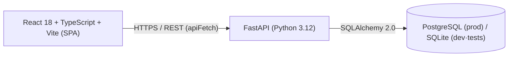
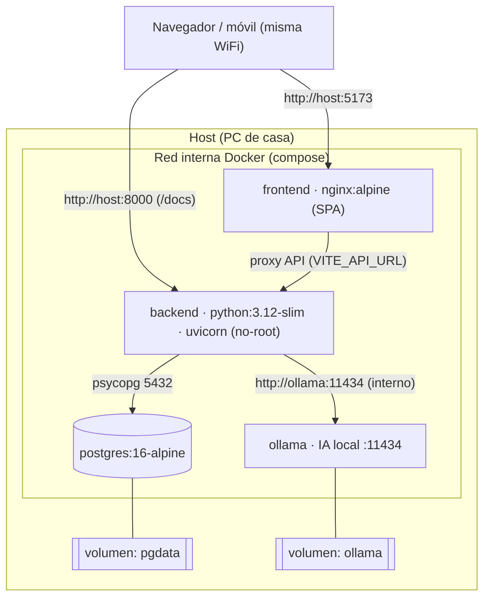
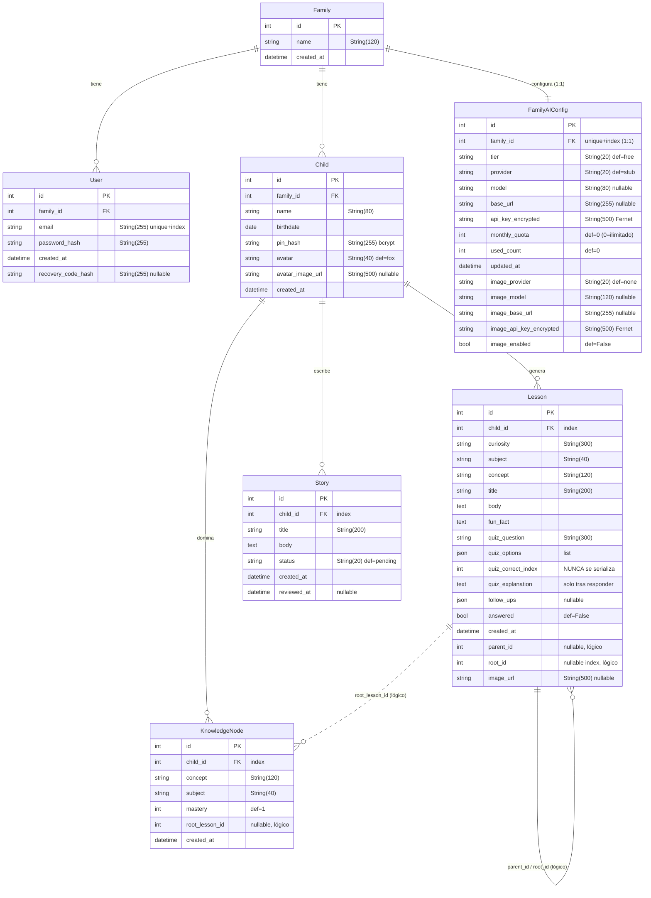

## Índice

0. [Ficha del proyecto](#0-ficha-del-proyecto)
1. [Descripción general del producto](#1-descripción-general-del-producto)
2. [Arquitectura del sistema](#2-arquitectura-del-sistema)
3. [Modelo de datos](#3-modelo-de-datos)
4. [Especificación de la API](#4-especificación-de-la-api)
5. [Historias de usuario](#5-historias-de-usuario)
6. [Tickets de trabajo](#6-tickets-de-trabajo)
7. [Pull requests](#7-pull-requests)

---

> ℹ️ **Nota sobre esta entrega (Entrega 2 — Código funcional).**
> El MVP está **completo**: las **10 historias de usuario** implementadas, **203 pruebas automatizadas**
> en verde (143 backend + 60 frontend) y la aplicación arrancando de punta a punta con Docker Compose.
> Esta rama incluye **el código**, además de la documentación.
>
> La Entrega 1 fue documental y su material se conserva en [`docs/entrega-1/`](docs/entrega-1/README.md)
> **en futuro**, tal y como se escribió: reescribirlo borraría la evidencia de que hubo diseño previo a
> la implementación, que es precisamente lo que se pedía entonces. Lo que se construyó, lo que cambió
> respecto a aquella propuesta y por qué está en [`docs/entrega-2/`](docs/entrega-2/README.md).
>
> 📚 **La documentación completa y detallada está en [`docs/entrega-1/`](docs/entrega-1/README.md)** (23
> documentos + 7 ADRs): producto, diseño técnico, pruebas, despliegue y bitácora de IA. Este README es el
> resumen curado sobre la plantilla oficial.

---

## 0. Ficha del proyecto

### **0.1. Tu nombre completo:**

Germán González Pérez

### **0.2. Nombre del proyecto:**

**Chispa** ✨ — aprendizaje por curiosidad para niños, con IA.

### **0.3. Descripción breve del proyecto:**

Chispa es una **app web de aprendizaje por curiosidad para niños**. Dentro de una **cuenta familiar**, cada
niño (perfil con **PIN**) enciende una "chispa" (una pregunta), recibe una **mini-lección adaptada a su edad**,
la refuerza con un **reto (quiz)** y puede seguir preguntando en una conversación tipo chat. Cada tema
explorado se convierte en una **"isla"** de su **grafo de conocimiento** ("archipiélago"), su mapa de
aprendizaje vivo. Los padres administran, supervisan y aprueban contenido. La IA (texto e imagen) es
**multiproveedor y configurable por familia**, con **claves cifradas** y **degradación elegante**: sin
proveedor configurado, todo funciona en **modo demo** sin coste ni errores.

No es una app de deberes ni una enciclopedia con IA: es un **espacio personal de descubrimiento** con memoria
pedagógica.

### **0.4. URL del proyecto:**

> **Sin URL pública todavía; despliegue autoalojado verificado.** Chispa es una aplicación pensada para
> correr en casa, y así se ha comprobado: `docker compose up --build -d` levanta Postgres, backend,
> frontend y Ollama, aplica las **11 migraciones sobre base vacía** y responde en
> `http://localhost:5173` (API y Swagger en `:8000`). Desde el móvil o la tablet de casa se entra por
> **LAN con QR** desde la propia app.
>
> La salida literal de ese arranque está en
> [`docs/entrega-2/evidencias/despliegue/`](docs/entrega-2/evidencias/despliegue/). El despliegue
> público con HTTPS es trabajo de la Entrega 3; su diseño ya está escrito en
> [`docs/superpowers/specs/`](docs/superpowers/specs/).
>
> **Para probarlo en cinco minutos** no hace falta ninguna clave de IA: sin proveedor configurado la
> aplicación funciona entera en modo demo. Ver §1.4.

### 0.5. URL o archivo comprimido del repositorio

- **Esta entrega (documentación y código):** `github.com/ggonzalezperez/AI4Devs-finalproject`,
  rama **`feature-entrega2-GGP`**. Contiene `readme.md`, `prompts.md`, el **código funcional completo**
  (`backend/`, `frontend/`, `docker-compose.yml`) y la **evidencia de despliegue**.
- **Repositorio de desarrollo:** `github.com/ggonzalezperez/chispa` — privado, es donde vive el
  historial de commits del día a día. Todo su contenido versionado se ha volcado aquí.
- **Entrega 1:** rama `feature-entrega1-GGP` del mismo repositorio, conservada como evidencia histórica.

---

## 1. Descripción general del producto

> Producto **implementado**; esta sección resume el producto, documentado en detalle en
> [`docs/entrega-1/01-product/`](docs/entrega-1/01-product/).

### **1.1. Objetivo:**

> «Chispa ayuda a los niños a aprender desde su curiosidad, convirtiendo cada pregunta en una pequeña aventura
> de conocimiento adaptada a su edad, segura para la familia y acumulada en su propio mapa de aprendizaje.»

**Problema.** La curiosidad infantil choca hoy con pantallas pasivas, contenido no adaptado a la edad y sin
supervisión parental. No existe un camino directo entre "esto me intriga" y una explicación breve, recordable
y a la medida del niño, dentro de un espacio seguro que la familia controle.

**Valor que aporta.** Chispa convierte cualquier pregunta del niño en **micro-aprendizaje seguro y adaptado por
edad**, visible como un **archipiélago de conocimiento que crece**, con **control parental real** y sin exponer
los datos del menor. Combina tres mundos que por separado fallan:

| Mundo | Qué aporta | Riesgo si va solo | Cómo lo resuelve Chispa |
|---|---|---|---|
| Curiosidad libre | Motivación intrínseca | Entretenimiento superficial | Cada curiosidad se conecta con una habilidad concreta |
| Progreso educativo | Estructura y mejora visible | Parecer "colegio disfrazado" | La materia entra como soporte de la pregunta, no como imposición |
| Memoria personalizada | Continuidad y adaptación | Vigilancia o perfilado excesivo | Ficha visible para padres, minimización de datos y control familiar |

**Para quién.** Dos actores: **Familia / Adulto** (gestiona, supervisa, aprueba, configura la IA — sesión con
contraseña, token `family`) y **Explorador / Niño** (aprende con PIN, sin exponer sus datos — token `child`).

**Principios de producto no negociables:** 1) Curiosidad primero, currículo después · 2) Seguridad infantil por
diseño · 3) La ficha manda · 4) Texto canónico · 5) Progreso sin manipulación (sin *dark patterns*) · 6)
Aprendizaje corto y recordable · 7) Padres con control, niño con agencia · 8) Diseño incremental.

### **1.2. Características y funcionalidades principales:**

Las **11 historias de usuario (US1–US11)** se agrupan en **6 épicas**:

| Épica | Funcionalidad principal |
|---|---|
| **E1 · Onboarding y perfiles** | Cuenta familiar (JWT `family`); perfiles de niño con **PIN**, alias, avatar y edad calculada; sesiones familia/niño separadas (rechazo cruzado 401); cambio y **recuperación de contraseña por código** `XXXX-XXXX`, **sin email**. |
| **E2 · Bucle de aprendizaje** | **Encender la chispa**: curiosidad → **mini-lección** adaptada a la banda de edad (3–5 / 6–8 / 9–12), con analogía, dato sorprendente y follow-ups; **lectura en voz alta** (Web Speech); **reto (quiz)** de 3 opciones que sube la **maestría** de la isla (fallar no penaliza). |
| **E3 · Conocimiento vivo** | **Archipiélago** de islas creadas automáticamente; **buscador** insensible a acentos/mayúsculas; **chat con contexto** (hilo con `parent_id`/`root_id`, raíz primero); reabrir la conversación guardada de una isla. |
| **E4 · Cuentos** | El niño crea cuentos que quedan **pendientes**; la familia **aprueba/edita/rechaza** (aprobación parental); aislamiento entre familias. |
| **E5 · IA configurable** | IA **multiproveedor por familia** (texto: stub/Ollama/Claude habilitados; imagen: HuggingFace/SDXL local/OpenAI/Gemini/Pollinations); **claves cifradas (Fernet)**, nunca devueltas; **recomendador de modelo local por hardware** (VRAM/RAM). |
| **E6 · Plataforma y accesibilidad** | Panel de familia (actividad, historial, ficha, seguridad); **voz** (dictado 🎤 + lectura 🔊); **imágenes IA** (off por defecto); **i18n es/en**; responsive + táctil; **acceso LAN + QR**. |

**Diferenciador transversal — degradación elegante:** cada capacidad "de lujo" (imagen, voz, QR, IA real)
degrada sin romper la experiencia base. **Sin ninguna clave, la app es plenamente usable** en modo demo con un
stub determinista; *el niño nunca ve un fallo del proveedor*.

### **1.3. Diseño y experiencia de usuario:**

> **Diseño documentado; capturas y vídeo en entregas posteriores** (la Entrega 1 no incluye UI implementada).

Dirección visual **"Archipiélago"** (náutica): coral `#ff7a59` (CTA/activo) + teal `#0e837b` (océano), fondo
papel cálido `#e8e6e1`, tipografías **Fredoka** (títulos), **Mulish** (cuerpo del niño) y **Nunito** (panel
adulto). Esquinas muy redondeadas, avatares emoji en círculo con anillo coral, PIN de 4 puntos con teclado
numérico, recompensa en **conchas 🐚**. Edad foco de diseño: **6–8 años**. Sistema de diseño completo en
[`docs/design-system.md`](docs/design-system.md).

**Flujo principal de pantallas:** Bienvenida → Crear cuenta familiar → Añadir explorador → ¿Quién
explora? → Acceso del niño (PIN) → **Encender la chispa** → **Mini-lección** (🔊) → **Reto** → **Mis
conocimientos** (archipiélago). Panel adulto (desktop): Resumen · Historial · Ficha del niño · Seguridad ·
Cuentos.

### **1.4. Instrucciones de instalación:**

> **Procedimiento verificado** (autoalojado con Docker); salida real del arranque en [`docs/entrega-2/evidencias/despliegue/`](docs/entrega-2/evidencias/despliegue/). Detalle completo en
> [`docs/entrega-1/04-delivery/despliegue.md`](docs/entrega-1/04-delivery/despliegue.md).

```bash
# 1) Copiar la plantilla de entorno
cp .env.example .env
# 2) Rellenar en .env: JWT_SECRET (>= 32 caracteres), POSTGRES_PASSWORD y AI_CONFIG_KEY
# 3) Generar la clave Fernet para AI_CONFIG_KEY:
docker compose run --rm backend python -c "from app.services.crypto import generate_key; print(generate_key())"
# 4) Arrancar (el entrypoint ejecuta 'alembic upgrade head' y luego uvicorn):
docker compose up --build -d
# 5) Acceder:
#    Frontend:      http://localhost:5173
#    API + Swagger: http://localhost:8000/docs
```

**Desarrollo local (sin Docker):** backend con `py -3.12 -m venv .venv`, `pip install -e ".[dev]"`,
`alembic upgrade head`, `uvicorn app.main:app --reload` (usa **SQLite** en `development`); frontend con
`npm install` y `npm run dev`.

---

## 2. Arquitectura del Sistema

> Diseño técnico documentado en [`docs/entrega-1/02-technical-design/`](docs/entrega-1/02-technical-design/).

### **2.1. Diagrama de arquitectura:**

Chispa se diseña como una aplicación **cliente-servidor REST por capas**. Una **SPA React** consume una **API
FastAPI** sobre HTTPS/REST; la API persiste en **PostgreSQL** (producción) o **SQLite** (dev/tests) con el
mismo ORM. La IA es un detalle **enchufable** tras **dos *seams*** (puerto/adaptador) —texto e imagen— que
permiten cambiar de proveedor o funcionar **sin IA** cayendo a un stub determinista.



**Patrón y justificación.** Es una arquitectura **por capas** (routers → services → repositories → models) con
**puerto/adaptador (hexagonal)** para la IA. Se elige por: (a) **testabilidad** —cada capa se prueba aislada y
la IA se sustituye por un stub determinista—; (b) **portabilidad** —mismo ORM para Postgres/SQLite, sin lock-in
de proveedor de IA (BYOK por familia)—; y (c) **seguridad para menores** —moderación de entrada, aprobación
parental, aislamiento entre familias y doble sesión familia/niño separada—. **Sacrificio consciente:** los
enlaces conversacionales (`parent_id`/`root_id`) y `root_lesson_id` son enteros **lógicos** sin FK física (se
resuelven en la aplicación), a cambio de migraciones más simples y menos rígidas.

### **2.2. Descripción de componentes principales:**

- **SPA (React 18 + TypeScript 5.5 strict + Vite 5.4, React Router 6):** 20 pantallas; **dos sesiones
  independientes** en `localStorage` (familia `chispa_token` y niño `chispa_child_token`); cliente tipado
  `apiFetch<T>` con `ApiError(status, detail)`; tokens de diseño en un único `theme.css`.
- **API FastAPI (Python 3.12):** flujo estricto por capas **routers → services → repositories → models**
  (SQLAlchemy 2.0 estilo `Mapped`/`mapped_column`), contratos con **Pydantic v2**, dependencias de auth con
  `HTTPBearer(auto_error=False)` y JWT tipado familia/niño.
- **Seam de texto — `LessonGenerator` (Protocol):** adaptadores `ClaudeGenerator`, `OllamaGenerator`,
  `OpenAICompatGenerator`, `GeminiGenerator` y `StubLessonGenerator` (**fallback**), todos con `httpx` sin SDKs.
  Fábrica `build_generator(config)` que cae al stub si no hay clave/proveedor.
- **Seam de imagen — `ImageGenerator` (Protocol):** `StubImageGenerator` (→ None), HuggingFace, LocalSDXL,
  OpenAI, Gemini, Pollinations. Best-effort: `_attach_image` traga errores y **nunca rompe la lección**.
- **Persistencia:** PostgreSQL 16 / SQLite con **migraciones Alembic aditivas** (`alembic upgrade head` al
  arrancar).

### **2.3. Descripción de alto nivel del proyecto y estructura de ficheros**

Estructura del repositorio (monorepo autoalojable):

```
chispa/
├── backend/                  # API FastAPI (Python 3.12)
│   ├── app/
│   │   ├── main.py           # routers HTTP (/auth, /children, /lessons, /me, /family/*, /health)
│   │   ├── services/         # lógica de negocio: lesson_service, story_service, ai_config, crypto, moderation
│   │   ├── repositories/     # acceso a datos: lessons, children, stories, ai_config
│   │   ├── models/           # SQLAlchemy 2.0: Family, User, Child, Lesson, KnowledgeNode, Story, FamilyAIConfig
│   │   ├── schemas/          # Pydantic v2 (contratos de entrada/salida)
│   │   ├── ai/               # seams de IA: generadores de texto e imagen + ai_catalog
│   │   └── deps.py           # dependencias de auth (JWT tipado)
│   ├── alembic/              # migraciones lineales y aditivas
│   └── tests/                # pytest (unitarias + integración TestClient)
├── frontend/                 # SPA React + TS + Vite (20 pantallas, theme.css)
├── docs/                     # documentación (entrega-1, design-system, guía)
└── docker-compose.yml        # postgres + backend + frontend + ollama
```

Obedece a una **arquitectura por capas** en el backend con **puerto/adaptador** para la IA; el frontend separa
`api/` (cliente), `context/` (sesión, i18n), `components/` y `screens/`.

### **2.4. Infraestructura y despliegue**

Chispa es **autoalojable**: se empaqueta con **Docker Compose** (4 servicios + 2 volúmenes + red interna). Solo
se exponen al host el **frontend (5173)** y la **API (8000)**; **Ollama** queda ligado a `127.0.0.1` (no a la
red).



**Proceso de despliegue:** `docker compose up --build -d`; el `docker-entrypoint.sh` del backend
ejecuta **`alembic upgrade head`** (idempotente) y arranca uvicorn. **CI** con GitHub Actions (push + PR): job
backend (`ruff check .` + `pytest`) y job frontend (`tsc --noEmit` + `vitest`). **No se contempla CD** (modelo
self-hosted por familia). Acceso LAN configurando `VITE_API_URL` y `CORS_ORIGINS`; pantalla "📱 Conectar móvil"
con QR.

### **2.5. Seguridad**

Diseño de seguridad centrado en el **menor** (perspectiva OWASP; detalle en
[`docs/entrega-1/02-technical-design/seguridad.md`](docs/entrega-1/02-technical-design/seguridad.md)). Controles
principales:

- **JWT tipado (A01):** `create_token` firma `{sub, type, exp}` con HS256; `get_current_family_user` /
  `get_current_child` exigen el `type` correcto. Un token de niño en endpoint de familia → **401** (y viceversa).
- **Aislamiento por propietario (A01):** cada consulta filtra por dueño (`child_id` / `family_id`); acceso
  cruzado devuelve **404** (no revela existencia). Aísla entre familias y entre niños.
- **Cifrado de claves de IA (A02):** BYOK cifrado con **Fernet** (`api_key_encrypted`,
  `image_api_key_encrypted`); la API **nunca** las devuelve (solo booleanos `has_api_key` / `has_image_api_key`).
- **Hashing bcrypt (A02/A07):** contraseña, PIN y código de recuperación se guardan hasheados con bcrypt.
- **Moderación de entrada + degradación segura (A04):** `check_curiosity` bloquea texto inapropiado → **422**
  con mensaje amable *"Esta la vemos con un adulto 🛟"*; ante fallo del proveedor, fallback al stub.
- **Secreto del quiz (A04):** `quiz_correct_index` y `quiz_explanation` **no se serializan jamás** (`QuizPublic`
  solo expone `{question, options}`); la corrección se calcula solo en servidor.
- **Fail-closed del secreto JWT (A05):** fuera de `development`, `JWT_SECRET` debe tener ≥ 32 caracteres o el
  arranque aborta.
- **Anti-enumeración por timing (A07):** hash señuelo de coste constante en login/reset; código de recuperación
  de 128 bits que **rota** tras cada reset.
- **Mitigación SSRF (A10):** `validate_local_url` rechaza link-local (metadatos de nube) y `follow_redirects=False`.

**Privacidad del menor:** minimización (en el alta **no** se recogen datos del niño), PIN en lugar de
contraseña, supervisión parental, y a los proveedores de IA se les envía el **concepto** de la lección, nunca
datos personales del niño.

### **2.6. Tests**

> **203 pruebas en verde: 143 backend (32 ficheros) + 60 frontend (31).** `ruff` y `tsc --noEmit`
> limpios; CI en GitHub Actions ejecuta lint y tests en cada *push*. Salidas reales en
> [`docs/entrega-2/verificacion.md`](docs/entrega-2/verificacion.md); estrategia en
> [`docs/entrega-1/03-testing/`](docs/entrega-1/03-testing/).
>
> La cobertura **no persigue un porcentaje, sino el riesgo**: cada regla de seguridad del menor
> tiene su caso negativo. Que el backend nunca envíe la respuesta del quiz, que la moderación
> filtre la entrada del niño sin bloquear curiosidades legítimas, que un token de un tipo no sirva
> en endpoints del otro (401) y que los accesos cruzados devuelvan 404 y no 403.
>
> El TDD no es una intención declarada: **`tdd-guard` lo aplica con hooks** que bloquean escribir
> implementación sin un test que falle antes. Bloqueó al agente tres veces durante el desarrollo,
> registrado en la bitácora.

Pirámide clásica: base de **unitarias** (crypto, moderación, catálogo IA, generadores, contraseñas), capa de
**integración** con `TestClient(app)` sobre FastAPI + **SQLite en memoria** (`StaticPool`, tablas recreadas por
test), y cima de **E2E/manual** con IA real y navegador. La cobertura se concentra por **riesgo**:

| Riesgo protegido | Prueba prevista (ejemplo) |
|---|---|
| Seguridad del menor | Moderación de entrada; validación anti-SSRF en imágenes; generación de avatar |
| Aislamiento de datos | API de niños y de cuentos (404 entre familias); dependencias de acceso |
| Secreto del quiz | Contrato de `LessonRead` (sin `quiz_correct_index`/`quiz_explanation`) y de `/answer` |
| Degradación de IA | Config de IA sin clave → stub; componentes de voz que renderizan `null` sin romper |

Los generadores de IA se prueban **siempre con mocks/monkeypatch** (suite determinista, gratuita y rápida);
la confianza en IA real se obtiene aparte (lección con Claude, imagen con Pollinations). CI: `ruff` +
`pytest` (backend) y `tsc --noEmit` + `vitest` (frontend).

---

## 3. Modelo de Datos

> Detalle campo a campo en [`docs/entrega-1/02-technical-design/modelo-datos.md`](docs/entrega-1/02-technical-design/modelo-datos.md).

### **3.1. Diagrama del modelo de datos:**

**7 entidades.** La **familia** es el agregado raíz (agrupa usuarios, niños y config de IA); toda la actividad
de aprendizaje (lecciones, nodos de conocimiento, historias) cuelga del **niño**.



### **3.2. Descripción de entidades principales:**

- **`families` — Family** *(agregado raíz)*: `id` (PK), `name` `String(120)` not null, `created_at`
  (UTC-aware). Relaciones: 1:N con `users` y `children`; 1:1 con `family_ai_config`.
- **`users` — User** *(cuenta que inicia sesión)*: `id` (PK), `family_id` (FK→families, not null), `email`
  `String(255)` **unique + index**, `password_hash` `String(255)`, `recovery_code_hash` `String(255)` nullable
  (flujo sin email), `created_at`.
- **`children` — Child** *(perfil del niño, auth por PIN)*: `id` (PK), `family_id` (FK), `name` `String(80)`,
  `birthdate` `Date`, `pin_hash` `String(255)` bcrypt, `avatar` `String(40)` def `"fox"`, `avatar_image_url`
  `String(500)` nullable, `created_at`. `age` es **propiedad calculada** (no columna).
- **`lessons` — Lesson** *(unidad de aprendizaje + quiz + hilo)*: `id` (PK), `child_id` (FK, index),
  `curiosity` `String(300)`, `subject` `String(40)` ∈ {ciencia, matematicas, lenguaje, arte, cultura},
  `concept`, `title`, `body`, `fun_fact`, `quiz_question`, `quiz_options` `JSON`, `quiz_correct_index`
  (**nunca serializado**), `quiz_explanation` (solo tras responder), `follow_ups` `JSON` nullable, `answered`
  `bool` def `False`, `parent_id` / `root_id` (enteros **lógicos**, sin FK), `image_url` nullable, `created_at`.
- **`knowledge_nodes` — KnowledgeNode** *("isla" de conocimiento)*: `id` (PK), `child_id` (FK, index),
  `concept`, `subject`, `mastery` `int` def `1` (sube al acertar el quiz), `root_lesson_id` `int` nullable
  (lógico), `created_at`.
- **`stories` — Story** *(cuentos con moderación)*: `id` (PK), `child_id` (FK, index), `title`, `body`,
  `status` `String(20)` def `"pending"` ∈ {pending, approved, rejected}, `reviewed_at` nullable, `created_at`.
- **`family_ai_config` — FamilyAIConfig** *(1:1 con Family)*: `id` (PK), `family_id` (FK **unique + index**),
  `tier` def `"free"`, `provider` def `"stub"`, `model`/`base_url` nullable, `api_key_encrypted`
  (**Fernet**), `monthly_quota` def `0`, `used_count` def `0`, `updated_at`, y el bloque de imagen
  (`image_provider` def `"none"`, `image_model`, `image_base_url`, `image_api_key_encrypted` **Fernet**,
  `image_enabled` def `False`).

**Restricciones y decisiones destacadas:** sin enums nativos de BD (campos "enum" como `String` validados en
la app); timestamps **UTC-aware**; `email` y `family_ai_config.family_id` **únicos**; hilos conversacionales y
`root_lesson_id` como **enteros lógicos** (sin FK física); secretos **cifrados con Fernet**, nunca en claro.
El esquema se construye con **11 migraciones Alembic lineales y siempre aditivas**.

---

## 4. Especificación de la API

> API REST (FastAPI) con documentación **OpenAPI automática** en `/docs` (Swagger) una vez implementada.
> Contratos completos en [`docs/entrega-1/02-technical-design/contratos-api.md`](docs/entrega-1/02-technical-design/contratos-api.md).
> Se destacan **3 endpoints** representativos del bucle de valor.

```yaml
openapi: 3.0.3
info:
  title: Chispa API
  version: 0.1.0 (Entrega 1 · diseño previo)
paths:
  /auth/register:
    post:
      summary: Registrar cuenta familiar (autologin + código de recuperación)
      description: Crea la familia y el usuario adulto; devuelve un token de tipo "family" y un código de recuperación de un solo uso (mostrado una vez).
      security: []          # público (sin auth)
      requestBody:
        required: true
        content:
          application/json:
            schema:
              type: object
              required: [name, email, password]
              properties:
                name:     { type: string, example: "Los Gómez" }
                email:    { type: string, format: email, example: "demo@chispa.test" }
                password: { type: string, minLength: 8, example: "Chispa2026" }
      responses:
        "201":
          description: Cuenta creada
          content:
            application/json:
              schema:
                type: object
                properties:
                  access_token:  { type: string }
                  token_type:    { type: string, example: "bearer" }
                  recovery_code: { type: string, example: "AB12-CD34" }
        "409": { description: Email ya registrado }

  /lessons:
    post:
      summary: Encender la chispa (curiosidad → mini-lección)
      description: Crea una lección a partir de una curiosidad del niño. La respuesta NUNCA incluye la opción correcta ni la explicación del quiz.
      security: [{ childBearer: [] }]     # token de tipo child
      requestBody:
        required: true
        content:
          application/json:
            schema:
              type: object
              required: [curiosity]
              properties:
                curiosity: { type: string, minLength: 2, maxLength: 300, example: "¿por qué el cielo es azul?" }
                subject:   { type: string, nullable: true, enum: [ciencia, matematicas, lenguaje, arte, cultura] }
      responses:
        "201":
          description: Lección creada (LessonRead, sin quiz_correct_index ni quiz_explanation)
          content:
            application/json:
              schema:
                type: object
                properties:
                  id:        { type: integer, example: 42 }
                  curiosity: { type: string }
                  subject:   { type: string, example: "ciencia" }
                  concept:   { type: string, example: "dispersión de la luz" }
                  title:     { type: string }
                  body:      { type: string }
                  fun_fact:  { type: string }
                  answered:  { type: boolean, example: false }
                  quiz:
                    type: object
                    properties:
                      question: { type: string }
                      options:  { type: array, items: { type: string } }   # exactamente 3 en modo demo
                  follow_ups: { type: array, items: { type: string } }
                  image_url:  { type: string, nullable: true }
        "422": { description: Curiosidad bloqueada por moderación ("Esta la vemos con un adulto 🛟") }

  /lessons/{id}/answer:
    post:
      summary: Resolver el reto (quiz) y subir la maestría
      description: Compara la respuesta SOLO en el servidor. Si acierta, sube la maestría de la isla; fallar no penaliza.
      security: [{ childBearer: [] }]
      parameters:
        - { name: id, in: path, required: true, schema: { type: integer } }
      requestBody:
        required: true
        content:
          application/json:
            schema:
              type: object
              required: [choice_index]
              properties:
                choice_index: { type: integer, minimum: 0, maximum: 2, example: 1 }
      responses:
        "200":
          description: Resultado de la corrección
          content:
            application/json:
              schema:
                type: object
                properties:
                  correct:     { type: boolean, example: true }
                  explanation: { type: string }
                  concept:     { type: string }
        "404": { description: Lección inexistente o de otro niño (aislamiento) }

components:
  securitySchemes:
    familyBearer: { type: http, scheme: bearer, bearerFormat: JWT }   # claim type=family
    childBearer:  { type: http, scheme: bearer, bearerFormat: JWT }   # claim type=child
```

**Ejemplo (encender la chispa) — petición y respuesta:**

```http
POST /lessons
Authorization: Bearer <token child>
Content-Type: application/json

{ "curiosity": "¿por qué el cielo es azul?" }
```
```json
{
  "id": 42, "curiosity": "¿por qué el cielo es azul?", "subject": "ciencia",
  "concept": "dispersión de la luz", "title": "La luz y el cielo",
  "body": "...", "fun_fact": "...", "answered": false,
  "quiz": { "question": "¿Qué color se dispersa más?", "options": ["Rojo", "Azul", "Verde"] },
  "follow_ups": ["¿Y por qué los atardeceres son rojos?"], "image_url": null
}
```

> Regla estrella de diseño: `LessonRead` **no** trae `quiz_correct_index` ni `quiz_explanation`; la corrección
> se resuelve solo en `POST /lessons/{id}/answer`.

---

## 5. Historias de Usuario

> 3 historias principales del MVP (plantilla DoR con criterios Gherkin). Las 11 completas (US1–US11) están en
> [`docs/entrega-1/01-product/historias-usuario.md`](docs/entrega-1/01-product/historias-usuario.md).

**Historia de Usuario 1 — US1 · Cuenta familiar y perfiles de niño (E1 · Onboarding)**

> **Como** adulto responsable de una familia, **quiero** crear una cuenta y dar de alta a mis hijos como
> "exploradores" con su PIN y avatar, **para** darles un acceso propio y seguro y poder recuperar mi cuenta si
> olvido la contraseña.

- **Alcance:** alta de cuenta familiar (email + contraseña ≥ 8) con autologin (token `family`) y **código de
  recuperación** `XXXX-XXXX` mostrado una sola vez; alta de exploradores (avatar, alias, fecha de nacimiento,
  PIN de 4 dígitos) con edad calculada; acceso del niño con PIN (autorizado por el adulto → token `child`);
  separación estricta de sesiones; recuperación de contraseña por código, **sin email**.
- **Criterios de aceptación (Gherkin):**
```gherkin
Feature: Cuenta familiar y perfiles de niño

  Scenario: Crear una cuenta familiar
    Given estoy en la pantalla de crear cuenta familiar
    When introduzco nombre, email y una contraseña de al menos 8 caracteres con su confirmación
    And ambas contraseñas coinciden
    Then se crea la cuenta y recibo un token de tipo "family"
    And se me muestra UNA sola vez un código de recuperación con formato XXXX-XXXX

  Scenario: Acceso del niño con PIN correcto
    Given existe un explorador con PIN
    And la familia está autenticada en el dispositivo (el alta del niño la autoriza el adulto)
    When el niño introduce el PIN correcto en su pantalla de acceso
    Then recibe un token de tipo "child"

  Scenario: Separación de sesiones (regla de seguridad)
    Given tengo un token de tipo "child"
    When llamo a un endpoint de familia
    Then la respuesta es 401
    And con un token de tipo "family" en un endpoint de niño la respuesta también es 401
```

**Historia de Usuario 2 — US2 · Encender la chispa (E2 · Bucle de aprendizaje)**

> **Como** niño explorador, **quiero** escribir o dictar una pregunta (o elegir una sugerencia), **para**
> recibir al instante una mini-lección sobre eso que me da curiosidad.

- **Alcance:** crear una lección desde una curiosidad escrita (`POST /lessons`); lanzar una lección desde una
  sugerencia ("Islas para empezar", `GET /me/suggestions`); generación **determinista** en modo demo (`stub`).
- **Reglas:** curiosidad de 2–300 caracteres; la moderación puede bloquear con **422**; el quiz tiene
  **exactamente 3 opciones** y el índice correcto está entre 0 y 2; la respuesta **nunca** incluye
  `quiz_correct_index`.
- **Criterios de aceptación (Gherkin):**
```gherkin
Feature: Encender la chispa

  Scenario: Crear una lección desde una curiosidad
    Given estoy autenticado como niño en la pantalla de encender la chispa
    When envío una curiosidad
    Then se crea una lección (POST /lessons) y la app navega a la lección

  Scenario: La lección stub es determinista
    Given no hay proveedor de IA configurado (modo demo)
    When se genera una lección
    Then su subject está en {ciencia, matematicas, lenguaje, arte, cultura}
    And el quiz tiene exactamente 3 opciones
    And el índice de la opción correcta está entre 0 y 2
```

**Historia de Usuario 3 — US4 · Reto (quiz) que sube la maestría (E2 · Bucle de aprendizaje)**

> **Como** niño explorador, **quiero** poner a prueba lo aprendido con un reto rápido, **para** afianzar el
> concepto y ver crecer mi dominio de esa isla, sin castigo si me equivoco.

- **Alcance:** resolver el reto (`POST /lessons/{id}/answer`) y recibir corrección, explicación y concepto;
  **subir la maestría** del `KnowledgeNode` al acertar; **sin penalización** al fallar; el backend nunca revela
  la respuesta correcta antes de responder.
- **Regla de seguridad (3 capas):** `QuizPublic` solo expone `{question, options}`; `to_read_dict` no copia el
  índice/explicación; `answer_lesson` calcula la corrección solo en servidor.
- **Criterios de aceptación (Gherkin):**
```gherkin
Feature: Reto que sube la maestría

  Scenario: Respuesta correcta
    Given estoy resolviendo el reto de una lección
    When respondo correctamente (POST /lessons/{id}/answer)
    Then la respuesta indica correct=true
    And sube la maestría del KnowledgeNode asociado

  Scenario: Respuesta incorrecta (sin penalización)
    Given estoy resolviendo el reto de una lección
    When respondo de forma incorrecta
    Then la respuesta indica correct=false
    And no se penaliza mi maestría

  Scenario: El backend nunca revela la respuesta correcta (seguridad)
    Given recibo una lección con su reto
    When inspecciono la respuesta del backend
    Then no contiene el índice ni el texto de la opción correcta
```

---

## 6. Tickets de Trabajo

> **Tickets ejecutados.** Los tres se implementaron siguiendo el flujo SDD (brief → TDD → informe →
> revisión adversaria). El detalle tarea a tarea —53 briefs y 53 informes— está en
> [`.superpowers/sdd/`](.superpowers/sdd/INDEX.md), y el libro mayor con commits y recuentos de
> tests en [`.superpowers/sdd/progress.md`](.superpowers/sdd/progress.md).

**Ticket 1 — Backend · `POST /lessons` con seam de texto + fallback stub + moderación**

- **Contexto:** núcleo del bucle de aprendizaje (US2). Convierte una curiosidad del niño en una lección con
  quiz, sin filtrar la respuesta correcta.
- **Tareas:**
  1. Definir el `Protocol` `LessonGenerator` (`generate(curiosity, age, subject, history) → GeneratedLesson`)
     y `StubLessonGenerator` determinista (subject ∈ 5 materias; quiz de **exactamente 3 opciones**;
     `0 ≤ correct_index < 3`).
  2. Implementar la fábrica `build_generator(config)` con **fallback al stub** si no hay clave/proveedor.
  3. `check_curiosity(text)` (blocklist) → `ModerationError` traducido a **422**.
  4. Router `POST /lessons` (token `child`): moderar → generar → persistir `Lesson` + `ensure_node`
     (`KnowledgeNode` con `mastery=1`) → serializar con `to_read_dict` (**sin** `quiz_correct_index`).
- **Criterios de aceptación:** curiosidad 2–300; respuesta 201 con `quiz` de 3 opciones sin índice; entrada
  inapropiada → 422; sin proveedor → lección determinista reproducible.
- **Pruebas:** `test_lessons_api`, `test_lesson_generator` (determinismo), `test_moderation`.
- **Definición de hecho:** suite verde + `ruff` limpio; el índice correcto no aparece en la respuesta.

**Ticket 2 — Frontend · Pantalla "Encender la chispa" (`Spark.tsx`)**

- **Contexto:** pantalla de entrada del niño al bucle (US2), con sesión `child`.
- **Tareas:**
  1. Formulario de curiosidad (2–300 caracteres) con validación en cliente y botón de envío.
  2. Cargar "Islas para empezar" desde `GET /me/suggestions` (5 fijas) y permitir lanzarlas.
  3. `apiFetch<LessonRead>('POST', '/lessons', {curiosity})`; al recibir 201, **navegar** a `LessonScreen`.
  4. Manejar `ApiError` 422 mostrando el mensaje amable ("Esta la vemos con un adulto 🛟"), sin romper la UI.
- **Criterios de aceptación:** enviar una curiosidad crea y abre la lección; pinchar una sugerencia también;
  el 422 se muestra de forma amigable.
- **Pruebas:** componente `Spark` (Vitest + Testing Library) con `apiFetch` mockeado.
- **Definición de hecho:** `tsc --noEmit` sin errores; test de render y de navegación en verde.

**Ticket 3 — Base de datos · Migración Alembic de `lessons` + `knowledge_nodes` (aditiva)**

- **Contexto:** paso 2 de la cadena de migraciones ("aprendizaje base"), sobre el esquema inicial de
  familias/usuarios/niños.
- **Tareas:**
  1. `create_table` `lessons` (con `child_id` indexado, `quiz_*`, `answered` def `False`, `created_at`
     UTC-aware) y `knowledge_nodes` (`child_id` indexado, `mastery` def `1`).
  2. Solo operaciones **aditivas** (`create_table`/`create_index`); los `drop_*` **solo** en `downgrade()`.
  3. Mantener la cadena **lineal** (un único HEAD, `down_revision` = migración anterior).
  4. Verificar `alembic upgrade head` idempotente en el entrypoint del contenedor.
- **Criterios de aceptación:** `upgrade`/`downgrade` reversibles; sin pérdida de datos; funciona en SQLite
  (dev) y Postgres (prod).
- **Pruebas:** `test_models` / arranque de BD; `alembic upgrade head` + `downgrade base` en CI.
- **Definición de hecho:** migración lineal aplicada sin errores en ambos motores.

---

## 7. Pull Requests

El desarrollo vivió en el repositorio privado `ggonzalezperez/chispa`, con ramas por fase y
fusiones a `main` verificadas. Los entregables académicos se presentan como pull requests en este
fork:

**Pull Request 1 — Entrega 1 (documental).** Rama `feature-entrega1-GGP` → `main`. Incorporó la
documentación de producto y diseño técnico: 23 documentos y 7 ADRs. Abierto, sin fusionar, como
evidencia histórica.

**Pull Request 2 — Entrega 2 (código funcional).** Rama `feature-entrega2-GGP` → `main`, este
mismo. Incorpora `readme.md`, `prompts.md`, el código completo y la evidencia de despliegue.

### Trabajo real, por fases

| Fase | Qué entregó | Commits de referencia |
|---|---|---|
| Cimientos backend | Auth, familias, niños, JWT tipado | `3203a89` y anteriores |
| Frontend onboarding | Pantallas de alta, acceso con PIN, i18n | — |
| Núcleo | Lecciones, quiz, grafo de conocimiento | — |
| IA configurable | Multiproveedor por familia, clave cifrada con Fernet | — |
| Cuentos | Biblioteca con aprobación parental | — |
| Conversación e islas | Hilos con contexto, buscador del archipiélago | — |
| Voz, imagen, LAN | Dictado, lectura, costura de imagen, QR | `2327e68` |
| Método y estándares | `docs/estandares/`, 6 skills propias, TDD Guard | `7c9997e`, `3506d03` |
| Coherencia doc↔código | 6 divergencias cerradas, cada una con test | `32703f9` |
| **Panel de familia (US5/US6)** | La última historia del MVP | `8c90f4b` |
| Correcciones de uso real | Modelos caducados, validación de claves, salida de sesión del niño, micrófono, persistencia de imágenes | `69e3360`, `b5f1653`, `2bf6df6`, `06df0e8`, `6f7abae` |

Método y plantillas en
[`docs/entrega-1/05-ai-log/flujo-trabajo-ia.md`](docs/entrega-1/05-ai-log/flujo-trabajo-ia.md).
